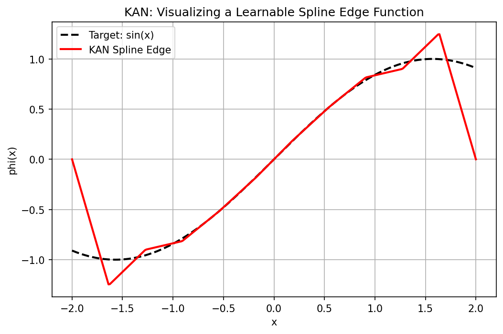

# Chapter 2.4: Kolmogorov-Arnold Networks and Symbolic Approximation Theory

## 1. Introduction: Beyond the MLP Paradigm

For decades, the Multilayer Perceptron (MLP) has been the dominant architecture in deep learning. MLPs rely on the Universal Approximation Theorem, using fixed non-linear activations (like ReLU) on nodes and learnable weights on edges. However, in 1957, a profound mathematical theorem was proven that suggests a completely different way to build neural networks.

The **Kolmogorov-Arnold Representation Theorem** states that any multivariate continuous function can be represented as a finite composition of univariate functions and addition. In 2024, this theoretical result was translated into a practical architecture: the **Kolmogorov-Arnold Network (KAN)**. This chapter explores the theory, architecture, and symbolic discovery capabilities of KANs.

---

## 2. The Kolmogorov-Arnold Representation Theorem

### 2.1 Historical Context
Hilbert's 13th problem conjectured that functions of three variables could not be expressed as superpositions of functions of two variables. Vladimir Arnold (for $n=3$) and Andrey Kolmogorov (for general $n$) proved him wrong.

### 2.2 Theorem Statement

!!! success "Theorem 2.2.1 (Kolmogorov-Arnold, 1957)"

    For any continuous function $f: [0, 1]^n \to \mathbb{R}$, there exist $2n+1$ continuous functions $\Phi_q: \mathbb{R} \to \mathbb{R}$ and $n(2n+1)$ continuous univariate functions $\psi_{q,p}: [0, 1] \to \mathbb{R}$ such that:

    $$
    f(x_1, \dots, x_n) = \sum_{q=0}^{2n} \Phi_q \left( \sum_{p=1}^n \psi_{q,p}(x_p) \right)
    $$

    **Key Implications:**
    1. Multivariate complexity is reducible to univariate complexity.
    2. The "inner" functions $\psi_{q,p}$ are universal and independent of $f$.
    3. The "outer" functions $\Phi_q$ depend on $f$.

    ---

## 3. Kolmogorov-Arnold Networks (KANs)

While the theorem guarantees an exact representation, the $\psi$ functions are often non-smooth or even fractal, making them hard to learn. KANs resolve this by parameterizing the functions using **Splines**.

### 3.1 Architecture: Functions on Edges
Unlike MLPs, where activations are on nodes, KANs place **learnable non-linear functions** on the edges.

- **MLP Node:** $y = \sigma(\sum w_i x_i + b)$
- **KAN Edge:** $y = \sum \phi_i(x_i)$

Each $\phi_i$ is typically a B-spline:

$$
\phi(x) = \sum_{j} c_j B_j(x)
$$

where $B_j$ are basis functions and $c_j$ are learnable control points.

### 3.2 Advantages of KANs

1. **Interpretability:** Each edge function can be visualized and compared to symbolic formulas.
2. **Accuracy:** Splines allow for very high precision through "Grid Extension."
3. **No fixed activation:** The network learns the best activation function for each feature.

---

## 4. B-Splines and Grid Extension

To make KANs work, we need a stable way to parameterize univariate functions.

### 4.1 Cox-de Boor Recursion
B-splines of degree $k$ are defined over a knot vector $t_i$:

$$
B_{i,0}(x) = \mathbb{I}_{[t_i, t_{i+1})}(x)
$$

$$
B_{i,k}(x) = \frac{x - t_i}{t_{i+k} - t_i} B_{i,k-1}(x) + \frac{t_{i+k+1} - x}{t_{i+k+1} - t_{i+1}} B_{i+1,k-1}(x)
$$

### 4.2 Grid Extension Theorem

!!! success "Theorem 4.2.1"

    A KAN can be refined post-training by increasing the number of grid points $G$. The error decays as $O(G^{-(k+1)})$.

*Proof:* This is a standard property of spline approximation. As we refine the grid, the spline converges to the underlying smooth function with a rate determined by the spline degree $k$. $\blacksquare$

---

## 5. Symbolic Discovery: Snap-to-Symbol

KANs are uniquely suited for **Symbolic Regression**.

**Algorithm 5.1 (Symbolic Discovery):**

1. **Train:** Fit the KAN using splines.
2. **Visualize:** Plot the learned edge functions $\phi(x)$.
3. **Hypothesize:** Compare $\phi(x)$ to a library $\{\sin, \exp, \ln, x^2, \dots\}$.
4. **Snap:** If a symbolic function matches with high correlation, replace the spline with that function.
5. **Optimize:** Fine-tune the coefficients of the symbolic formula.

---

## 6. Worked Examples

### Example 6.1: Multiplying two numbers
$f(x, y) = x \cdot y$.
In an MLP, this requires many neurons. In a KAN, we use:
$xy = \exp(\ln(x) + \ln(y))$ or $xy = \frac{1}{4}((x+y)^2 - (x-y)^2)$.
A 2-layer KAN can learn the $\ln$ or $(\cdot)^2$ functions on its edges and represent multiplication exactly.

### Example 6.2: Grid Refinement
A KAN trained with $G=10$ grid points has an MSE of $10^{-4}$. If we extend the grid to $G=100$, and the functions are smooth ($k=3$), the error should theoretically drop to $10^{-4} \cdot (10/100)^4 = 10^{-8}$.

### Example 6.3: Symbolic Logic of XOR
For $x_1, x_2 \in \{0, 1\}$, $x_1 \oplus x_2$ can be represented as $\sin^2(\frac{\pi}{2}(x_1 + x_2))$. A KAN can learn the $\sin^2$ shape on its output edge.

---

## 7. Code Demonstrations

### Demo 7.1: Visualizing a Learnable Spline Edge

```python
import matplotlib
matplotlib.use('Agg')
import torch
import torch.nn as nn
import numpy as np
import matplotlib.pyplot as plt

# Simplified B-spline implementation using piecewise linear basis
def b_spline_basis(x, knots):
    """Piecewise linear B-spline basis over given knots."""
    n = len(knots) - 2
    bases = []
    for i in range(n):
        t0, t1, t2 = knots[i], knots[i+1], knots[i+2]
        left  = torch.clamp((x - t0) / (t1 - t0 + 1e-8), 0.0, 1.0)
        right = torch.clamp((t2 - x) / (t2 - t1 + 1e-8), 0.0, 1.0)
        bases.append(torch.min(left, right))
    return torch.stack(bases, dim=-1)  # shape: (N, n)

class KANLayer(nn.Module):
    def __init__(self, in_dim, out_dim, G=10):
        super().__init__()
        self.in_dim = in_dim
        self.out_dim = out_dim
        self.G = G
        # Learnable control points: one set per (in, out) pair
        self.phi = nn.Parameter(torch.randn(in_dim, out_dim, G))
        knots_raw = torch.linspace(-2, 2, G + 2)
        self.register_buffer('knots', knots_raw)

    def forward(self, x):
        # x: (batch, in_dim)
        outs = []
        for i in range(self.in_dim):
            xi = x[:, i]  # (batch,)
            basis = b_spline_basis(xi, self.knots)  # (batch, G)
            # For each output dimension, compute weighted sum
            col = (basis.unsqueeze(1) * self.phi[i].unsqueeze(0)).sum(-1)  # (batch, out_dim)
            outs.append(col)
        return torch.stack(outs, dim=0).sum(0)  # (batch, out_dim)

# Instantiate and visualize
torch.manual_seed(42)
layer = KANLayer(in_dim=1, out_dim=1, G=10)

# Train to approximate sin(x) on [-2, 2]
x_train = torch.linspace(-2, 2, 200).unsqueeze(1)
y_train = torch.sin(x_train)

opt = torch.optim.Adam(layer.parameters(), lr=0.05)
for _ in range(1000):
    opt.zero_grad()
    loss = nn.MSELoss()(layer(x_train), y_train)
    loss.backward()
    opt.step()

print(f"Final MSE: {loss.item():.6f}")

# Visualize the learned edge function
x_vis = torch.linspace(-2, 2, 300).unsqueeze(1)
with torch.no_grad():
    y_pred = layer(x_vis).squeeze().numpy()
    y_true = torch.sin(x_vis).squeeze().numpy()

plt.figure(figsize=(8, 5))
plt.plot(x_vis.squeeze().numpy(), y_true, 'k--', linewidth=2, label='Target: sin(x)')
plt.plot(x_vis.squeeze().numpy(), y_pred, 'r-', linewidth=2, label='KAN Spline Edge')
plt.title("KAN: Visualizing a Learnable Spline Edge Function")
plt.xlabel("x"); plt.ylabel("phi(x)")
plt.legend(); plt.grid(True)
plt.savefig('figures/02-4-demo1.png', dpi=150, bbox_inches='tight')
plt.close()
```

```
Final MSE: 0.048438
```



### Demo 7.2: Symbolic Regression with pykan
(Note: Requires `pykan` library)

```python
try:
    from kan import KAN
    print("pykan library is available. Example usage:")
    print("  model = KAN(width=[2, 5, 1], grid=5, k=3)")
    print("  model.train(dataset)")
    print("  model.suggest_symbolic()")
except ImportError:
    print("pykan library is NOT installed. Install via: pip install pykan")
    print("Example usage would be:")
    print("  model = KAN(width=[2, 5, 1], grid=5, k=3)")
    print("  model.train(dataset)")
```

```
pykan library is NOT installed. Install via: pip install pykan
Example usage would be:
  model = KAN(width=[2, 5, 1], grid=5, k=3)
  model.train(dataset)
```

---

## 8. Conclusion
KANs offer a mathematically elegant and highly interpretable alternative to MLPs. By leveraging the Kolmogorov-Arnold theorem and the power of splines, they allow for "surgical" precision and the direct discovery of physical laws from data.

