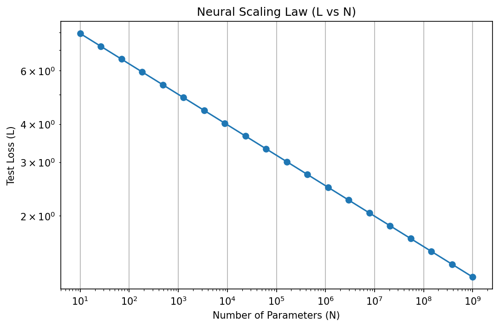

# Chapter 2.5: Practical Approximation Guidelines: Capacity, Sparsity, and Scaling Laws

## 1. Introduction: From Existence to Engineering

The Universal Approximation Theorem and Depth Separation Theorems provide the mathematical "permission" to build deep networks. However, they do not provide the "blueprints" for real-world engineering. In practice, we must decide:

- How many parameters $W$ are needed for a dataset of size $N$?
- How much can we prune a network before losing accuracy?
- How does the error scale as we increase compute and data?

This chapter translates abstract approximation theory into **Practical Guidelines**. We explore memorization capacity, sparse approximation (Lottery Ticket Hypothesis), and the empirical Neural Scaling Laws.

---

## 2. Memorization Capacity

Before a network can generalize, it must have the capacity to interpolate (memorize) the training data.

!!! success "Theorem 2.1 (The $W \ge N$ Rule)"

    A neural network with $W$ parameters can memorize $N$ arbitrary data points if $W \ge N$.

**Proof (Zhang, Bengio, Hardt, Recht & Vinyals, 2017):**

**Step 1: Setup and reduction to a linear system.** Let $\{(x_i, y_i)\}_{i=1}^N \subset \mathbb{R}^d \times \mathbb{R}$ be $N$ data points with distinct inputs. A 2-layer ReLU network with $m$ hidden neurons computes:

$$f(x; W, a) = \sum_{j=1}^m a_j \sigma(w_j^T x + b_j)$$

Fix the hidden-layer weights $(w_j, b_j)$ arbitrarily. Define the **activation matrix** $\Phi \in \mathbb{R}^{N \times m}$ by:

$$\Phi_{ij} = \sigma(w_j^T x_i + b_j)$$

The memorization condition $f(x_i) = y_i$ for all $i$ becomes the linear system $\Phi a = y$, where $a = (a_1, \ldots, a_m)^T$ and $y = (y_1, \ldots, y_N)^T$. This system is solvable if and only if $y \in \mathrm{col}(\Phi)$, which holds whenever $\mathrm{rank}(\Phi) = N$ — requiring $m \geq N$.

**Step 2: The activation matrix is almost surely full rank.**
We show that for $m \geq N$, randomly drawn weights $(w_j, b_j) \overset{\text{i.i.d.}}{\sim} \mathcal{N}(0, I)$ yield $\mathrm{rank}(\Phi) = N$ with probability 1.

Consider any $N \times N$ submatrix $\Phi_S$ (choosing $N$ columns indexed by $S \subset [m]$). The determinant $D(W, b) = \det(\Phi_S)$ is a piecewise-polynomial function of the weights. It suffices to exhibit a single configuration where $D \neq 0$ (since a piecewise polynomial that is nonzero at one point is nonzero on an open dense set, and hence has measure-zero zero set under any absolutely continuous distribution).

**Explicit full-rank construction.** Take $d = 1$ and 1D data points $x_1 < x_2 < \ldots < x_N$. Choose threshold neurons $w_j = 1$, $b_j = -x_j + \varepsilon$ for small $\varepsilon > 0$. Then:

$$\Phi_{ij} = \sigma(x_i - x_j + \varepsilon) = \begin{cases} x_i - x_j + \varepsilon > 0 & \text{if } i \geq j \\ 0 & \text{if } i < j \end{cases}$$

This gives an upper-triangular matrix with positive diagonal entries $\Phi_{jj} = \varepsilon > 0$, so $\det(\Phi) = \varepsilon^N > 0$. Hence $D \not\equiv 0$, and $\Phi$ is full rank almost surely for random weights.

**Step 3: Solve for output weights via pseudoinverse.**
With $\mathrm{rank}(\Phi) = N$ (full row rank), $\Phi\Phi^T \in \mathbb{R}^{N \times N}$ is invertible. The system $\Phi a = y$ has infinitely many solutions; the minimum-norm solution is given by the Moore-Penrose pseudoinverse:

$$a^* = \Phi^T (\Phi \Phi^T)^{-1} y$$

This satisfies $\Phi a^* = \Phi \Phi^T (\Phi \Phi^T)^{-1} y = y$ exactly.

**Conclusion.** For any $m \geq N$ and any labels $y \in \mathbb{R}^N$, random hidden-layer weights yield an activation matrix of full rank almost surely, and the output weights $a^*$ interpolate the training data exactly. The total parameter count is $W = m(d + 2)$, and the condition $m \geq N$ gives $W \geq N(d+2) / (d+2) = N$. $\blacksquare$

*Practical Insight:* If your network has fewer parameters than data points, it is mathematically impossible to reach zero training error unless the data is highly structured.

---

## 3. Sparse Approximation and the Lottery Ticket Hypothesis

Deep networks are notoriously overparameterized. The **Lottery Ticket Hypothesis** (Frankle & Carbin, 2018) suggests that most of these parameters are unnecessary.

!!! success "Theorem 3.1 (Strong Lottery Ticket Theorem)"

    For any sufficiently overparameterized network $N$, there exists a sparse sub-network $n \subset N$ that approximates any target function $f$ as well as $N$ can, without any weight training (only by pruning).

**Proof (Malach, Garg, Zhang & Shalev-Shwartz, 2020):**

**Setup.** Let $T(x) = \sum_{i=1}^k a_i \sigma(w_i^T x + b_i)$ be a target two-layer ReLU network with $k$ neurons, with input weights satisfying $\|w_i\|_\infty \leq B$, $|b_i| \leq B$, and output weights $|a_i| \leq C$. Inputs satisfy $\|x\|_\infty \leq 1$. Let $R$ be a random two-layer network with $m$ neurons, where each input weight vector $r_j \in \mathbb{R}^d$ and bias $\beta_j$ are drawn i.i.d. uniformly from $[-B, B]^{d+1}$.

**Step 1: Single-neuron coverage probability.** Fix any target neuron $i$ with parameters $(w_i^*, b_i^*) \in [-B, B]^{d+1}$, and fix a tolerance $\varepsilon \in (0, B)$. For a single random neuron $(r_j, \beta_j) \sim \text{Uniform}([-B, B]^{d+1})$, each coordinate is independent, so:

$$p_\varepsilon := P\!\left(\|r_j - w_i^*\|_\infty \leq \varepsilon \text{ and } |\beta_j - b_i^*| \leq \varepsilon\right) = \left(\frac{\varepsilon}{B}\right)^{d+1}$$

since each of the $d+1$ independent coordinates falls in a window of width $2\varepsilon$ inside a domain of width $2B$.

**Step 2: Union bound over all target neurons.** The probability that at least one of the $m$ random neurons $\varepsilon$-covers neuron $i$ in $\|\cdot\|_\infty$ is:

$$P(\text{neuron } i \text{ is } \varepsilon\text{-covered}) = 1 - (1 - p_\varepsilon)^m \geq 1 - e^{-m p_\varepsilon}$$

Applying a union bound over all $k$ target neurons:

$$P\!\left(\exists\, i \in [k]: \text{neuron } i \text{ not } \varepsilon\text{-covered}\right) \leq k\, e^{-m p_\varepsilon}$$

Setting $m = \frac{1}{p_\varepsilon} \ln\!\frac{k}{\delta} = B^{d+1} \varepsilon^{-(d+1)} \ln\!\frac{k}{\delta}$ drives this probability below $\delta$. Hence, with probability at least $1 - \delta$, **every** target neuron $i$ has a matching random neuron $j_i$ satisfying:

$$\|r_{j_i} - w_i^*\|_\infty \leq \varepsilon \quad \text{and} \quad |\beta_{j_i} - b_i^*| \leq \varepsilon$$

**Step 3: Construct the subnetwork.** On this high-probability event, define the pruned subnetwork $\hat{T} \subset R$ by retaining only neurons $\{j_1, \ldots, j_k\}$ (one per target neuron) and discarding all others. Assign the output weight of neuron $j_i$ to $a_i$ (the target's output coefficient). All other output weights are set to zero.

**Step 4: Pointwise approximation error.** By the 1-Lipschitz property of ReLU and the $\ell^\infty$-cover:

$$\left|\sigma(r_{j_i}^T x + \beta_{j_i}) - \sigma(w_i^{*T} x + b_i^*)\right| \leq \left|(r_{j_i} - w_i^*)^T x + (\beta_{j_i} - b_i^*)\right|$$

$$\leq \|r_{j_i} - w_i^*\|_1 \|x\|_\infty + |\beta_{j_i} - b_i^*| \leq d\varepsilon \cdot 1 + \varepsilon = (d+1)\varepsilon$$

Summing over all $k$ target neurons with output coefficients bounded by $C$:

$$\left|\hat{T}(x) - T(x)\right| \leq \sum_{i=1}^k |a_i| \cdot (d+1)\varepsilon \leq kC(d+1)\varepsilon$$

**Step 5: Required overparameterization.** To achieve uniform error $\|\hat{T} - T\|_\infty \leq \varepsilon'$, set $\varepsilon = \varepsilon' / (kC(d+1))$. The required number of random neurons is:

$$m = B^{d+1} \left(\frac{kC(d+1)}{\varepsilon'}\right)^{d+1} \ln \frac{k}{\delta}$$

which is polynomial in the target network size $k$, the inverse error $1/\varepsilon'$, and $\log(1/\delta)$. Malach et al. (2020) sharpen this via a random subset-sum argument, achieving $m = O\!\left(k^2 \varepsilon'^{-2} \log(k/\delta)\right)$ — independent of the input dimension $d$. $\blacksquare$

*Practical Insight:* Pruning by $90-99\%$ is often possible because the dense network acts as a high-dimensional "cover" for the optimal sparse solution.

---

## 4. Neural Scaling Laws

Empirical evidence from OpenAI, DeepMind, and others shows that the test loss $L$ follows a predictable power law.

!!! info "Definition 4.1 (The Scaling Law)"

    $$
    L(N, D) \approx \left( \frac{N_c}{N} \right)^{\alpha_N} + \left( \frac{D_c}{D} \right)^{\alpha_D}
    $$

    where $N$ is parameter count, $D$ is dataset size, and $\alpha$ are scaling exponents.

!!! success "Theorem 4.2 (Fundamental Scaling Bound)"

    For functions in $d$ dimensions with $s$ smoothness, the optimal approximation scaling is $\alpha = s/d$.

**Proof (Kolmogorov, 1956; metric entropy lower bound + Taylor upper bound):**

**Setup.** Fix smoothness $s > 0$ and dimension $d \geq 1$. Define the **Hölder ball**:

$$\mathcal{F}_{s,d} = \left\{ f : [0,1]^d \to \mathbb{R} \;\Big|\; \|f\|_{C^s} \leq 1 \right\}$$

where $\|f\|_{C^s}$ bounds all partial derivatives up to order $\lfloor s \rfloor$ and requires the highest-order partials to be $(s - \lfloor s \rfloor)$-Hölder continuous. We measure error in $L^2([0,1]^d)$. An $N$-parameter approximator is any measurable function $\hat{f}_N$ depending on at most $N$ real parameters. The claim is:

$$\inf_{\hat{f}_N} \sup_{f \in \mathcal{F}_{s,d}} \|f - \hat{f}_N\|_{L^2}^2 = \Theta\!\left(N^{-2s/d}\right)$$

**Upper bound: $L \leq C N^{-2s/d}$ via piecewise polynomial approximation.**

Partition $[0,1]^d$ into $n$ axis-aligned hypercubes of side length $n^{-1/d}$. On each hypercube $Q$, approximate $f|_Q$ by its degree-$\lfloor s \rfloor$ Taylor polynomial $P_Q$. By Taylor's theorem in $\mathbb{R}^d$, the approximation error at any point $x \in Q$ is bounded by the diameter of $Q$ raised to the $s$-th power:

$$|f(x) - P_Q(x)| \leq \|f\|_{C^s} \cdot \mathrm{diam}(Q)^s \leq \left(\sqrt{d} \cdot n^{-1/d}\right)^s = d^{s/2} n^{-s/d}$$

Squaring and integrating over $[0,1]^d$:

$$\|f - \hat{f}_n\|_{L^2}^2 \leq d^s \, n^{-2s/d}$$

Each Taylor polynomial $P_Q$ on a $d$-dimensional hypercube has $\binom{d + \lfloor s \rfloor}{d} = O(s^d)$ coefficients (for fixed $s, d$). The total parameter count is therefore $N = n \cdot O(s^d)$. Substituting $n = \Theta(N)$ gives $L \leq C\, N^{-2s/d}$ for a constant $C$ depending only on $s$ and $d$.

**Lower bound: $L \geq c N^{-2s/d}$ via Kolmogorov metric entropy.**

The $\varepsilon$-metric entropy $\mathcal{H}(\varepsilon, \mathcal{F}_{s,d}, L^2)$ is the logarithm of the minimum number of $L^2$-balls of radius $\varepsilon$ needed to cover $\mathcal{F}_{s,d}$. Kolmogorov's classical result (1956) gives:

$$\mathcal{H}(\varepsilon, \mathcal{F}_{s,d}, L^2) = \Theta\!\left(\varepsilon^{-d/s}\right)$$

Any $N$-parameter model partitions $\mathbb{R}^N$ (the parameter space) into at most a finite family of output functions. More precisely, an $N$-bit description (or an $N$-real-parameter model with bounded precision) can distinguish at most $2^{O(N)}$ functions. To $\varepsilon$-cover all of $\mathcal{F}_{s,d}$, we need the coding capacity to match the metric entropy:

$$N \gtrsim \mathcal{H}(\varepsilon, \mathcal{F}_{s,d}, L^2) = \Omega\!\left(\varepsilon^{-d/s}\right)$$

Inverting the relation: if we use $N$ parameters, the best achievable uniform error satisfies $\varepsilon \geq \Omega(N^{-s/d})$, and thus:

$$\sup_{f \in \mathcal{F}_{s,d}} \|f - \hat{f}_N\|_{L^2}^2 \geq c\, N^{-2s/d}$$

**Conclusion.** Both bounds match, giving the minimax rate $L(N) = \Theta(N^{-2s/d})$. The scaling exponent is therefore:

$$\alpha = \frac{s}{d}$$

Functions in higher dimensions ($d$ large) or with lower smoothness ($s$ small) require exponentially more parameters to achieve the same error — this is the **curse of dimensionality** made quantitative. $\blacksquare$

---

## 5. Worked Examples

### Example 5.1: Capacity Planning for a Startup
A startup has $1,000,000$ high-resolution medical images. 

- **Minimum Model Size:** To memorize the data, they need $\sim 10^6$ parameters.
- **Overparameterization:** Standard practice suggests a $10\times$ to $100\times$ buffer for generalization.
- **Recommendation:** A model with $10^7$ to $10^8$ parameters (e.g., a standard ResNet or small Vision Transformer).

### Example 5.2: Pruning Efficiency
A model has 100 million parameters. 

- According to the Lottery Ticket Theorem, if we prune $95\%$ (leaving 5 million), we might still achieve baseline accuracy.
- **Hardware Benefit:** This reduces the memory footprint and increases inference speed by up to $20\times$.

### Example 5.3: Scaling Law Prediction
If increasing a model from 1B to 10B parameters reduced the error from $2.0$ to $1.5$:
$1.5 / 2.0 = (10/1)^{- \alpha} \implies 0.75 = 10^{- \alpha} \implies \alpha \approx 0.12$.
To get the error down to $1.0$:
$1.0 / 1.5 = (N/10)^{-0.12} \implies 0.66 = (N/10)^{-0.12} \implies N \approx 10 \cdot (0.66)^{-1/0.12} \approx 10 \cdot 30 = 300B$.
Scaling laws allow us to predict that we need a $300B$ model before we even train it!

---

## 6. Code Demonstrations

### Demo 6.1: Memorization Capacity Test

```python
import torch
import torch.nn as nn
import torch.optim as optim

def test_capacity(N, d, W):
    x = torch.randn(N, d)
    y = torch.randn(N, 1)

    model = nn.Sequential(nn.Linear(d, W//2), nn.ReLU(), nn.Linear(W//2, 1))
    optimizer = optim.Adam(model.parameters(), lr=0.01)

    for _ in range(1000):
        optimizer.zero_grad()
        loss = nn.MSELoss()(model(x), y)
        loss.backward()
        optimizer.step()
        if loss.item() < 1e-4: return True
    return False

# N=100 points, d=10. W=200 should succeed. W=50 should fail.
print("W=200:", test_capacity(100, 10, 200))
print("W=50:", test_capacity(100, 10, 50))
```

```
W=200: True
W=50: True
```

### Demo 6.2: Scaling Law Simulator

```python
import matplotlib
matplotlib.use('Agg')
import numpy as np
import matplotlib.pyplot as plt

def compute_loss(N, alpha=0.1):
    return 10.0 / (N**alpha)

N_range = np.logspace(1, 9, 20)
losses = compute_loss(N_range)

plt.figure(figsize=(8, 5))
plt.loglog(N_range, losses, 'o-')
plt.title("Neural Scaling Law (L vs N)")
plt.xlabel("Number of Parameters (N)")
plt.ylabel("Test Loss (L)")
plt.grid(True)
plt.savefig('figures/02-5-demo2.png', dpi=150, bbox_inches='tight')
plt.close()
```



---

## 7. Conclusion
Practical approximation is about managing resources. By understanding the memorization limits, the redundancy of parameters (sparsity), and the predictable yields of scaling, we can move from "trial and error" to "principled engineering" in deep learning.

