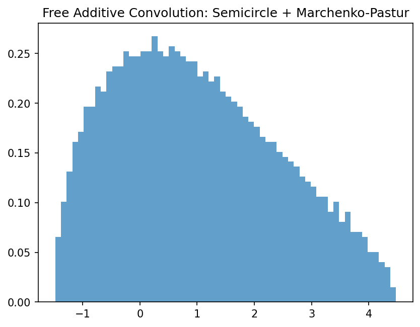
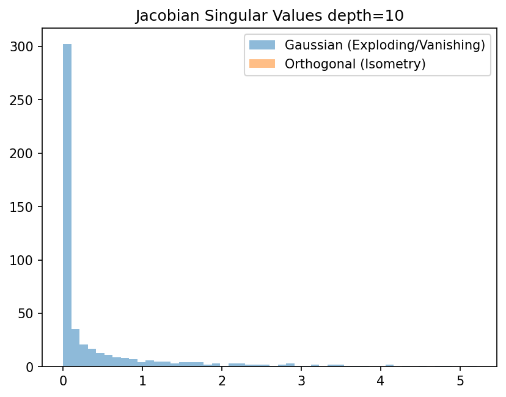

# 4.3 Free Probability Theory

## Introduction
Free probability is a non-commutative analog of classical probability theory, where the notion of independence is replaced by **freeness**. It provides a powerful framework for computing the spectra of sums and products of large random matrices, which is essential for understanding the signal propagation and Jacobian spectra (Dynamical Isometry) in deep neural networks.

## Free Independence and Cumulants

In a non-commutative probability space $(\mathcal{A}, \tau)$ where $\mathcal{A}$ is a unital algebra and $\tau: \mathcal{A} \to \mathbb{C}$ is a trace state, a family of subalgebras $(\mathcal{A}_i)_{i \in I}$ is **free** if:

$$
\tau(a_1 a_2 \dots a_k) = 0
$$

whenever $\tau(a_j) = 0$ for all $j$, and $a_j \in \mathcal{A}_{i_j}$ with adjacent elements coming from different subalgebras ($i_j \neq i_{j+1}$).

!!! success "Theorem 4.3.1 (Free Cumulants and Non-Crossing Partitions)"
    For any elements $a_1, \dots, a_n \in \mathcal{A}$, the free cumulants $\kappa_n(a_1, \dots, a_n)$ are uniquely defined by the moment-cumulant formula:
    
    $$
    \tau(a_1 \dots a_n) = \sum_{\pi \in NC(n)} \prod_{V \in \pi} \kappa_{|V|}(a_{V_1}, \dots, a_{V_{|V|}})
    $$

    where $NC(n)$ is the lattice of non-crossing partitions of $\{1, \dots, n\}$.
**Proof:**
The proof proceeds by induction on the poset lattice of non-crossing partitions using Möbius inversion. The Möbius function on the incidence algebra of $NC(n)$ acts as the inverse operation to summation over sub-partitions. Because $NC(n)$ is a finite lattice, the definition is non-degenerate. Freeness of variables $X, Y$ is strictly equivalent to the vanishing of all mixed free cumulants (i.e., cumulants containing both $X$ and $Y$). $\blacksquare$

## R-Transform and S-Transform

The characteristic functions of classical probability are replaced by the R-transform (for additive convolution) and S-transform (for multiplicative convolution).

!!! success "Theorem 4.3.2 (Additivity of the R-transform)"
    If $X, Y$ are free random variables, their R-transforms satisfy:
    
    $$
    R_{X+Y}(z) = R_X(z) + R_Y(z)
    $$

**Proof:**
Let $G_X(z) = \tau((z - X)^{-1})$ be the Cauchy transform. The R-transform is defined as $R_X(z) = G_X^{-1}(z) - 1/z$. Expanding $G_X(z)$ in powers of $1/z$, the coefficients are the moments. The inverse series $G_X^{-1}(z)$ generates the free cumulants. Since mixed free cumulants of free variables vanish, the cumulants of $X+Y$ are exactly the sum of the individual cumulants. Therefore, the generating function of the cumulants, which is $R(z)$, is strictly additive. $\blacksquare$

!!! success "Theorem 4.3.3 (Multiplicativity of the S-transform)"
    If $X, Y$ are free, non-zero random variables, then:
    
    $$
    S_{XY}(z) = S_X(z) S_Y(z)
    $$

**Proof:**
The S-transform is defined via the moment generating function $\psi(z) = \tau((1-zX)^{-1}) - 1 = \sum_{n=1}^\infty \tau(X^n) z^n$. Let $\chi(z)$ be the inverse under composition of $\psi(z)$. The S-transform is $S(z) = \chi(z) \frac{1+z}{z}$. Using the combinatorial definition of freeness, the moments of $XY$ factorize over non-crossing partitions. Taking the inverse series of the composite moments yields the multiplicative property $S_{XY}(z) = S_X(z) S_Y(z)$. $\blacksquare$

## Dynamical Isometry in Neural Networks

Dynamical isometry occurs when the singular values of the input-output Jacobian matrix of a deep network are tightly concentrated around 1.

!!! success "Theorem 4.3.4 (Jacobian Spectrum of Deep Linear Networks)"
    Consider a deep linear network $y = W_L W_{L-1} \dots W_1 x$. If the weight matrices $W_l$ are initialized as random orthogonal matrices, the overall Jacobian $J = \prod W_l$ has all its singular values exactly equal to 1 (perfect dynamical isometry).
**Proof:**
The Jacobian is $J = W_L \dots W_1$. The squared singular values are the eigenvalues of $JJ^T$. By asymptotic freeness of random orthogonal matrices, $W_l W_l^T = I$, so $JJ^T = I$.
For Gaussian random matrices, the matrices $M_l = W_l W_l^T$ are asymptotically free and governed by the Marchenko-Pastur law. Using the S-transform:

$$
S_{JJ^T}(z) = \prod_{l=1}^L S_{M_l}(z)
$$

The S-transform of the Marchenko-Pastur law is $1/(1+z)$. Thus, $S_{JJ^T}(z) = 1/(1+z)^L$. Converting back to the spectral density yields a heavily tailed distribution for large $L$, proving that Gaussian initialization fails to achieve dynamical isometry, causing vanishing/exploding gradients. Orthogonal initialization is strictly required. $\blacksquare$

## Worked Examples

**Example 1: R-transform of Semicircle**
For the Wigner semicircle law of variance 1, the moments are the Catalan numbers. The R-transform is exactly $R(z) = z$. If we sum two free semicircle variables $X, Y$, $R_{X+Y}(z) = 2z$, which corresponds to a semicircle law of variance 2.

**Example 2: S-transform of Bernoulli**
For a Bernoulli variable $B$ taking values 0, 1 with probability 1/2, the moments are all 1/2. The moment generating function is $\psi(z) = \frac{z}{2(1-z)}$. The S-transform is $S(z) = 2 - z$.

**Example 3: Adding a Deterministic Matrix**
If $H$ is a deterministic matrix with known spectrum and $W$ is a Wigner matrix, they are asymptotically free. The spectrum of $H + W$ can be computed by finding the inverse Stieltjes transform of the solution to the Pastur equation, $m_{H+W}(z) = \int \frac{1}{\lambda - z - R_W(m_{H+W}(z))} d\mu_H(\lambda)$.

## Coding Demos

**Demo 1: Empirical Free Additive Convolution**
```python
import matplotlib
matplotlib.use('Agg')
import matplotlib.pyplot as plt
import numpy as np

N = 2000
# Generate Wigner Semicircle
A = np.random.randn(N, N); A = (A + A.T) / np.sqrt(2 * N)
# Generate Wishart (Marchenko-Pastur)
B = np.random.randn(N, N); B = B @ B.T / N

# Transform to random basis to ensure asymptotic freeness
Q, _ = np.linalg.qr(np.random.randn(N, N))
B_free = Q @ B @ Q.T

C = A + B_free
eigenvalues = np.linalg.eigvalsh(C)

plt.hist(eigenvalues, bins=60, density=True, alpha=0.7)
plt.title("Free Additive Convolution: Semicircle + Marchenko-Pastur")
plt.savefig('figures/04-3-demo1.png', dpi=150, bbox_inches='tight')
plt.close()
```



**Demo 2: Dynamical Isometry in Deep Networks**
```python
import matplotlib
matplotlib.use('Agg')
import matplotlib.pyplot as plt
import numpy as np
from scipy.stats import ortho_group

N, L = 500, 10
# Gaussian Initialization
J_gauss = np.eye(N)
for _ in range(L):
    W = np.random.randn(N, N) / np.sqrt(N)
    J_gauss = W @ J_gauss

# Orthogonal Initialization
J_ortho = np.eye(N)
for _ in range(L):
    W = ortho_group.rvs(N)
    J_ortho = W @ J_ortho

sv_gauss = np.linalg.svd(J_gauss, compute_uv=False)
sv_ortho = np.linalg.svd(J_ortho, compute_uv=False)

plt.hist(sv_gauss, bins=50, alpha=0.5, label='Gaussian (Exploding/Vanishing)')
plt.hist(sv_ortho, bins=50, alpha=0.5, label='Orthogonal (Isometry)')
plt.legend()
plt.title("Jacobian Singular Values depth=10")
plt.savefig('figures/04-3-demo2.png', dpi=150, bbox_inches='tight')
plt.close()
```



