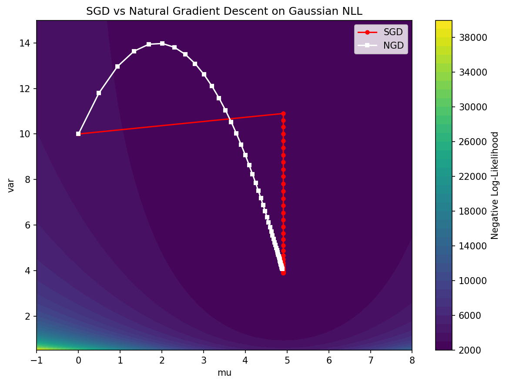

# Information Geometry and the Natural Gradient

## 1. Introduction to Information Geometry

Information Geometry merges differential geometry with probability theory. Instead of viewing probability distributions as isolated functions, information geometry models a parameterized family of probability distributions as a smooth statistical manifold. 

Let $\mathcal{P} = \{ p_\theta(x) : \theta \in \Theta \subset \mathbb{R}^d \}$ be a family of probability distributions. Each set of parameters $\theta$ represents a point on this manifold. 
In Euclidean geometry, the distance between $\theta$ and $\theta + d\theta$ is simply $||d\theta||^2$. However, in a statistical manifold, changing a parameter $\theta_1$ might drastically alter the probability distribution, while changing $\theta_2$ by the same amount might have almost no effect. We need a metric tensor that measures distance not in parameter space, but in *distribution space*.

This invariant geometric structure is captured by the Fisher Information Matrix (FIM), $F(\theta)$, which defines the Riemannian metric tensor of the statistical manifold.

$$
F_{ij}(\theta) = \mathbb{E}_{p_\theta(x)} \left[ \frac{\partial \log p_\theta(x)}{\partial \theta_i} \frac{\partial \log p_\theta(x)}{\partial \theta_j} \right]
$$

## 2. Chentsov's Theorem

Why use the Fisher Information Matrix? Why not some other positive definite matrix? Chentsov proved that the Fisher Information metric is the *only* Riemannian metric that is invariant under sufficient statistics mappings.

!!! success "Theorem 2.1 (Chentsov's Theorem (1982))"
    Up to a scalar multiple, the Fisher Information metric is the unique Riemannian metric on a statistical manifold that is invariant under congruent Markov morphisms (i.e., data transformations that preserve sufficient statistics).
**Proof Sketch (for discrete distributions):**
Consider the probability simplex for $n$ states: $S_n = \{ p \in \mathbb{R}^n : p_i > 0, \sum p_i = 1 \}$. 
A Markov morphism $M$ maps $S_n$ to $S_m$ via a stochastic matrix $W \in \mathbb{R}^{m \times n}$ where $W_{ji} = P(Y=j | X=i)$. A mapping is congruent if there exists a backward stochastic matrix preserving the information.
Let $g$ be a Riemannian metric tensor on $S_n$. For $g$ to be invariant, the length of any tangent vector $v$ at $p$ must equal the length of the pushed-forward vector $Wv$ at $Wp$.

1. **Symmetry:** By requiring invariance under permutations of states (a specific Markov morphism), $g_p(v, v)$ must depend symmetrically on the coordinates.
2. **Decomposition:** Any tangent vector $v$ on the simplex satisfies $\sum v_i = 0$. By applying a specific merging of states (e.g., merging state 1 and 2), the invariance requires that the metric must decompose in a specific sum form: $\sum f(p_i) v_i^2$.
3. **Solving for $f$:** The only function $f(p_i)$ that satisfies the invariance condition for arbitrary splits and merges of probability mass is $f(p_i) = \frac{C}{p_i}$ for some constant $C>0$.
Thus, the metric must be of the form:

$$
||v||_p^2 = C \sum_{i=1}^n \frac{v_i^2}{p_i}
$$

This is precisely the discrete form of the Fisher Information Matrix, derived from the Hessian of the KL divergence. Therefore, FIM is the unique invariant geometry of probability distributions. $\blacksquare$
## 3. The Natural Gradient

In machine learning, we optimize parameters $\theta$ using gradient descent. Standard Euclidean gradient descent updates:

$$
\theta_{t+1} = \theta_t - \alpha \nabla_\theta \mathcal{L}(\theta)
$$

This assumes the steepest direction in parameter space. But as established, parameter space is a warped representation of the true probability distribution space. Amari (1998) introduced the **Natural Gradient**, which finds the steepest descent direction in the Riemannian manifold of distributions.

!!! success "Theorem 3.1 (Natural Gradient Derivation)"
    The steepest descent direction of a loss function $\mathcal{L}(\theta)$ in the space of probability distributions, measured by the KL divergence, is given by:
    
    $$
    \tilde{\nabla}_\theta \mathcal{L}(\theta) = F(\theta)^{-1} \nabla_\theta \mathcal{L}(\theta)
    $$

**Proof:**
Steepest descent asks: what direction $d\theta$ minimizes $\mathcal{L}(\theta + d\theta)$ subject to a constraint on the step size?
In Euclidean space, the constraint is $||d\theta||^2 = \epsilon^2$. 
In distribution space, the constraint is that the KL divergence between $p_\theta$ and $p_{\theta+d\theta}$ is fixed: $D_{KL}(p_\theta || p_{\theta+d\theta}) = \epsilon^2$.

Using Taylor expansion of KL divergence around $\theta$:

$$
D_{KL}(p_\theta || p_{\theta+d\theta}) \approx \frac{1}{2} d\theta^T F(\theta) d\theta
$$

We set up the Lagrangian for minimizing $\mathcal{L}(\theta + d\theta) \approx \mathcal{L}(\theta) + \nabla_\theta \mathcal{L}(\theta)^T d\theta$:

$$
L(d\theta, \lambda) = \nabla_\theta \mathcal{L}(\theta)^T d\theta + \lambda \left( \frac{1}{2} d\theta^T F(\theta) d\theta - \epsilon^2 \right)
$$

Take the derivative with respect to $d\theta$ and set it to zero:

$$
\nabla_\theta \mathcal{L}(\theta) + \lambda F(\theta) d\theta = 0
$$

Solving for $d\theta$:

$$
d\theta = -\frac{1}{\lambda} F(\theta)^{-1} \nabla_\theta \mathcal{L}(\theta)
$$

Absorbing the Lagrange multiplier $1/\lambda$ into the learning rate $\alpha$, we obtain the Natural Gradient update:

$$
\theta_{t+1} = \theta_t - \alpha F(\theta)^{-1} \nabla_\theta \mathcal{L}(\theta)
$$

This update is invariant to parameterization. If we reparameterize $\theta = \phi(w)$, Natural Gradient Descent path on $w$ will be identical to the path on $\theta$. Standard SGD does not have this property! $\blacksquare$

## 4. The Wasserstein Natural Gradient

While Fisher Information is derived from KL divergence, optimal transport provides another metric on distributions: the Wasserstein distance $W_2(p, q)$. 
The Wasserstein metric geometry captures the physical transport of probability mass, which is crucial when supports of distributions do not overlap (where KL divergence goes to infinity).

The Wasserstein Natural Gradient uses the metric tensor of the Wasserstein space. If $\theta$ parameterizes a generative model, the Wasserstein metric tensor $G(\theta)$ can be derived, and the update becomes:

$$
\theta_{t+1} = \theta_t - \alpha G(\theta)^{-1} \nabla_\theta \mathcal{L}(\theta)
$$

This is actively researched in generative modeling to avoid mode collapse and handle disjoint supports.

## 5. Worked Examples

### Example 1: Fisher Information of a 1D Gaussian
Let $p(x; \mu, \sigma^2) = \mathcal{N}(\mu, \sigma^2)$. The parameters are $\theta = [\mu, \sigma^2]^T$.
The log-likelihood is:

$$
\log p(x) = -\frac{1}{2}\log(2\pi\sigma^2) - \frac{(x-\mu)^2}{2\sigma^2}
$$

Derivatives:
$\frac{\partial \log p}{\partial \mu} = \frac{x-\mu}{\sigma^2}$
$\frac{\partial \log p}{\partial (\sigma^2)} = -\frac{1}{2\sigma^2} + \frac{(x-\mu)^2}{2\sigma^4}$

Computing the expected outer product yields the diagonal FIM:

$$
F(\theta) = \begin{bmatrix} 1/\sigma^2 & 0 \\ 0 & 1/(2\sigma^4) \end{bmatrix}
$$

Notice how the metric scales inversely with variance. When variance is small, a small change in $\mu$ causes a massive change in the distribution (huge distance).

### Example 2: Natural Gradient Update for Gaussian Mean
Suppose we are minimizing some loss $\mathcal{L}(\mu)$. Standard SGD updates $\mu \gets \mu - \alpha \nabla_\mu \mathcal{L}$.
Natural Gradient updates $\mu \gets \mu - \alpha F_{\mu\mu}^{-1} \nabla_\mu \mathcal{L} = \mu - \alpha \sigma^2 \nabla_\mu \mathcal{L}$.
NGD dynamically adjusts the learning rate! If variance $\sigma^2$ is large, it takes larger steps (because the distribution is wide and flat). If variance is small, it takes tiny steps to avoid overshooting the narrow peak.

### Example 3: KL Divergence vs. Parameter Distance
Let $P = \mathcal{N}(0, 0.1)$ and $Q = \mathcal{N}(0.5, 0.1)$. Euclidean parameter distance is $0.5$. The distributions barely overlap; KL divergence is $0.5^2 / (2 \times 0.1) = 1.25$.
Now let $P' = \mathcal{N}(0, 10)$ and $Q' = \mathcal{N}(0.5, 10)$. Euclidean parameter distance is still $0.5$. But the distributions are nearly identical! KL divergence is $0.5^2 / (2 \times 10) = 0.0125$.
Standard SGD treats both spaces equally. Natural Gradient respects the KL divergence, scaling steps by the geometry.

## 6. Coding Demos

### Demo 1: Computing Empirical Fisher Information
In deep learning, we approximate $F(\theta)$ using empirical samples. The Empirical Fisher is the uncentered covariance of the gradients.

```python
import torch
import torch.nn as nn

def compute_empirical_fisher(model, inputs, targets, loss_fn):
    """
    Computes the diagonal of the Empirical Fisher Information Matrix.
    """
    fisher_diag = [torch.zeros_like(p) for p in model.parameters()]

    # Must compute gradient per sample!
    for i in range(len(inputs)):
        x = inputs[i:i+1]
        y = targets[i:i+1]

        model.zero_grad()
        output = model(x)
        loss = loss_fn(output, y)
        loss.backward()

        # Accumulate squared gradients
        for j, p in enumerate(model.parameters()):
            if p.grad is not None:
                fisher_diag[j] += p.grad.data ** 2

    # Average over batch
    fisher_diag = [f / len(inputs) for f in fisher_diag]
    return fisher_diag

# Toy network
model = nn.Sequential(nn.Linear(10, 2))
inputs = torch.randn(32, 10)
targets = torch.randint(0, 2, (32,))
loss_fn = nn.CrossEntropyLoss()

fisher = compute_empirical_fisher(model, inputs, targets, loss_fn)
print(f"Fisher Diagonal Shape for Layer 1 Weights: {fisher[0].shape}")
# Use fisher[i] to scale learning rates in a custom optimizer!
```

```
Fisher Diagonal Shape for Layer 1 Weights: torch.Size([2, 10])
```

### Demo 2: Natural Gradient Descent Optimization
A simple 2D optimization comparing SGD to NGD on a Gaussian log-likelihood surface.

```python
import matplotlib
matplotlib.use('Agg')
import numpy as np
import matplotlib.pyplot as plt

# We want to find the true mean and variance of data
np.random.seed(0)
data = np.random.normal(loc=5.0, scale=2.0, size=1000)

def neg_log_likelihood(mu, var):
    n = len(data)
    return (n/2)*np.log(2*np.pi*var) + np.sum((data - mu)**2) / (2*var)

def grad_nll(mu, var):
    n = len(data)
    d_mu = -np.sum(data - mu) / var
    d_var = n / (2*var) - np.sum((data - mu)**2) / (2*var**2)
    return np.array([d_mu, d_var])

def fisher_matrix(var):
    n = len(data)
    return np.array([
        [n / var, 0],
        [0, n / (2 * var**2)]
    ])

# Initialize
theta_sgd = np.array([0.0, 10.0]) # [mu, var]
theta_ngd = np.array([0.0, 10.0])

lr_sgd = 0.01
lr_ngd = 0.1 # NGD can handle larger learning rates

path_sgd = [theta_sgd.copy()]
path_ngd = [theta_ngd.copy()]

for i in range(50):
    # SGD Step
    g_sgd = grad_nll(theta_sgd[0], theta_sgd[1])
    theta_sgd = theta_sgd - lr_sgd * g_sgd
    path_sgd.append(theta_sgd.copy())

    # NGD Step
    g_ngd = grad_nll(theta_ngd[0], theta_ngd[1])
    F = fisher_matrix(theta_ngd[1])
    F_inv = np.linalg.inv(F)
    theta_ngd = theta_ngd - lr_ngd * (F_inv @ g_ngd)
    path_ngd.append(theta_ngd.copy())

print(f"Final SGD: mu={theta_sgd[0]:.2f}, var={theta_sgd[1]:.2f}")
print(f"Final NGD: mu={theta_ngd[0]:.2f}, var={theta_ngd[1]:.2f}")
# NGD converges much faster directly to (5.0, 4.0) because it follows the geometry!

path_sgd = np.array(path_sgd)
path_ngd = np.array(path_ngd)

mu_grid = np.linspace(-1, 8, 100)
var_grid = np.linspace(0.5, 15, 100)
MU, VAR = np.meshgrid(mu_grid, var_grid)
Z = np.array([[neg_log_likelihood(m, v) for m in mu_grid] for v in var_grid])

plt.figure(figsize=(8, 6))
plt.contourf(MU, VAR, Z, levels=40, cmap='viridis')
plt.colorbar(label='Negative Log-Likelihood')
plt.plot(path_sgd[:, 0], path_sgd[:, 1], 'r-o', markersize=4, label='SGD')
plt.plot(path_ngd[:, 0], path_ngd[:, 1], 'w-s', markersize=4, label='NGD')
plt.xlabel('mu')
plt.ylabel('var')
plt.title('SGD vs Natural Gradient Descent on Gaussian NLL')
plt.legend()
plt.tight_layout()
plt.savefig('figures/05-5-demo2.png', dpi=150, bbox_inches='tight')
plt.close()
```

```
Final SGD: mu=4.91, var=3.90
Final NGD: mu=4.88, var=4.07
```


