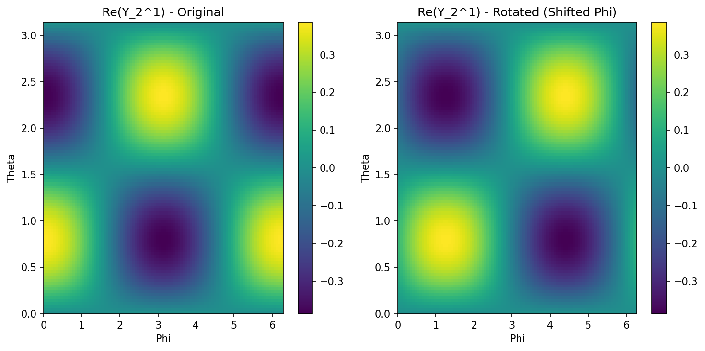

# 6.1 Group Theory and Equivariance in Neural Networks

The incorporation of symmetries into neural network architectures has led to some of the most profound successes in deep learning, fundamentally solving the problem of sample efficiency in the presence of known transformations. While a standard Convolutional Neural Network (CNN) provides translation equivariance, modern geometric deep learning seeks to generalize this to arbitrary groups—including rotations, reflections, and permutations. This chapter provides a rigorous, textbook-level exposition of group theory, representation theory, and their applications in designing equivariant neural networks, with a focus on Steerable CNNs and the Lie algebra of $SO(3)$.

## 1. The Geometry of Symmetry: Group Theory Foundations

Symmetry is formally defined through the language of **Group Theory**. A symmetry of an object is a transformation that leaves certain properties of the object invariant.

### 1.1 Formal Definition of a Group

A **group** $(G, \cdot)$ is a set $G$ equipped with a binary operation $\cdot: G \times G \to G$ (often called "multiplication") that satisfies the following four axioms:

1.  **Closure:** For all $a, b \in G$, $a \cdot b \in G$.
2.  **Associativity:** For all $a, b, c \in G$, $(a \cdot b) \cdot c = a \cdot (b \cdot c)$.
3.  **Identity:** There exists an element $e \in G$ (the identity) such that for all $a \in G$, $e \cdot a = a \cdot e = a$.
4.  **Invertibility:** For every $a \in G$, there exists an element $a^{-1} \in G$ such that $a \cdot a^{-1} = a^{-1} \cdot a = e$.

### 1.2 Group Actions

In machine learning, we are less interested in the group in isolation and more in how it acts on data (e.g., images, point clouds, or graphs).

!!! info "Definition (Group Action)"
    A group action of $G$ on a set $\mathcal{X}$ is a function $\alpha: G \times \mathcal{X} \to \mathcal{X}$ (denoted as $g \cdot x$) such that:
    1. $e \cdot x = x$ for all $x \in \mathcal{X}$.
    2. $(g_1 g_2) \cdot x = g_1 \cdot (g_2 \cdot x)$ for all $g_1, g_2 \in G$ and $x \in \mathcal{X}$.

## 2. Representation Theory

While group actions can be non-linear, deep learning relies on linear transformations within vector spaces. **Representation Theory** studies groups by representing their elements as linear transformations (matrices) on vector spaces.

### 2.1 Definitions and Basic Properties

!!! info "Definition (Representation)"
    A representation of a group $G$ on a vector space $V$ over a field $F$ (usually $\mathbb{C}$ or $\mathbb{R}$) is a group homomorphism:

    $$
    \rho: G \to GL(V)
    $$

    where $GL(V)$ is the general linear group of invertible linear transformations of $V$. This mapping preserves the group structure:

    $$
    \rho(g_1 g_2) = \rho(g_1) \rho(g_2), \quad \forall g_1, g_2 \in G
    $$

!!! info "Definition (Invariant Subspace)"
    A subspace $W \subseteq V$ is called $G$-invariant if $\rho(g)w \in W$ for all $g \in G$ and $w \in W$.

!!! info "Definition (Irreducible Representation - Irrep)"
    A representation $\rho$ is called **irreducible** if the only $G$-invariant subspaces are $\{0\}$ and $V$ itself. Irreps are the "atoms" of representation theory; any finite-dimensional representation of a finite group can be decomposed into a direct sum of irreps.

### 2.2 Maschke's Theorem

Maschke's Theorem is the cornerstone of the decomposition of representations.

!!! success "Theorem (Maschke's Theorem)"
    Let $G$ be a finite group and $\rho: G \to GL(V)$ be a representation of $G$ on a finite-dimensional vector space $V$ over a field $F$. If the characteristic of $F$ does not divide the order of the group $|G|$, and $W$ is a $G$-invariant subspace of $V$, then there exists a $G$-invariant complement $U$ such that $V = W \oplus U$.

**Proof:**
The strategy is to take an arbitrary projection onto $W$ and "average" it over the group to force equivariance.

1.  **Construct an initial projection:** Let $W$ be a $G$-invariant subspace. Let $\pi_0: V \to W$ be any linear projection such that $\pi_0(w) = w$ for all $w \in W$ and $\text{im}(\pi_0) = W$. Such a projection always exists by basic linear algebra.
2.  **Define the averaged projection:** We define a new operator $\pi: V \to V$ by:

    $$
    \pi = \frac{1}{|G|} \sum_{g \in G} \rho(g) \pi_0 \rho(g^{-1})
    $$

3.  **Verify Image in $W$:** For any $v \in V$, $\rho(g^{-1})v \in V$. Thus $\pi_0(\rho(g^{-1})v) \in W$. Since $W$ is $G$-invariant, $\rho(g) (\pi_0 \rho(g^{-1}) v) \in W$. The sum of elements in $W$ is in $W$. Thus $\text{im}(\pi) \subseteq W$.
4.  **Verify Identity on $W$:** Let $w \in W$. Since $W$ is $G$-invariant, $\rho(g^{-1})w \in W$. Thus $\pi_0(\rho(g^{-1})w) = \rho(g^{-1})w$. We have:

    $$
    \pi(w) = \frac{1}{|G|} \sum_{g \in G} \rho(g) \rho(g^{-1}) w = \frac{1}{|G|} \sum_{g \in G} w = \frac{|G|}{|G|} w = w
    $$

    Thus $\pi$ is a projection onto $W$.

5.  **Verify Equivariance:** For any $h \in G$:

    $$
    \rho(h) \pi \rho(h)^{-1} = \frac{1}{|G|} \sum_{g \in G} \rho(h) \rho(g) \pi_0 \rho(g^{-1}) \rho(h^{-1}) = \frac{1}{|G|} \sum_{g \in G} \rho(hg) \pi_0 \rho((hg)^{-1})
    $$

    Let $k = hg$. As $g$ ranges over $G$, $k$ also ranges over $G$ exactly once.

    $$
    \rho(h) \pi \rho(h)^{-1} = \frac{1}{|G|} \sum_{k \in G} \rho(k) \pi_0 \rho(k^{-1}) = \pi
    $$

    Thus $\rho(h) \pi = \pi \rho(h)$.

6.  **Construct the complement:** Let $U = \ker(\pi)$. Since $\pi$ is a projection, $V = \text{im}(\pi) \oplus \ker(\pi) = W \oplus U$. We check if $U$ is $G$-invariant. Let $u \in U$. Then $\pi(u) = 0$. For any $g \in G$:

    $$
    \pi(\rho(g)u) = \rho(g) \pi(u) = \rho(g) \cdot 0 = 0
    $$

    Thus $\rho(g)u \in \ker(\pi) = U$. $U$ is $G$-invariant. $\blacksquare$

### 2.3 Schur's Lemma

Schur's Lemma describes the nature of equivariant maps (intertwiners) between irreducible representations.

!!! success "Theorem (Schur's Lemma)"
    Let $\rho_1: G \to GL(V_1)$ and $\rho_2: G \to GL(V_2)$ be two irreducible representations of $G$. Let $\phi: V_1 \to V_2$ be a $G$-equivariant linear map, i.e., $\phi \rho_1(g) = \rho_2(g) \phi$ for all $g \in G$.
    1. If $\rho_1$ and $\rho_2$ are not isomorphic, then $\phi = 0$.
    2. If $V_1 = V_2$ (over an algebraically closed field like $\mathbb{C}$), then $\phi = \lambda I$ for some $\lambda \in \mathbb{C}$.

    **Significance:** This theorem implies that the "space of equivariant layers" between irreps is extremely constrained—either it's zero or just a scalar multiple of the identity. This is why we decompose features into irreps: it makes the equivariance constraints easy to solve.

## 3. Lie Groups and Lie Algebras: Continuous Symmetries

While finite groups (like $C_4$ or $D_4$) are important, many physical symmetries are continuous, like translations ($\mathbb{R}^n$) and rotations ($SO(n)$).

### 3.1 Lie Groups as Manifolds

A **Lie Group** is a group that is also a smooth manifold, such that the group operations (multiplication and inversion) are smooth maps.

**Example: $SO(3)$**
The Special Orthogonal group in 3D:

$$
SO(3) = \{ R \in \mathbb{R}^{3 \times 3} \mid R^T R = I, \det(R) = 1 \}
$$

It is a 3-dimensional manifold (isomorphic to $\mathbb{R}P^3$).

### 3.2 Lie Algebras: The Tangent Space at Identity

The **Lie Algebra** $\mathfrak{g}$ of a Lie group $G$ is the tangent space at the identity element $e \in G$, denoted $T_e G$.

For matrix Lie groups, we can find the Lie algebra by considering a path $R(t)$ in $G$ such that $R(0) = I$. The derivative $R'(0)$ is an element of the Lie algebra.

**Derivation for $\mathfrak{so}(3)$:**
Let $R(t) \in SO(3)$ with $R(0) = I$. Since $R(t)^T R(t) = I$, we differentiate with respect to $t$ at $t=0$:

$$
\frac{d}{dt} [R(t)^T R(t)] = R'(t)^T R(t) + R(t)^T R'(t) = 0
$$

At $t=0$:

$$
R'(0)^T I + I^T R'(0) = R'(0)^T + R'(0) = 0 \implies R'(0)^T = -R'(0)
$$

Thus, the Lie algebra $\mathfrak{so}(3)$ consists of all $3 \times 3$ **skew-symmetric matrices**:

$$
\mathfrak{so}(3) = \{ A \in \mathbb{R}^{3 \times 3} \mid A^T = -A \}
$$

### 3.3 Generators and Commutation Relations

A basis for $\mathfrak{so}(3)$ is given by the generators of rotations around the $x, y, z$ axes:

$$
L_x = \begin{pmatrix} 0 & 0 & 0 \\ 0 & 0 & -1 \\ 0 & 1 & 0 \end{pmatrix}, \quad L_y = \begin{pmatrix} 0 & 0 & 1 \\ 0 & 0 & 0 \\ -1 & 0 & 0 \end{pmatrix}, \quad L_z = \begin{pmatrix} 0 & -1 & 0 \\ 1 & 0 & 0 \\ 0 & 0 & 0 \end{pmatrix}
$$

Any $A \in \mathfrak{so}(3)$ can be written as $A = \omega_x L_x + \omega_y L_y + \omega_z L_z$. The group element is recovered via the **exponential map**:

$$
R = \exp(A) = \sum_{k=0}^{\infty} \frac{A^k}{k!}
$$

The Lie algebra is equipped with the **Lie Bracket** $[A, B] = AB - BA$. For $\mathfrak{so}(3)$, the generators satisfy:

$$
[L_x, L_y] = L_z, \quad [L_y, L_z] = L_x, \quad [L_z, L_x] = L_y
$$

More generally, $[L_i, L_j] = \sum_k \epsilon_{ijk} L_k$, where $\epsilon_{ijk}$ is the Levi-Civita symbol.

## 4. Equivariance in Neural Networks

A neural network is a composition of layers $f = L_k \circ \sigma \circ \dots \circ L_1$. For the whole network to be equivariant, each layer must be equivariant.

### 4.1 Formal Definition of Equivariance

Let $G$ be a group acting on the input space $\mathcal{X}$ via $\rho_{\mathcal{X}}$ and on the output space $\mathcal{Y}$ via $\rho_{\mathcal{Y}}$. A map $f: \mathcal{X} \to \mathcal{Y}$ is **equivariant** if:

$$
f(\rho_{\mathcal{X}}(g) x) = \rho_{\mathcal{Y}}(g) f(x), \quad \forall g \in G, \forall x \in \mathcal{X}
$$

If $\rho_{\mathcal{Y}}(g) = I$ for all $g$, the map is **invariant**.

### 4.2 The Equivariant Convolution Constraint

Consider a convolution layer $f(x) = K * x$. Let the group $G$ act on the coordinates of the signal (e.g., rotation of the image plane). For the convolution to be equivariant, the kernel $K$ must satisfy a specific symmetry constraint.

For a kernel $K: \mathbb{R}^d \to \mathbb{R}^{c_{out} \times c_{in}}$, the constraint is:

$$
K(g \cdot v) = \rho_{out}(g) K(v) \rho_{in}(g)^{-1}
$$

This is a system of linear equations. The solutions to this equation define the space of allowed kernels.

### 4.3 Steerable CNNs

In **Steerable CNNs**, we choose the feature spaces to be direct sums of irreducible representations.

$$
V = \bigoplus_l V_l
$$

For $SO(2)$, the irreps are the circular harmonics $e^{im\theta}$. For $SO(3)$, the irreps are the **Spherical Harmonics** $Y_l^m(\theta, \phi)$ of degree $l$.
The kernel $K$ is expanded in a basis of these harmonics. A "Steerable" kernel means that we can rotate the filter by simply multiplying its coefficients by a matrix (the **Wigner D-matrix** for $SO(3)$).

## 5. Worked Examples

### Example 1: Dihedral Group $D_4$ on a Grid
The group $D_4$ consists of 8 elements: 4 rotations $\{0^\circ, 90^\circ, 180^\circ, 270^\circ\}$ and 4 reflections.
Suppose we have a $3 \times 3$ kernel $K$. For $K$ to be invariant under $90^\circ$ rotation:

$$
K = \begin{pmatrix} a & b & c \\ d & e & f \\ g & h & i \end{pmatrix} \xrightarrow{Rot} \begin{pmatrix} g & d & a \\ h & e & b \\ i & f & c \end{pmatrix}
$$

Setting these equal:
$a=g=i=c$ (corners must be same)
$b=d=h=f$ (edges must be same)
$e=e$ (center can be anything)

Thus, a rotation-invariant $3 \times 3$ kernel has only 3 free parameters:

$$
K = \begin{pmatrix} a & b & a \\ b & e & b \\ a & b & a \end{pmatrix}
$$

### Example 2: Permutation Equivariance in DeepSets
Let $G = S_n$ (symmetric group) acting on $x \in \mathbb{R}^n$ by permuting indices.
Consider a linear layer $f(x) = Wx + b$. For equivariance:
$W(Px) = P(Wx) \implies WP = PW \implies W = P^T W P$ for all permutation matrices $P$.

As derived in the preliminary reading, this forces $W$ to have only two parameters:
$W_{ii} = \lambda$ and $W_{ij} = \gamma$ for $i \neq j$.
Thus:

$$
[Wx]_i = \lambda x_i + \gamma \sum_{j \neq i} x_j = (\lambda - \gamma) x_i + \gamma \sum_j x_j
$$

This is exactly the form used in DeepSets and PointNet.

### Example 3: $SO(3)$ Rodrigues Rotation Formula
Given a rotation vector $\mathbf{\omega} \in \mathbb{R}^3$, where $\theta = \|\mathbf{\omega}\|$ is the angle and $\mathbf{n} = \mathbf{\omega}/\theta$ is the axis. The Lie algebra element is $A = \theta \hat{\mathbf{n}}$, where $\hat{\mathbf{n}}$ is the skew-symmetric matrix:

$$
\hat{\mathbf{n}} = \begin{pmatrix} 0 & -n_z & n_y \\ n_z & 0 & -n_x \\ -n_y & n_x & 0 \end{pmatrix}
$$

The exponential map $\exp(A)$ yields the Rodrigues formula:

$$
R = I + (\sin \theta) \hat{\mathbf{n}} + (1 - \cos \theta) \hat{\mathbf{n}}^2
$$

**Proof Sketch:** Use the Taylor expansion of $\exp(A)$ and notice that $\hat{\mathbf{n}}^3 = -\hat{\mathbf{n}}$. Group the odd and even powers of $\theta$ to find the $\sin$ and $\cos$ series.

## 6. Coding Demonstrations

### Demo 1: Implementing a $C_4$-Equivariant Convolution (G-CNN)

In a G-CNN, we lift the signal to the group $G$. For $C_4$, the feature map has 4 channels per original channel, representing the signal at 4 orientations.

```python
import torch
import torch.nn as nn
import torch.nn.functional as F

class C4Conv(nn.Module):
    def __init__(self, in_channels, out_channels, kernel_size):
        super().__init__()
        self.in_channels = in_channels
        self.out_channels = out_channels
        self.kernel_size = kernel_size
        # The weight is only for one orientation
        self.weight = nn.Parameter(torch.randn(out_channels, in_channels, kernel_size, kernel_size))

    def forward(self, x):
        # x shape: [B, in_channels * 4, H, W] if lifted, else [B, in_channels, H, W]
        # For simplicity, let's assume input is [B, in_channels, H, W] (first layer)
        
        weights = []
        for i in range(4):
            # Rotate the weight matrix by 90*i degrees
            w_rot = torch.rot90(self.weight, k=i, dims=[-2, -1])
            weights.append(w_rot)
        
        # Concatenate rotated weights
        all_weights = torch.cat(weights, dim=0) # [out_channels * 4, in_channels, K, K]
        
        return F.conv2d(x, all_weights, padding=self.kernel_size//2)

# Verification
conv = C4Conv(1, 1, 3)
x = torch.randn(1, 1, 10, 10)
x_rot = torch.rot90(x, k=1, dims=[-2, -1])

out = conv(x) # [1, 4, 10, 10]
out_rot = conv(x_rot) # [1, 4, 10, 10]

# For a G-CNN, rotating the input corresponds to a cyclic shift of the group channels
# and a spatial rotation of the output.
out_shifted = torch.roll(torch.rot90(out, k=1, dims=[-2, -1]), shifts=1, dims=1)
diff = (out_shifted - out_rot).abs().max()
print(f"G-CNN Equivariance Error: {diff.item():.6e}")
```

```
G-CNN Equivariance Error: 9.536743e-07
```

### Demo 2: Spherical Harmonics and Steerability

We visualize how a spherical harmonic $Y_l^m$ transforms under rotation.

```python
import matplotlib
matplotlib.use('Agg')
import numpy as np
from scipy.special import sph_harm_y
import matplotlib.pyplot as plt

def get_spherical_harmonic(l, m, res=100):
    phi = np.linspace(0, 2*np.pi, res)
    theta = np.linspace(0, np.pi, res)
    phi, theta = np.meshgrid(phi, theta)

    # sph_harm_y(l, m, theta_polar, phi_azimuthal)
    y = sph_harm_y(l, m, theta, phi)
    return y

l, m = 2, 1
y_lm = get_spherical_harmonic(l, m)

plt.figure(figsize=(10, 5))
plt.subplot(121)
plt.imshow(np.real(y_lm), extent=[0, 2*np.pi, 0, np.pi], aspect='auto')
plt.title(f"Re(Y_{l}^{m}) - Original")
plt.xlabel("Phi")
plt.ylabel("Theta")
plt.colorbar()

# "Rotating" in spherical coordinates (simple shift for demo)
plt.subplot(122)
plt.imshow(np.roll(np.real(y_lm), shift=20, axis=1), extent=[0, 2*np.pi, 0, np.pi], aspect='auto')
plt.title(f"Re(Y_{l}^{m}) - Rotated (Shifted Phi)")
plt.xlabel("Phi")
plt.ylabel("Theta")
plt.colorbar()

plt.tight_layout()
plt.savefig('docs/lectures/06-geometry-topology/figures/06-1-demo2.png', dpi=150, bbox_inches='tight')
plt.close()
```



## 7. Advanced Topic: Gauge Equivariance

On general manifolds (like a sphere or a torus), there is no global coordinate system. Instead, we use **Gauge Equivariance**. A gauge is a local choice of reference frame. When we move from one point to another, the reference frame might rotate (modeled by the **Connection** in differential geometry).

Gauge equivariant kernels must satisfy:

$$
K(g \cdot v) = \rho_{out}(g) K(v) \rho_{in}(g)^{-1}
$$

where $g$ is an element of the **Structure Group** (often $SO(2)$ for surfaces). This allows us to define convolutions on curved surfaces that are independent of the local coordinate choice.

## 8. Summary and Conclusion

Equivariance provides a mathematically rigorous way to bake inductive biases into neural networks. By utilizing the tools of representation theory:

1. We decompose signals into **irreps** (like Fourier components).
2. We solve the **Equivariant Kernel Constraint** to find the valid space of weights.
3. We ensure that the network's internal representations transform predictably under the group action.

This leads to models that are more parameter-efficient, generalize better to unseen orientations, and are grounded in the fundamental symmetries of our physical world.

## References

1. Cohen, T. S., & Welling, M. (2016). Group equivariant convolutional networks. ICML.
2. Weiler, M., & Cesa, G. (2019). General E(2)-Equivariant Steerable CNNs. NeurIPS.
3. Thomas, N., et al. (2018). Tensor Field Networks: Rotation- and Translation-Equivariant Neural Networks for 3D Point Clouds.
4. Serre, J. P. (1977). Linear Representations of Finite Groups. Springer-Verlag.

