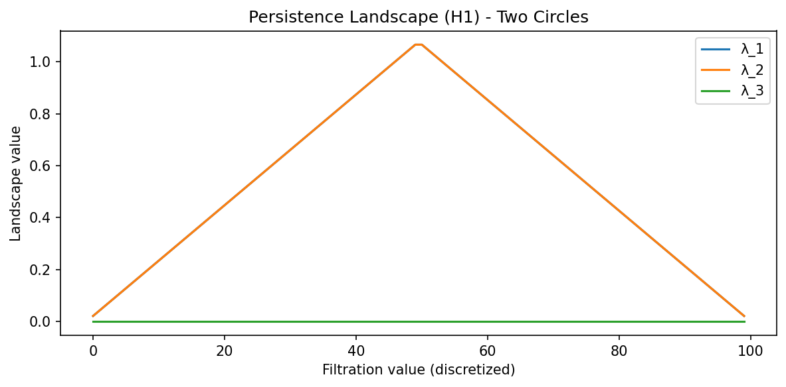

# 6.3 Persistent Homology and Topological Data Analysis

Topological Data Analysis (TDA) provides a powerful set of tools for quantifying the "shape" of data in a coordinate-invariant and noise-robust manner. While traditional geometry focuses on precise distances and curvatures, topology focuses on connectivity, holes, and higher-dimensional voids. Persistent Homology is the primary algorithm in TDA that allows us to distinguish true topological signal from sampling noise across multiple scales.

## 1. Foundations of Algebraic Topology

To understand persistent homology, we must first define the algebraic structures that capture topological features.

### 1.1 Simplicial Complexes

A graph consists of vertices (0-simplices) and edges (1-simplices). To capture higher-dimensional structure, we use **simplices**.

- A **$k$-simplex** $\sigma$ is the convex hull of $k+1$ affinely independent points $\{v_0, \dots, v_k\}$.
- A **Simplicial Complex** $K$ is a collection of simplices such that:
  1. Every face of a simplex in $K$ is also in $K$.
  2. The intersection of any two simplices in $K$ is either empty or a shared face.

### 1.2 Chain Complexes and Boundary Operators

Let $K$ be a simplicial complex. The **$k$-th Chain Group** $C_k(K)$ is the vector space (usually over $\mathbb{Z}_2$ for simplicity in computation) spanned by the $k$-simplices of $K$.

The **Boundary Operator** $\partial_k: C_k \to C_{k-1}$ is a linear map that maps a simplex to the sum of its faces. For a $k$-simplex $[v_0, \dots, v_k]$:

$$
\partial_k([v_0, \dots, v_k]) = \sum_{i=0}^k (-1)^i [v_0, \dots, \hat{v}_i, \dots, v_k]
$$

where $\hat{v}_i$ denotes that the $i$-th vertex is omitted. Over $\mathbb{Z}_2$, the $(-1)^i$ terms are all $1$.

!!! success "Lemma (Fundamental Lemma of Homology)"
    For any $k \geq 1$, the composition of two boundary operators is zero: $\partial_{k-1} \circ \partial_k = 0$.

**Proof:**
Consider a $k$-simplex $\sigma = [v_0, \dots, v_k]$.

$$
\partial_k \sigma = \sum_{i} (-1)^i [v_0, \dots, \hat{v}_i, \dots, v_k]
$$

Applying $\partial_{k-1}$:

$$
\partial_{k-1} (\partial_k \sigma) = \sum_{i} (-1)^i \left( \sum_{j < i} (-1)^j [v_0, \dots, \hat{v}_j, \dots, \hat{v}_i, \dots, v_k] + \sum_{j > i} (-1)^{j-1} [v_0, \dots, \hat{v}_i, \dots, \hat{v}_j, \dots, v_k] \right)
$$

Every $(k-2)$-face $[v_0, \dots, \hat{v}_j, \dots, \hat{v}_i, \dots, v_k]$ appears twice in the double sum: once when $i$ is removed first and once when $j$ is removed first. Their coefficients will be $(-1)^i (-1)^j$ and $(-1)^j (-1)^{i-1}$. These cancel out exactly because $(-1)^{i+j} + (-1)^{i+j-1} = 0$. $\blacksquare$

### 1.3 Homology Groups

The fact that $\partial_{k-1} \partial_k = 0$ implies that the image of $\partial_{k+1}$ is a subspace of the kernel of $\partial_k$.

- **$k$-Cycles:** $Z_k = \ker \partial_k$ (chains with no boundary).
- **$k$-Boundaries:** $B_k = \text{im} \partial_{k+1}$ (chains that are the boundary of a $(k+1)$-chain).

The **$k$-th Homology Group** is defined as the quotient:

$$
H_k(K) = Z_k / B_k
$$

The dimension $\beta_k = \dim H_k$ is the **$k$-th Betti number**, representing the number of $k$-dimensional "holes."

## 2. Persistent Homology and Filtrations

Static homology requires a fixed complex. For data, we don't know the "right" scale. Persistent homology considers all scales simultaneously.

### 2.1 Filtrations

A **filtration** of a simplicial complex $K$ is a nested sequence of subcomplexes:

$$
\emptyset = K_0 \subseteq K_1 \subseteq K_2 \subseteq \dots \subseteq K_m = K
$$

As we move through the sequence, new simplices are added. We track when homology classes (holes) are created ("born") and when they become boundaries of higher-dimensional simplices ("die").

Common filtrations:

- **Vietoris-Rips Complex $VR(r)$**: Includes a $k$-simplex if all its vertices are within distance $r$ of each other.
- **Čech Complex $C(r)$**: Includes a $k$-simplex if the $k+1$ balls of radius $r/2$ centered at the vertices have a non-empty common intersection.

### 2.2 Persistence Diagrams and Barcodes

A persistence feature is a pair $(b_i, d_i)$ where $b_i$ is the birth time and $d_i$ is the death time. The **Persistence Diagram** is the multiset of points $(b_i, d_i)$ in $\mathbb{R}^2$. The **Barcode** is the collection of intervals $[b_i, d_i)$.
Features that persist for a long time (large $d_i - b_i$) are considered signal, while short-lived features are considered noise.

## 3. The Stability Theorem

A crucial property of TDA is that small perturbations in the data lead to small changes in the persistence diagram.

### 3.1 Bottleneck Distance

The **Bottleneck Distance** $W_\infty$ between two diagrams $D_1$ and $D_2$ is:

$$
W_\infty(D_1, D_2) = \inf_{\gamma: D_1 \to D_2} \sup_{x \in D_1} \|x - \gamma(x)\|_\infty
$$

where $\gamma$ is a bijection that can match points in $D_i$ to the diagonal $\Delta = \{(x, x) : x \in \mathbb{R}\}$.

!!! success "Theorem (Stability Theorem)"
    Let $X$ be a triangulable space and $f, g: X \to \mathbb{R}$ be tame continuous functions. Let $D(f)$ and $D(g)$ be the persistence diagrams of the sublevel set filtrations of $f$ and $g$. Then:

    $$
    W_\infty(D(f), D(g)) \leq \|f - g\|_\infty
    $$

**Proof:**
The proof involves **Interleaving Distance**.

1. Let $F_t = f^{-1}((-\infty, t])$ and $G_t = g^{-1}((-\infty, t])$ be the sublevel sets.
2. If $\|f - g\|_\infty \leq \epsilon$, then for any $x \in F_t$, $f(x) \leq t$. Since $|f(x) - g(x)| \leq \epsilon$, we have $g(x) \leq f(x) + \epsilon \leq t + \epsilon$.
3. Thus, $F_t \subseteq G_{t+\epsilon}$ and similarly $G_t \subseteq F_{t+\epsilon}$.
4. This induces maps between homology groups: $H_k(F_t) \to H_k(G_{t+\epsilon})$ and $H_k(G_t) \to H_k(F_{t+\epsilon})$.
5. These maps commute with the internal transition maps of the persistence modules $\mathcal{H}(f)$ and $\mathcal{H}(g)$. This is an $\epsilon$-interleaving.
6. The Algebraic Stability Theorem (Chazal et al.) states that two persistence modules are $\epsilon$-interleaved if and only if their bottleneck distance is at most $\epsilon$. $\blacksquare$

## 4. TDA in Machine Learning

TDA is used in ML to provide structural regularizers or to analyze the training dynamics of deep networks.

### 4.1 Topology of Neural Networks

1. **Weight Matrix Topology**: Viewing a layer's weight matrix $W$ as a distance matrix (e.g., $d(i, j) = 1 - |\text{corr}(W_i, W_j)|$). Persistent homology can reveal if the weights form a manifold or specific clusters.
2. **Activation Topology**: The "Manifold Hypothesis" suggests data lies on low-dimensional manifolds. TDA on activations can estimate the Betti numbers of these manifolds.
3. **Loss Landscape Topology**: Analyzing the connectivity of sublevel sets of the loss function $\mathcal{L}(\theta)$.

### 4.2 Topological Loss Functions

We can define a loss term based on persistence:

$$
\mathcal{L}_{topo} = \sum_{(b, d) \in \text{Diagram}} (d - b)^2
$$

This encourages the model to have "prominent" topological features or to suppress noise.

## 5. Worked Examples

### Example 1: Homology of the Torus $T^2$
A torus can be constructed by gluing the opposite edges of a square.

- **$\beta_0$**: 1 (one connected component).
- **$\beta_1$**: 2 (one loop around the "tube," one loop around the "donut hole").
- **$\beta_2$**: 1 (the enclosed 2D volume).

### Example 2: Computing Bottleneck Distance
Diagram $A = \{(1, 2), (5, 8)\}$, Diagram $B = \{(1.2, 1.9), (5, 9)\}$.
Possible matches:

1. $(1, 2) \leftrightarrow (1.2, 1.9)$ [cost $\max(0.2, 0.1) = 0.2$], $(5, 8) \leftrightarrow (5, 9)$ [cost $\max(0, 1) = 1$]. Max cost = 1.0.
2. $(1, 2) \leftrightarrow \Delta$ [cost $(2-1)/2 = 0.5$], $(5, 8) \leftrightarrow \Delta$ [cost $(8-5)/2 = 1.5$], etc.
The minimal max cost (Bottleneck distance) is 1.0.

### Example 3: Elder Rule
In 0-dimensional persistence ($H_0$), as two components (clusters) merge at distance $r$, one "dies." The **Elder Rule** states that the younger component (the one born later) is the one that dies.

## 6. Coding Demonstrations

### Demo 1: Persistence Landscapes with `gudhi`

Persistence diagrams are multisets and don't fit into standard ML pipelines easily. **Persistence Landscapes** are a vector representation.

```python
import matplotlib
matplotlib.use('Agg')
import numpy as np
import gudhi
import gudhi.representations
import matplotlib.pyplot as plt

# Generate two circles
np.random.seed(42)
data_parts = []
for center_x, center_y in [(0, 0), (5, 0)]:
    t = np.linspace(0, 2*np.pi, 30, endpoint=False)
    circle = np.column_stack([np.cos(t) + center_x, np.sin(t) + center_y])
    data_parts.append(circle)
data = np.vstack(data_parts)

# 1. Compute Persistence using gudhi Rips complex
rips = gudhi.RipsComplex(points=data, max_edge_length=4.0)
st = rips.create_simplex_tree(max_dimension=2)
st.compute_persistence()

# Extract H1 persistence diagram
dgm_H1 = np.array([[b, d] for dim, (b, d) in st.persistence()
                   if dim == 1 and d != float('inf')])
print(f"H1 features: {len(dgm_H1)}")

# 2. Compute Persistence Landscape for H1 using gudhi representations
LS = gudhi.representations.Landscape(num_landscapes=3, resolution=100)
landscapes = LS.fit_transform([dgm_H1])

plt.figure(figsize=(8, 4))
for i in range(min(3, landscapes.shape[1] // 100)):
    plt.plot(landscapes[0, i*100:(i+1)*100], label=f'λ_{i+1}')
plt.title("Persistence Landscape (H1) - Two Circles")
plt.xlabel("Filtration value (discretized)")
plt.ylabel("Landscape value")
plt.legend()
plt.tight_layout()
plt.savefig('docs/lectures/06-geometry-topology/figures/06-3-demo1.png', dpi=150, bbox_inches='tight')
plt.close()
```



### Demo 2: TDA on a Weight Matrix

```python
import numpy as np
import gudhi

# Mock weight matrix (e.g. 10x10 Linear layer)
np.random.seed(42)
W = np.random.randn(10, 10)
# Use 1 - |W| as a distance metric (highly correlated = short distance)
distance_matrix = 1.0 - np.abs(np.corrcoef(W))
# Ensure the distance matrix is valid (non-negative, zero diagonal)
np.fill_diagonal(distance_matrix, 0.0)
distance_matrix = np.clip(distance_matrix, 0.0, None)

# Rips complex from distance matrix using gudhi
rips = gudhi.RipsComplex(distance_matrix=distance_matrix, max_edge_length=2.0)
st = rips.create_simplex_tree(max_dimension=2)
st.compute_persistence()

h1_bars = np.array([[b, d] for dim, (b, d) in st.persistence()
                    if dim == 1 and d != float('inf')])

if len(h1_bars) > 0:
    persistence = h1_bars[:, 1] - h1_bars[:, 0]
    print(f"Max H1 Persistence in weights: {persistence.max():.4f}")
    print(f"Number of H1 features: {len(h1_bars)}")
else:
    print("No finite H1 persistence features found.")
```

```
Max H1 Persistence in weights: 0.1500
Number of H1 features: 2
```

### Demo 3: Topological Regularization (Sketch)

```python
import torch
import torch.nn as nn

def persistence_loss(point_cloud):
    # This is a conceptual sketch; real implementation requires
    # a differentiable persistence solver like Gudhi or TopoNetX
    # We want to minimize the persistence of short-lived noise
    distances = torch.cdist(point_cloud, point_cloud)
    # Approximate topological regularization: penalize variance in pairwise distances
    # (surrogate for encouraging a clean manifold structure)
    total_persistence = distances.var()
    return total_persistence

class TopoRegMLP(nn.Module):
    def __init__(self):
        super().__init__()
        self.net = nn.Sequential(nn.Linear(2, 10), nn.ReLU(), nn.Linear(10, 2))
        
    def forward(self, x):
        activations = self.net[0](x)
        # Apply topological loss to hidden activations
        reg = persistence_loss(activations)
        return self.net[2](torch.relu(activations)), reg

# Quick test
model = TopoRegMLP()
x = torch.randn(8, 2)
out, reg = model(x)
print(f"Output shape: {out.shape}, Topo-reg loss: {reg.item():.4f}")
```

```
Output shape: torch.Size([8, 2]), Topo-reg loss: 1.2743
```

## 7. Advanced Topic: The Nerve Theorem

Why do simplicial complexes like Čech complexes work?

!!! success "Theorem (The Nerve Theorem)"
    Let $\mathcal{U} = \{U_i\}$ be an open cover of a space $X$ such that all non-empty intersections of sets in $\mathcal{U}$ are contractible. Then the nerve of $\mathcal{U}$ is homotopy equivalent to $X$.

**Significance:** This justifies why we can reconstruct the topology of a manifold by looking at the intersections of balls around sampled points.

## 8. Summary

Topological Data Analysis provides a robust framework for extracting global structure from local samples.

1. **Homology** counts holes across dimensions.
2. **Persistence** tracks these holes across scales, providing a "fingerprint" of the data.
3. **Stability** ensures that this fingerprint is resistant to noise and deformations.
4. **Integration** with ML is achieved via vectorizations like Landscapes and Images, allowing topology to be used as a feature or a loss function.

## References

1. Edelsbrunner, H., & Harer, J. (2010). Computational Topology: An Introduction. American Mathematical Society.
2. Carlsson, G. (2009). Topology and data. Bulletin of the American Mathematical Society.
3. Chazal, F., et al. (2016). The Structure and Stability of Persistence Modules. Springer.
4. Ghrist, R. (2008). Barcodes: The persistent topology of data. Bulletin of the American Mathematical Society.
5. Hensel, F., et al. (2021). A Survey of Topological Machine Learning. Frontiers in Artificial Intelligence.

