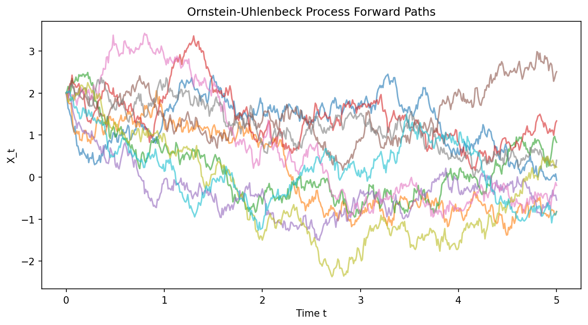

# 7.2 Diffusion Models, SDEs, and Score Matching

## 1. Introduction to Stochastic Differential Equations (SDEs)

Generative diffusion models transform complex data distributions into simple noise distributions via a continuous-time forward process, and subsequently generate data by simulating the reverse process. Both processes are naturally described by Stochastic Differential Equations (SDEs).

An Itô SDE takes the general form:

$$
dX_t = \mu(X_t, t) dt + \sigma(X_t, t) dW_t
$$

Where $X_t \in \mathbb{R}^D$ is the random state variable, $\mu(\cdot, \cdot)$ is the **drift coefficient**, $\sigma(\cdot, \cdot)$ is the **diffusion coefficient**, and $W_t$ is a standard Brownian motion (Wiener process).

In this section, we provide rigorous derivations of two fundamental pillars of continuous-time stochastic processes and diffusion models: the Fokker-Planck Equation (which describes how the probability density of $X_t$ evolves over time) and the Girsanov Theorem (which describes how changing the drift of an SDE affects the underlying probability measure).

---

## 2. The Fokker-Planck Equation (Kolmogorov Forward Equation)

The Fokker-Planck equation gives the deterministic partial differential equation (PDE) that governs the time evolution of the probability density function $p(x, t)$ of the random variable $X_t$ defined by an SDE.

### 2.1 Theorem Statement

!!! success "Theorem (Fokker-Planck)"
    Let $X_t$ be a $D$-dimensional Itô process given by $dX_t = \mu(X_t, t)dt + \sigma(X_t, t)dW_t$. Assuming the probability density $p(x, t)$ of $X_t$ exists and is sufficiently smooth, it satisfies the PDE:

    $$
    \frac{\partial p(x, t)}{\partial t} = -\sum_{i=1}^D \frac{\partial}{\partial x_i} [\mu_i(x, t) p(x, t)] + \frac{1}{2} \sum_{i=1}^D \sum_{j=1}^D \frac{\partial^2}{\partial x_i \partial x_j} [D_{ij}(x, t) p(x, t)]
    $$

    where $D(x, t) = \sigma(x, t) \sigma(x, t)^T$ is the diffusion tensor.

### 2.2 Rigorous Derivation

**Step 1: Itô's Lemma on a Test Function**

Let $f(x)$ be an arbitrary, smooth, compactly supported test function $f \in C_c^\infty(\mathbb{R}^D)$. We apply multi-dimensional Itô's Lemma to $f(X_t)$:

$$
df(X_t) = \sum_{i=1}^D \frac{\partial f}{\partial x_i} dX_{t,i} + \frac{1}{2} \sum_{i,j=1}^D \frac{\partial^2 f}{\partial x_i \partial x_j} dX_{t,i} dX_{t,j}
$$

Substituting $dX_t$ and using the standard Itô calculus rules ($dt dt = 0, dt dW = 0, dW_i dW_j = \delta_{ij} dt$):

$$
df(X_t) = \left( \sum_{i=1}^D \mu_i(X_t, t) \frac{\partial f}{\partial x_i} + \frac{1}{2} \sum_{i,j=1}^D [\sigma \sigma^T]_{ij}(X_t, t) \frac{\partial^2 f}{\partial x_i \partial x_j} \right) dt + \sum_{i=1}^D \left( \nabla f^T \sigma \right)_i dW_{t,i}
$$

**Step 2: Taking Expectations**

We integrate from $0$ to $t$ and take the expected value $\mathbb{E}$. The expectation of the Itô integral with respect to Brownian motion is zero (it is a martingale). Thus:

$$
\mathbb{E}[f(X_t)] - \mathbb{E}[f(X_0)] = \int_0^t \mathbb{E} \left[ \sum_{i=1}^D \mu_i(X_s, s) \frac{\partial f(X_s)}{\partial x_i} + \frac{1}{2} \sum_{i,j=1}^D D_{ij}(X_s, s) \frac{\partial^2 f(X_s)}{\partial x_i \partial x_j} \right] ds
$$

Differentiating both sides with respect to time $t$:

$$
\frac{d}{dt} \mathbb{E}[f(X_t)] = \mathbb{E} \left[ \sum_{i=1}^D \mu_i(X_t, t) \frac{\partial f(X_t)}{\partial x_i} + \frac{1}{2} \sum_{i,j=1}^D D_{ij}(X_t, t) \frac{\partial^2 f(X_t)}{\partial x_i \partial x_j} \right]
$$

**Step 3: Rewriting Expectations as Integrals**

We rewrite the expectations explicitly using the probability density $p(x, t)$:

$$
\int_{\mathbb{R}^D} f(x) \frac{\partial p(x, t)}{\partial t} dx = \int_{\mathbb{R}^D} \left( \sum_{i=1}^D \mu_i(x, t) \frac{\partial f}{\partial x_i} + \frac{1}{2} \sum_{i,j=1}^D D_{ij}(x, t) \frac{\partial^2 f}{\partial x_i \partial x_j} \right) p(x, t) dx
$$

**Step 4: Integration by Parts**

We apply integration by parts to shift the derivatives from the test function $f(x)$ onto the density $p(x, t)$. Because $f$ is compactly supported, boundary terms vanish at infinity.

For the drift term (one integration by parts):

$$
\int \mu_i(x, t) p(x, t) \frac{\partial f}{\partial x_i} dx = -\int f(x) \frac{\partial}{\partial x_i} [\mu_i(x, t) p(x, t)] dx
$$

For the diffusion term (two integrations by parts):

$$
\int D_{ij}(x, t) p(x, t) \frac{\partial^2 f}{\partial x_i \partial x_j} dx = \int f(x) \frac{\partial^2}{\partial x_i \partial x_j} [D_{ij}(x, t) p(x, t)] dx
$$

**Step 5: Concluding the PDE**

Substituting these back into the integral equation:

$$
\int_{\mathbb{R}^D} f(x) \left[ \frac{\partial p}{\partial t} + \sum_{i=1}^D \frac{\partial}{\partial x_i}(\mu_i p) - \frac{1}{2} \sum_{i,j=1}^D \frac{\partial^2}{\partial x_i \partial x_j}(D_{ij} p) \right] dx = 0
$$

Since this must hold for any arbitrary test function $f(x)$, the term in the brackets must be identically zero almost everywhere. Rearranging yields the Fokker-Planck equation. $\blacksquare$

---

## 3. Girsanov Theorem and Change of Measure

In diffusion models, we are deeply concerned with mapping between a complex data distribution (the true path measure $\mathbb{P}$) and a prior noise distribution (a reference path measure $\mathbb{Q}$). The Girsanov Theorem provides the exact mathematical framework for this by defining the Radon-Nikodym derivative between two measures induced by SDEs with different drifts.

### 3.1 Theorem Statement

!!! success "Theorem (Girsanov)"
    Let $(\Omega, \mathcal{F}, \mathbb{Q})$ be a probability space where $W_t$ is a standard Brownian motion. Consider an adapted process $\gamma_t$ satisfying the Novikov condition:

    $$
    \mathbb{E}_{\mathbb{Q}} \left[ \exp\left( \frac{1}{2} \int_0^T \|\gamma_t\|^2 dt \right) \right] < \infty
    $$

    Define the continuous exponential martingale $Z_t$:

    $$
    Z_t = \exp\left( \int_0^t \gamma_s^T dW_s - \frac{1}{2} \int_0^t \|\gamma_s\|^2 ds \right)
    $$

    If we define a new probability measure $\mathbb{P}$ such that $\frac{d\mathbb{P}}{d\mathbb{Q}} = Z_T$, then under the new measure $\mathbb{P}$, the process defined by:

    $$
    \tilde{W}_t = W_t - \int_0^t \gamma_s ds
    $$

    is a standard Brownian motion.

### 3.2 Proof (Sketch using Itô Calculus)

A full proof requires deep martingale theory, but we provide the core Itô calculus machinery demonstrating that $Z_t$ is a martingale, which is the cornerstone of the theorem.

**Step 1: Itô's Lemma on the Radon-Nikodym process**

Let $Y_t = \int_0^t \gamma_s^T dW_s - \frac{1}{2} \int_0^t \|\gamma_s\|^2 ds$. Thus $Z_t = \exp(Y_t)$. The differentials are:

$$
dY_t = -\frac{1}{2} \|\gamma_t\|^2 dt + \gamma_t^T dW_t
$$

$$
(dY_t)^2 = \|\gamma_t\|^2 dt
$$

We apply Itô's Lemma to $f(y) = e^y$:

$$
dZ_t = d(e^{Y_t}) = e^{Y_t} dY_t + \frac{1}{2} e^{Y_t} (dY_t)^2
$$

Substitute the differentials:

$$
dZ_t = Z_t \left( -\frac{1}{2} \|\gamma_t\|^2 dt + \gamma_t^T dW_t \right) + \frac{1}{2} Z_t \|\gamma_t\|^2 dt
$$

Notice that the $dt$ terms perfectly cancel out!

$$
dZ_t = Z_t \gamma_t^T dW_t
$$

**Step 2: The Martingale Property**

The equation $dZ_t = Z_t \gamma_t^T dW_t$ has no drift term ($dt$ coefficient is exactly 0). Assuming sufficient integrability (enforced by the Novikov condition), a stochastic integral with respect to Brownian motion is a local martingale, and in this case, a true martingale. This implies $\mathbb{E}[Z_T] = \mathbb{E}[Z_0] = e^0 = 1$. This is the strict requirement for $Z_T$ to be a valid probability density function mapping one measure to another.

**Step 3: Application to Diffusion Models**

In diffusion, we have a forward process $dX = f(X, t)dt + G(t)dW$ and a reverse process. Girsanov's theorem proves that the KL divergence between the forward path measure and the reverse path measure reduces strictly to the expected difference in their drift functions, scaled by the diffusion matrix. This leads directly to the **Score Matching** loss function, where the neural network aims to learn the modified drift by estimating the score function $\nabla_x \log p(x, t)$. $\blacksquare$

---

## 4. Worked Examples

### 4.1 Example: Ornstein-Uhlenbeck (OU) Process Fokker-Planck
Consider the OU process: $dX_t = -\theta X_t dt + \sigma dW_t$.
Here $\mu(x) = -\theta x$ and $D(x) = \sigma^2$.
The Fokker-Planck equation is:

$$
\frac{\partial p}{\partial t} = -\frac{\partial}{\partial x}(-\theta x p) + \frac{1}{2}\sigma^2 \frac{\partial^2 p}{\partial x^2}
$$

$$
\frac{\partial p}{\partial t} = \theta p + \theta x \frac{\partial p}{\partial x} + \frac{1}{2}\sigma^2 \frac{\partial^2 p}{\partial x^2}
$$

The stationary distribution (where $\frac{\partial p}{\partial t} = 0$) solves $\frac{1}{2}\sigma^2 p'' + \theta (x p)' = 0$. Integrating once yields $\frac{1}{2}\sigma^2 p' + \theta x p = 0$. Solving this first-order ODE gives $p(x) \propto \exp(-\frac{\theta}{\sigma^2} x^2)$, which is a Gaussian distribution $\mathcal{N}(0, \frac{\sigma^2}{2\theta})$.

### 4.2 Example: Score Function for a Gaussian
Let $p(x) = \mathcal{N}(x; \mu, \sigma^2) = \frac{1}{\sqrt{2\pi\sigma^2}} \exp\left(-\frac{(x-\mu)^2}{2\sigma^2}\right)$.
The score function is defined as $\nabla_x \log p(x)$.

$$
\log p(x) = C - \frac{(x-\mu)^2}{2\sigma^2}
$$

$$
\nabla_x \log p(x) = -\frac{x-\mu}{\sigma^2}
$$

In a diffusion model, the network $s_\theta(x)$ is trained to approximate this exact vector field!

### 4.3 Example: Variance Exploding (VE) SDE
The VE SDE is $dX_t = \sqrt{\frac{d [\sigma^2(t)]}{dt}} dW_t$.
There is no drift ($\mu = 0$). The Fokker-Planck equation reduces to the heat equation with a time-dependent diffusion coefficient:

$$
\frac{\partial p}{\partial t} = \frac{1}{2} \frac{d [\sigma^2(t)]}{dt} \nabla^2 p
$$

The solution given a delta initialization $p(x, 0) = \delta(x - x_0)$ is the Gaussian transition kernel $p(x_t | x_0) = \mathcal{N}(x_t; x_0, \sigma^2(t) - \sigma^2(0))$.

---

## 5. Coding Demonstrations

### 5.1 Simulating the Forward SDE (OU Process)

This script simulates the forward process $dX_t = -0.5 X_t dt + dW_t$.

```python
import matplotlib
matplotlib.use('Agg')
import numpy as np
import matplotlib.pyplot as plt

def simulate_ou_process(x0, T, num_steps, theta, sigma, num_paths):
    dt = T / num_steps
    paths = np.zeros((num_paths, num_steps + 1))
    paths[:, 0] = x0
    
    for t in range(num_steps):
        # standard Euler-Maruyama method
        dW = np.sqrt(dt) * np.random.randn(num_paths)
        paths[:, t+1] = paths[:, t] - theta * paths[:, t] * dt + sigma * dW
        
    return paths

# Parameters
T = 5.0
steps = 500
paths = simulate_ou_process(x0=2.0, T=T, num_steps=steps, theta=0.5, sigma=1.0, num_paths=10)

plt.figure(figsize=(10, 5))
time = np.linspace(0, T, steps + 1)
for i in range(10):
    plt.plot(time, paths[i, :], alpha=0.6)
plt.title("Ornstein-Uhlenbeck Process Forward Paths")
plt.xlabel("Time t")
plt.ylabel("X_t")
plt.savefig('figures/07-2-demo1.png', dpi=150, bbox_inches='tight')
plt.close()
```



### 5.2 Denoising Score Matching Loss Implementation

Here we implement the fundamental objective of Score-Based Generative Models: Denoising Score Matching. We wish to train a network $s_\theta(x, t)$ to match $\nabla_x \log p_{t}(x | x_0)$. For a forward Gaussian perturbation $p_t(x|x_0) = \mathcal{N}(x; x_0, \sigma_t^2 I)$, the score is $-(x - x_0) / \sigma_t^2$.

```python
import torch
import torch.nn as nn

class ToyScoreNet(nn.Module):
    def __init__(self):
        super().__init__()
        # Takes x (dim=2) and t (dim=1)
        self.net = nn.Sequential(
            nn.Linear(3, 32), nn.ReLU(),
            nn.Linear(32, 32), nn.ReLU(),
            nn.Linear(32, 2)
        )
    def forward(self, x, t):
        xt = torch.cat([x, t], dim=-1)
        return self.net(xt)

def denoising_score_matching_loss(score_net, x_0, t, sigma_t):
    """
    x_0: unperturbed data batch (B, D)
    t: time step batch (B, 1)
    sigma_t: std deviation at time t (B, 1)
    """
    # Sample noise
    noise = torch.randn_like(x_0)
    
    # Perturb data: x_t = x_0 + sigma_t * noise
    x_t = x_0 + sigma_t * noise
    
    # The true analytical score is -noise / sigma_t
    target_score = -noise / sigma_t
    
    # Network predicts score
    predicted_score = score_net(x_t, t)
    
    # L2 loss weighted by sigma_t^2 (as per Song et al.)
    loss = 0.5 * (sigma_t ** 2) * torch.sum((predicted_score - target_score)**2, dim=-1)
    return loss.mean()

# Dummy execution
model = ToyScoreNet()
x_0 = torch.randn(16, 2) # Batch of 16, Dim 2
t = torch.rand(16, 1)    # Random times in [0, 1]
sigma_t = t * 2.0        # Dummy schedule

loss = denoising_score_matching_loss(model, x_0, t, sigma_t)
loss.backward()
print(f"Denoising Score Matching Loss: {loss.item():.4f}")
```

```
Denoising Score Matching Loss: 630.3624
```

