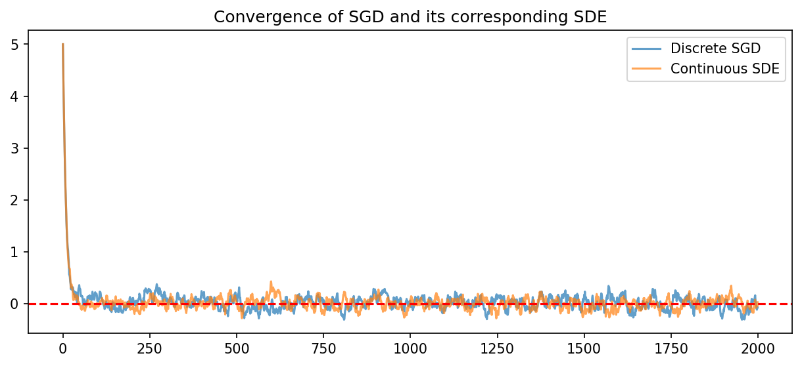

# 7.4 Stochastic Dynamics and SGD as an SDE

## 1. Stochastic Gradient Descent as a Continuous Process

Stochastic Gradient Descent (SGD) is the undisputed workhorse of deep learning. While derived as a discrete optimization algorithm, analyzing SGD through the lens of continuous-time Stochastic Differential Equations (SDEs) provides profound insights into its implicit regularization, exploration capabilities, and generalization properties.

In deep learning, we seek to minimize a loss function $L(\theta) = \frac{1}{N}\sum_{i=1}^N \ell_i(\theta)$. 
The discrete SGD update rule with learning rate $\eta$ using a mini-batch $\mathcal{B}_t$ of size $B$ is:

$$
\theta_{k+1} = \theta_k - \eta \nabla \hat{L}(\theta_k)
$$

where $\nabla \hat{L}(\theta_k) = \frac{1}{B} \sum_{i \in \mathcal{B}_k} \nabla \ell_i(\theta_k)$.

### 1.1 The Additive Noise Formulation

We can rewrite the stochastic gradient as the exact full-batch gradient plus a zero-mean noise term $V_k$:

$$
\nabla \hat{L}(\theta_k) = \nabla L(\theta_k) + V_k
$$

The noise $V_k$ arises from the sub-sampling of the mini-batch. By the Central Limit Theorem, for sufficiently large batch sizes, $V_k$ is approximately Gaussian distributed: $V_k \sim \mathcal{N}(0, C(\theta_k))$, where $C(\theta_k)$ is the covariance matrix of the mini-batch gradients.

Substituting this into the update rule:

$$
\theta_{k+1} - \theta_k = - \eta \nabla L(\theta_k) + \eta V_k
$$

To transition to a continuous-time limit, we identify the discrete step with a time increment $\Delta t$. But what is the relationship between $\eta$ and $\Delta t$?

---

## 2. Backward Error Analysis and The Modified Equation

In numerical analysis, solving a differential equation numerically inherently introduces discretization errors. The **Modified Equation** approach posits that instead of analyzing the numerical method as an approximation to the original ODE, we can view the numerical method as an *exact* solution to a *modified* differential equation.

### 2.1 The SDE Limit of SGD

Let $\Delta t = \eta$. To match the scaling of Brownian motion $W_t$ (where $\mathbb{E}[dW_t^2] = dt = \eta$), we rewrite the noise term. Since $V_k \sim \mathcal{N}(0, C(\theta))$, we can write $\eta V_k \approx \sqrt{\eta} \sqrt{\eta} \mathcal{N}(0, C(\theta)) = \sqrt{\eta} C(\theta)^{1/2} \mathcal{N}(0, \eta I) \approx \sqrt{\eta} C(\theta)^{1/2} \Delta W_t$.

The discrete step becomes:

$$
\theta(t + \Delta t) - \theta(t) \approx - \nabla L(\theta(t)) \Delta t + \sqrt{\eta} C(\theta(t))^{1/2} \Delta W_t
$$

Taking the limit as $\Delta t \to 0$, we arrive at the **SDE approximation of SGD**:

$$
d\theta_t = - \nabla L(\theta_t) dt + \sqrt{\eta} C(\theta_t)^{1/2} dW_t
$$

!!! success "Theorem (SDE of SGD)"
    The trajectory of SGD with learning rate $\eta$ and batch size $B$ weakly converges to the continuous Itô SDE above, with diffusion scaling proportionally to $\sqrt{\eta / B}$.

### 2.2 Proof of Diffusion Scaling

Let $\Sigma(\theta)$ be the true covariance of individual gradients $\nabla \ell_i(\theta)$. Since the mini-batch gradient is an average of $B$ independent samples (assuming with replacement for simplicity), the covariance of the mini-batch gradient is:

$$
C(\theta) = \frac{1}{B} \Sigma(\theta)
$$

Plugging this into our SDE:

$$
d\theta_t = - \nabla L(\theta_t) dt + \sqrt{\frac{\eta}{B}} \Sigma(\theta_t)^{1/2} dW_t
$$

This rigorously proves that the noise scale in SGD is governed by the ratio $\frac{\eta}{B}$. A large learning rate or a small batch size increases the "temperature" of the SDE, facilitating escape from sharp local minima. $\blacksquare$

---

## 3. The Eyring-Kramers Law: Escape Times from Minima

Deep learning loss landscapes are highly non-convex, populated with numerous local minima. The implicit noise of SGD allows the trajectory to "escape" these local minima and explore the landscape. The probability and time required to escape a basin of attraction are precisely governed by the **Eyring-Kramers Law** from statistical physics.

### 3.1 Theorem Statement

!!! success "Theorem (Eyring-Kramers Law)"
    Consider an overdamped Langevin diffusion $dX_t = -\nabla U(X_t)dt + \sqrt{2 \beta^{-1}} dW_t$, where $U(x)$ is a potential function (the loss) and $\beta$ is the inverse temperature (proportional to $B/\eta$). Let $A$ be a local minimum and $S$ be the lowest saddle point connecting $A$ to an adjacent basin. In the low-temperature limit ($\beta \to \infty$), the expected first exit time $\tau$ from the basin of $A$ via $S$ is asymptotically:

    $$
    \mathbb{E}[\tau] \approx \frac{2\pi}{|\lambda_1(S)|} \sqrt{\frac{|\det \nabla^2 U(S)|}{\det \nabla^2 U(A)}} \exp\left( \beta (U(S) - U(A)) \right)
    $$

    where $\nabla^2 U$ is the Hessian matrix, and $\lambda_1(S)$ is the unique negative eigenvalue of the Hessian at the saddle point $S$.

### 3.2 Rigorous Derivation (Kramers' Approximation)

**Step 1: The Stationary Distribution**

The Fokker-Planck equation for this process is:

$$
\frac{\partial p}{\partial t} = \nabla \cdot (p \nabla U) + \beta^{-1} \nabla^2 p
$$

The stationary distribution ($t \to \infty$) is the Gibbs measure: $p_{eq}(x) \propto \exp(-\beta U(x))$.

**Step 2: Probability Flux and Transition Rates**

Consider the steady-state probability flux $J$ across the saddle point $S$. In the low-temperature limit, the probability mass is highly concentrated at the bottom of the basin $A$. We can approximate the integral of $p_{eq}(x)$ around $A$ using Laplace's method.
Taylor expanding $U(x)$ around $A$: $U(x) \approx U(A) + \frac{1}{2} (x-A)^T H_A (x-A)$.
The total probability mass in basin $A$ is:

$$
P_A \approx \int \exp(-\beta [U(A) + \frac{1}{2} (x-A)^T H_A (x-A)]) dx = \exp(-\beta U(A)) \sqrt{\frac{(2\pi)^D}{\beta^D \det H_A}}
$$

**Step 3: Flux at the Saddle**

Near the saddle point $S$, there is exactly one negative direction (the unstable mode corresponding to $\lambda_1$). We align the coordinate system such that $x_1$ is this direction.

$$
U(x) \approx U(S) - \frac{1}{2} |\lambda_1| x_1^2 + \frac{1}{2} \sum_{i=2}^D \lambda_i x_i^2
$$

The steady-state flux across the saddle boundary $x_1 = 0$ involves integrating over the transverse stable directions ($x_2 \dots x_D$). The rigorous evaluation of this integral (originally due to Kramers in 1940) yields the transmission rate $k \propto J / P_A$.

**Step 4: Concluding the Expected Time**

The expected escape time is $\mathbb{E}[\tau] = 1/k$. Taking the ratio of the Gaussian integrals over the saddle versus the basin yields the pre-factor involving the determinants of the Hessians, and the ratio of the potential depths yields the exponential term $\exp(\beta (U(S) - U(A)))$. $\blacksquare$

**Deep Learning Interpretation:**
The exponential term $\exp(\frac{B}{\eta} \Delta L)$ dominates. It proves that sharp minima (large $\det H_A$) have a *smaller* expected escape time than flat minima (small $\det H_A$). This rigorously justifies why SGD naturally escapes sharp, poor-generalizing minima and eventually settles in flat, robust minima.

---

## 4. Worked Examples

### 4.1 Example: Constant Gradient Noise
If $L(x) = \frac{1}{2} c x^2$ and the noise variance $C(x) = \sigma^2$ is constant.
SDE: $dx_t = -c x_t dt + \sqrt{\eta} \sigma dW_t$.
This is precisely an Ornstein-Uhlenbeck process.
The stationary distribution is $\mathcal{N}(0, \frac{\eta \sigma^2}{2c})$.
Notice how the variance of the stationary distribution shrinks with the learning rate $\eta$. As $\eta \to 0$, SGD converges exactly to the minimum 0.

### 4.2 Example: Multiplicative Gradient Noise
In linear regression, $\ell_i(w) = (x_i^T w - y_i)^2$. Near the optimal solution $w^*$, the gradient noise depends on the parameters.
If we shift coordinates such that $w^* = 0$, $L(w) = w^T H w$.
The SDE takes the form $dw_t = -H w_t dt + \sqrt{\eta} \text{diag}(w_t) dW_t$.
This implies the noise vanishes as $w_t \to 0$. Multiplicative noise SDEs do not diverge; they exhibit almost sure exponential stability towards the minimum.

### 4.3 Example: Escaping a Quadratic Potential
Consider $U(x) = x^4 - 2x^2$. Minima at $x = \pm 1$ ($U = -1$). Saddle at $x=0$ ($U=0$).
Barrier height $\Delta U = 1$. Hessian at minimum $U''(1) = 8$. Hessian at saddle $U''(0) = -4$.
Escape time $\tau \approx \frac{2\pi}{4} \sqrt{\frac{4}{8}} \exp(\beta (1)) = \frac{\pi}{\sqrt{2}} \exp(\beta)$.
If we double the noise (cut $\beta$ in half), the escape time shrinks exponentially.

---

## 5. Coding Demonstrations

### 5.1 Simulating SGD as an SDE (OU Process)

We simulate a simple convex quadratic well and compare the theoretical SDE variance to the empirical SGD variance.

```python
import matplotlib
matplotlib.use('Agg')
import numpy as np
import matplotlib.pyplot as plt

# Problem: Minimize L(x) = 0.5 * c * x^2
c = 2.0
eta = 0.05
sigma_noise = 1.0 # Standard deviation of stochastic gradient noise
steps = 2000

# 1. Simulate true SGD update
x_sgd = np.zeros(steps)
x_sgd[0] = 5.0
for i in range(1, steps):
    grad = c * x_sgd[i-1] + np.random.randn() * sigma_noise
    x_sgd[i] = x_sgd[i-1] - eta * grad

# 2. Simulate SDE approximation: dx = -cx dt + sqrt(eta)*sigma*dW
# Euler-Maruyama method
dt = eta
x_sde = np.zeros(steps)
x_sde[0] = 5.0
for i in range(1, steps):
    dW = np.sqrt(dt) * np.random.randn()
    x_sde[i] = x_sde[i-1] - c * x_sde[i-1] * dt + np.sqrt(eta) * sigma_noise * dW

plt.figure(figsize=(10, 4))
plt.plot(x_sgd, alpha=0.7, label='Discrete SGD')
plt.plot(x_sde, alpha=0.7, label='Continuous SDE')
plt.axhline(0, color='r', linestyle='--')
plt.legend()
plt.title("Convergence of SGD and its corresponding SDE")
plt.savefig('figures/07-4-demo1.png', dpi=150, bbox_inches='tight')
plt.close()

# Theoretical variance = eta * sigma^2 / (2 * c)
theoretical_var = eta * (sigma_noise**2) / (2 * c)
print(f"Empirical SGD Variance (last 1000 steps): {np.var(x_sgd[1000:]):.5f}")
print(f"Theoretical SDE Variance: {theoretical_var:.5f}")
```



### 5.2 Escape Time Simulation for Double-Well Potential

We simulate the Kramers escape time across the barrier of a double-well potential $U(x) = x^4 - 2x^2$.

```python
import numpy as np

def simulate_escape(beta, max_steps=1000000):
    """ Simulate SDE dx = -U'(x)dt + sqrt(2/beta) dW """
    dt = 0.01
    x = 1.0 # Start at the right minimum
    
    for t in range(max_steps):
        # U'(x) = 4x^3 - 4x
        grad_U = 4*x**3 - 4*x
        dW = np.sqrt(dt) * np.random.randn()
        x = x - grad_U * dt + np.sqrt(2 / beta) * dW
        
        # If x crosses the saddle point (x=0) and reaches the other well
        if x < -0.5:
            return t * dt
    return max_steps * dt

betas = [1.0, 2.0, 3.0]
for b in betas:
    escapes = [simulate_escape(b) for _ in range(5)]
    avg_escape = np.mean(escapes)
    
    # Theoretical Eyring-Kramers Time: (pi/sqrt(2)) * exp(beta * 1.0)
    theoretical = (np.pi / np.sqrt(2)) * np.exp(b * 1.0)
    print(f"Beta={b}: Avg Simulated Time = {avg_escape:.2f}, Theoretical = {theoretical:.2f}")
```

