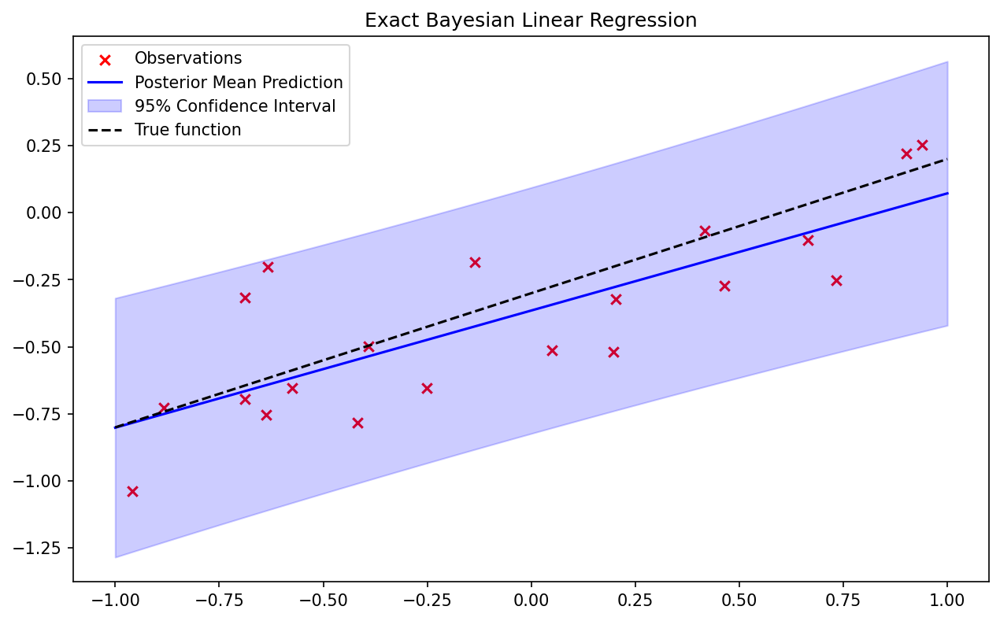

# 08-1 Probabilistic Foundations and Bayesian Neural Networks

## Introduction

In the standard paradigm of deep learning, we often treat neural network parameters as fixed, deterministic quantities to be optimized. This approach, known as point estimation or frequentist learning, relies on finding a single set of weights $\mathbf{w}$ that minimizes a given loss function. While spectacularly successful in many domains, this paradigm exhibits a fundamental flaw: it lacks a native mechanism to express *epistemic uncertainty*—the model's uncertainty about its own parameters due to limited or noisy data.

Bayesian machine learning offers a principled alternative. By treating parameters not as fixed values but as random variables, we elevate our models from simple function approximators to probabilistic reasoners. The Bayesian framework, rooted in probability theory and measure theory, provides a consistent, mathematically rigorous methodology for updating beliefs in the presence of new evidence.

In this lecture, we will rigorously develop the foundations of Bayesian inference, proving that probability theory is the unique logical extension of Boolean algebra to settings of uncertainty (Cox's Theorem) and establishing the theoretical justification for the existence of priors (de Finetti's Theorem). We will then transition to Bayesian Neural Networks (BNNs), exploring how deep learning architectures can be reinterpreted through this probabilistic lens.

## 1. The Epistemological Foundations of Probability

Before applying Bayesian methods to neural networks, we must ask a fundamental question: *Why probability?* Why is probability theory the correct framework for reasoning about uncertainty, rather than fuzzy logic or some other heuristic scoring system? 

The answer lies in Cox's Theorem (1946), which demonstrates that any system of plausible reasoning that satisfies a set of basic, intuitive desiderata must be isomorphic to classical probability theory.

### 1.1 Cox's Theorem

Cox's Theorem establishes that probability is not merely a tool for describing long-run frequencies of repeatable events (the frequentist view), but rather the unique, mathematically consistent system for quantifying degrees of belief (the Bayesian view).

!!! success "Theorem 1.1 (Cox's Theorem)"

    Let $B(A \mid X)$ denote a real-valued degree of belief (or plausibility) of a proposition $A$ given information $X$. If the function $B$ satisfies the following axioms (desiderata):

    1. **Divisibility and Comparability:** Degrees of plausibility are represented by real numbers.
    2. **Qualitative Correspondence with Common Sense:** Plausibilities must align with Aristotelian logic when propositions are known to be true or false.
    3. **Consistency:**
    - If a conclusion can be reasoned in multiple ways, every possible way must yield the same plausibility value.
    - The system must always account for all relevant evidence (no ignoring data).
    - Equivalent states of knowledge must be represented by equivalent plausibility values.

    Then, there exists a strictly monotonic transformation $f$ such that $P(A \mid X) = f(B(A \mid X))$ satisfies the standard rules of probability:

    1. $0 \leq P(A \mid X) \leq 1$
    2. $P(\text{True} \mid X) = 1$
    3. $P(A \text{ and } B \mid X) = P(A \mid X) P(B \mid A, X)$ (The Product Rule)
    4. $P(A \text{ or } B \mid X) = P(A \mid X) + P(B \mid X) - P(A \text{ and } B \mid X)$ (The Sum Rule)

**Proof of Cox's Theorem (Outline and Rigorous Derivation)**

The proof proceeds by deriving the product rule and the sum rule directly from the axioms of consistency.

*Part 1: The Product Rule*

Consider the plausibility of the conjunction $A \land B$ given $X$, denoted $(A, B \mid X)$. We seek a function $F$ that relates this joint plausibility to the conditional plausibilities. By consistency, the plausibility of $A \land B$ can only depend on:

1. The plausibility of $A$ given $X$, $(A \mid X)$.
2. The plausibility of $B$ given $A$ and $X$, $(B \mid A, X)$.

Thus, we postulate an unknown function $F$:

$$
(A, B \mid X) = F((B \mid A, X), (A \mid X))
$$

Because logical conjunction is associative, $A \land (B \land C) = (A \land B) \land C$. We evaluate $(A, B, C \mid X)$ in two ways.

First way (associating $B$ and $C$):

$$
(A, (B, C) \mid X) = F((B, C \mid A, X), (A \mid X))
$$

$$
(A, (B, C) \mid X) = F( F((C \mid B, A, X), (B \mid A, X)), (A \mid X) )
$$

Second way (associating $A$ and $B$):

$$
((A, B), C \mid X) = F((C \mid A, B, X), (A, B \mid X))
$$

$$
((A, B), C \mid X) = F( (C \mid A, B, X), F((B \mid A, X), (A \mid X)) )
$$

Let $x = (C \mid A, B, X)$, $y = (B \mid A, X)$, and $z = (A \mid X)$. Equating the two expansions gives the associativity equation for the function $F$:

$$
F(F(x, y), z) = F(x, F(y, z))
$$

This is a well-known functional equation (Aczél's equation). Its general continuous solution, up to a monotonic mapping $w(\cdot)$, is:

$$
w(F(x, y)) = w(x) w(y)
$$

By defining $P(A \mid X) \equiv w((A \mid X))$, we immediately recover the standard product rule of probability:

$$
P(A, B \mid X) = P(A \mid X) P(B \mid A, X)
$$

*Part 2: The Sum Rule*

The negation of a proposition $A$ is denoted $\sim A$. The plausibility of $A$ and its negation must be linked by a function $S$:

$$
(\sim A \mid X) = S((A \mid X))
$$

Since the double negation $\sim(\sim A)$ is logically equivalent to $A$, $S$ must be a decreasing involution: $S(S(x)) = x$.
Furthermore, using De Morgan's laws and the previously derived product rule, one can constrain the functional form of $S$. Applying the mapping $w$, we derive:

$$
w((A \mid X))^m + w((\sim A \mid X))^m = 1
$$

for some positive constant $m$. By redefining our probability scale as $P(\cdot \mid \cdot) = w(\cdot)^m$, we obtain the classical sum rule:

$$
P(A \mid X) + P(\sim A \mid X) = 1
$$

This completes the derivation. $\blacksquare$

Cox's theorem fundamentally justifies the Bayesian approach: if we wish to build a neural network that reasons about uncertainty without violating basic logical consistencies, we *must* use the calculus of probability.

### 1.2 Exchangeability and de Finetti's Theorem

In machine learning, we routinely assume that our dataset $\mathcal{D} = \{x_1, \dots, x_N\}$ is composed of independent and identically distributed (i.i.d.) random variables. However, strict independence is often a philosophical overreach. If the variables were truly independent, observing $x_1, \dots, x_{N-1}$ would tell us absolutely nothing about $x_N$, rendering learning impossible. 

The concept we actually rely upon is **exchangeability**.

!!! info "Definition 1.1 (Exchangeability)"

    A sequence of random variables $X_1, X_2, \dots$ is infinitely exchangeable if, for any $N$ and any permutation $\pi$ of the indices $\{1, \dots, N\}$, the joint probability distribution is invariant:

    $$
    P(X_1, \dots, X_N) = P(X_{\pi(1)}, \dots, X_{\pi(N)})
    $$

    Exchangeability means the order of observations does not matter, but the observations are not necessarily independent. Observing a sequence of coin flips (Heads, Heads, Heads) increases our belief that the next flip will be Heads. They are dependent, yet exchangeable.

!!! success "Theorem 1.2 (de Finetti's Representation Theorem)"

    A sequence of binary random variables $X_1, X_2, \dots$ is infinitely exchangeable if and only if there exists a unique probability measure $\mu(\theta)$ on $[0, 1]$ such that for all $N$, the joint distribution can be represented as:

    $$
    P(X_1, \dots, X_N) = \int_{0}^{1} \prod_{i=1}^{N} P(X_i \mid \theta) \, d\mu(\theta)
    $$

    where $P(X_i \mid \theta) = \theta^{X_i} (1-\theta)^{1-X_i}$.

    Crucially, as $N \to \infty$, the random variable $\bar{X}_N = \frac{1}{N} \sum_{i=1}^N X_i$ converges almost surely to $\theta$, and $\mu$ is the distribution of this limiting frequency.

**Proof of de Finetti's Theorem (Outline)**

Let $X_1, \dots, X_N$ be an exchangeable sequence of binary variables. For any $M \geq N$, let $S_M = \sum_{j=1}^M X_j$ be the number of successes in $M$ trials.
Because the sequence is exchangeable, any specific sequence of length $N$ containing exactly $k$ successes (where $k = \sum_{i=1}^N X_i$) has the same probability. 

Conditioned on $S_M = m$, the probability of a specific sequence of length $N$ with $k$ successes is given by the hypergeometric distribution:

$$
P(X_1=x_1, \dots, X_N=x_N \mid S_M = m) = \frac{\binom{M-N}{m-k}}{\binom{M}{m}}
$$

We can express the marginal joint probability by summing over all possible values of $S_M$:

$$
P(X_1, \dots, X_N) = \sum_{m=0}^M P(X_1, \dots, X_N \mid S_M = m) P(S_M = m)
$$

Let $F_M(\theta)$ be the cumulative distribution function of the empirical mean $\theta_M = S_M / M$. We can rewrite the sum as a Riemann-Stieltjes integral over $\theta \in [0, 1]$:

$$
P(X_1, \dots, X_N) = \int_{0}^{1} \frac{\binom{M-N}{M\theta - k}}{\binom{M}{M\theta}} \, dF_M(\theta)
$$

As $M \to \infty$, the ratio of combinatorial terms converges uniformly to $\theta^k (1-\theta)^{N-k}$. By Helly's Selection Theorem, the sequence of distribution functions $F_M(\theta)$ possesses a weakly converging subsequence that converges to a proper distribution $F(\theta)$ (with associated measure $\mu$). Thus, taking the limit $M \to \infty$:

$$
\lim_{M \to \infty} P(X_1, \dots, X_N) = \int_{0}^{1} \theta^k (1-\theta)^{N-k} \, dF(\theta)
$$

$$
P(X_1, \dots, X_N) = \int_{0}^{1} \left( \prod_{i=1}^N P(X_i \mid \theta) \right) d\mu(\theta)
$$

This completes the proof. $\blacksquare$

**Philosophical Implications for Machine Learning:**
De Finetti's Theorem is profoundly important for Bayesian Deep Learning. It states that if we assume our data is exchangeable, there *must* exist some latent parameter $\theta$ (the weights of our neural network), a likelihood function $\prod P(X_i \mid \theta)$, and a prior distribution $\mu(\theta)$. 

The theorem proves that parameters and priors are not arbitrary modeling choices, but mathematical necessities arising directly from the assumption of data exchangeability.

## 2. From Classical to Bayesian Neural Networks

Having established the rigorous foundations of Bayesian inference, we now apply this machinery to neural networks. A standard feedforward neural network computes a function $y = f(x; \mathbf{w})$, where $\mathbf{w}$ represents the weights and biases.

### 2.1 The Standard Frequentist Approach

In the frequentist setting, given a dataset $\mathcal{D} = \{(x_i, y_i)\}_{i=1}^N$, we seek to maximize the likelihood of the data given the weights:

$$
\mathbf{w}_{\text{MLE}} = \arg\max_{\mathbf{w}} P(\mathcal{D} \mid \mathbf{w}) = \arg\max_{\mathbf{w}} \prod_{i=1}^N P(y_i \mid x_i, \mathbf{w})
$$

If we assume the targets $y_i$ are corrupted by Gaussian noise, $y_i \sim \mathcal{N}(f(x_i; \mathbf{w}), \sigma^2)$, maximizing the likelihood is mathematically equivalent to minimizing the Mean Squared Error (MSE). 

Adding a weight decay regularizer $\lambda \|\mathbf{w}\|^2$ is equivalent to Maximum a Posteriori (MAP) estimation, where we place a Gaussian prior on the weights and seek the mode of the posterior. However, both MLE and MAP yield a single point estimate for $\mathbf{w}$.

### 2.2 The Bayesian Neural Network Formulation

In a Bayesian Neural Network (BNN), we treat all weights and biases $\mathbf{w}$ as random variables. The learning process is not an optimization problem, but an inference problem. We update our prior belief about the weights, $P(\mathbf{w})$, into a posterior belief, $P(\mathbf{w} \mid \mathcal{D})$, using Bayes' Theorem:

$$
P(\mathbf{w} \mid \mathcal{D}) = \frac{P(\mathcal{D} \mid \mathbf{w}) P(\mathbf{w})}{P(\mathcal{D})}
$$

Here:

- $P(\mathbf{w})$ is the **prior**: Our beliefs about the weights before seeing data. Often chosen to be an isotropic Gaussian $P(\mathbf{w}) = \mathcal{N}(\mathbf{0}, \alpha^{-1} \mathbf{I})$.
- $P(\mathcal{D} \mid \mathbf{w})$ is the **likelihood**: The probability of the data given the weights.
- $P(\mathbf{w} \mid \mathcal{D})$ is the **posterior**: Our updated belief about the weights.
- $P(\mathcal{D})$ is the **evidence** or **marginal likelihood**: 

$$
P(\mathcal{D}) = \int P(\mathcal{D} \mid \mathbf{w}) P(\mathbf{w}) \, d\mathbf{w}
$$

The central challenge of Bayesian deep learning is computing the evidence $P(\mathcal{D})$. Because $\mathbf{w}$ typically contains millions of dimensions, and the neural network likelihood is highly non-convex, the integral is analytically intractable and cannot be computed via simple numerical quadrature.

### 2.3 Making Predictions

In a frequentist network, prediction on a new test point $x^*$ is computed as $y^* = f(x^*; \mathbf{w}_{\text{MLE}})$. 

In a BNN, we do not have a single set of weights. Instead, we must compute the **posterior predictive distribution** by integrating out the weights, taking an ensemble of all possible neural networks weighted by their posterior probability:

$$
P(y^* \mid x^*, \mathcal{D}) = \int P(y^* \mid x^*, \mathbf{w}) P(\mathbf{w} \mid \mathcal{D}) \, d\mathbf{w}
$$

This integral provides both a mean prediction (the expected value) and a measure of uncertainty (the variance of the predictive distribution). If the posterior $P(\mathbf{w} \mid \mathcal{D})$ is highly dispersed (high uncertainty in the weights), the predictive distribution $P(y^* \mid x^*, \mathcal{D})$ will be broad, reflecting the model's epistemic uncertainty.

## 3. Worked Examples

To solidify these concepts, we step through three detailed worked examples, starting from simple conjugate models and building toward models that require approximate inference.

### 3.1 Worked Example 1: The Beta-Binomial Model (Coin Toss)

This is the canonical example of Bayesian updating, demonstrating how the posterior seamlessly acts as the prior for future data.

**Problem:** We have a coin with an unknown probability of landing heads, $\theta \in [0, 1]$. We flip it $N$ times, observing $k$ heads. What is our posterior distribution for $\theta$?

**Step 1: Define the Likelihood**
The number of heads $k$ follows a Binomial distribution:

$$
P(k \mid \theta, N) = \binom{N}{k} \theta^k (1 - \theta)^{N-k}
$$

**Step 2: Define the Prior**
We choose a Beta distribution as the prior because it is the conjugate prior to the Binomial distribution. It is parameterized by $\alpha$ and $\beta$:

$$
P(\theta \mid \alpha, \beta) = \frac{\theta^{\alpha-1}(1-\theta)^{\beta-1}}{B(\alpha, \beta)}
$$

where $B(\alpha, \beta)$ is the Beta function.

**Step 3: Compute the Posterior**
Using Bayes' theorem, ignoring normalization constants (the evidence), the posterior is proportional to the prior times the likelihood:

$$
P(\theta \mid k, N, \alpha, \beta) \propto P(k \mid \theta, N) P(\theta \mid \alpha, \beta)
$$

$$
P(\theta \mid k, N, \alpha, \beta) \propto \left( \theta^k (1-\theta)^{N-k} \right) \left( \theta^{\alpha-1} (1-\theta)^{\beta-1} \right)
$$

$$
P(\theta \mid k, N, \alpha, \beta) \propto \theta^{k+\alpha-1} (1-\theta)^{N-k+\beta-1}
$$

We recognize this functional form as another Beta distribution, with updated parameters $\alpha' = \alpha + k$ and $\beta' = \beta + N - k$.

$$
P(\theta \mid k, N, \alpha, \beta) = \text{Beta}(\alpha + k, \beta + N - k)
$$

This exact analytic solution demonstrates the elegance of conjugate priors. The data simply updates the "pseudocounts" $\alpha$ and $\beta$.

### 3.2 Worked Example 2: Bayesian Linear Regression

We now move to a continuous domain, exploring the Bayesian equivalent of standard linear regression.

**Problem:** Given inputs $\mathbf{X} \in \mathbb{R}^{N \times D}$ and targets $\mathbf{y} \in \mathbb{R}^N$, find the posterior distribution of the weights $\mathbf{w} \in \mathbb{R}^D$ in the linear model $y = \mathbf{w}^T \mathbf{x} + \epsilon$, where $\epsilon \sim \mathcal{N}(0, \sigma^2)$.

**Step 1: Likelihood**
Assuming i.i.d. Gaussian noise, the likelihood is:

$$
P(\mathbf{y} \mid \mathbf{X}, \mathbf{w}) = \mathcal{N}(\mathbf{y} \mid \mathbf{X}\mathbf{w}, \sigma^2 \mathbf{I}) = \left(\frac{1}{2\pi\sigma^2}\right)^{N/2} \exp\left( -\frac{1}{2\sigma^2} (\mathbf{y} - \mathbf{X}\mathbf{w})^T(\mathbf{y} - \mathbf{X}\mathbf{w}) \right)
$$

**Step 2: Prior**
We place a zero-mean isotropic Gaussian prior on the weights:

$$
P(\mathbf{w}) = \mathcal{N}(\mathbf{w} \mid \mathbf{0}, \alpha^{-1} \mathbf{I}) = \left(\frac{\alpha}{2\pi}\right)^{D/2} \exp\left( -\frac{\alpha}{2} \mathbf{w}^T\mathbf{w} \right)
$$

**Step 3: Posterior**
The posterior is proportional to the prior times the likelihood:

$$
P(\mathbf{w} \mid \mathbf{y}, \mathbf{X}) \propto \exp\left( -\frac{1}{2\sigma^2} (\mathbf{y} - \mathbf{X}\mathbf{w})^T(\mathbf{y} - \mathbf{X}\mathbf{w}) - \frac{\alpha}{2} \mathbf{w}^T\mathbf{w} \right)
$$

Expanding the exponent and completing the square for $\mathbf{w}$, we find that the posterior is also a multivariate Gaussian, $\mathcal{N}(\mathbf{w} \mid \mathbf{m}_N, \mathbf{S}_N)$, with:

$$
\mathbf{S}_N^{-1} = \alpha \mathbf{I} + \sigma^{-2} \mathbf{X}^T \mathbf{X}
$$

$$
\mathbf{m}_N = \sigma^{-2} \mathbf{S}_N \mathbf{X}^T \mathbf{y}
$$

Notice that the mean of the posterior, $\mathbf{m}_N$, is exactly the solution to ridge regression with L2 regularization parameter $\lambda = \alpha \sigma^2$. The Bayesian framework naturally incorporates regularization through the prior. Furthermore, it provides the full covariance matrix $\mathbf{S}_N$, capturing the correlations and uncertainties among all parameters.

### 3.3 Worked Example 3: Non-Conjugate Inference (Logistic Regression)

In neural networks, the likelihood and prior are rarely conjugate, making exact analytic solutions impossible. We illustrate this bottleneck with Bayesian Logistic Regression.

**Problem:** Perform binary classification $y_i \in \{0, 1\}$ using a logistic sigmoid link function, $P(y_i=1 \mid \mathbf{x}_i, \mathbf{w}) = \sigma(\mathbf{w}^T \mathbf{x}_i)$.

**Step 1: Likelihood**

$$
P(\mathbf{y} \mid \mathbf{X}, \mathbf{w}) = \prod_{i=1}^N \sigma(\mathbf{w}^T \mathbf{x}_i)^{y_i} (1 - \sigma(\mathbf{w}^T \mathbf{x}_i))^{1-y_i}
$$

**Step 2: Prior**
Gaussian prior $P(\mathbf{w}) = \mathcal{N}(\mathbf{0}, \alpha^{-1} \mathbf{I})$.

**Step 3: The Posterior Bottleneck**

$$
P(\mathbf{w} \mid \mathbf{y}, \mathbf{X}) = \frac{ \mathcal{N}(\mathbf{w} \mid \mathbf{0}, \alpha^{-1}\mathbf{I}) \prod_{i=1}^N \sigma(\mathbf{w}^T \mathbf{x}_i)^{y_i} (1 - \sigma(\mathbf{w}^T \mathbf{x}_i))^{1-y_i} }{ \int \mathcal{N}(\mathbf{w}' \mid \mathbf{0}, \alpha^{-1}\mathbf{I}) \prod_{i=1}^N \sigma(\mathbf{w}'^T \mathbf{x}_i)^{y_i} (1 - \sigma(\mathbf{w}'^T \mathbf{x}_i))^{1-y_i} \, d\mathbf{w}' }
$$

The integral in the denominator cannot be evaluated analytically. The product of a Gaussian and a sequence of sigmoids is not a recognized distribution family. 

To proceed, we must use approximate inference techniques. The two dominant paradigms are:

1. **Markov Chain Monte Carlo (MCMC):** Draw samples asymptotically from the exact posterior (explored in lecture 08-2).
2. **Variational Inference (VI):** Propose a parameterized family of tractable distributions $q(\mathbf{w} \mid \phi)$ and optimize $\phi$ to minimize the Kullback-Leibler (KL) divergence to the true posterior (explored in lecture 08-4).

## 4. Coding Demos

We provide two implementation demonstrations. The first shows an exact analytical posterior for Bayesian Linear Regression. The second provides a foundational PyTorch implementation of a Variational Bayesian Neural Network layer using the "Bayes by Backprop" (Blundell et al., 2015) reparameterization trick.

### 4.1 Coding Demo 1: Exact Bayesian Linear Regression in Python

This code demonstrates how the posterior uncertainty shrinks as more data points are observed.

```python
import matplotlib
matplotlib.use('Agg')
import numpy as np
import matplotlib.pyplot as plt

# 1. Generate Synthetic Data
np.random.seed(42)
true_w0, true_w1 = -0.3, 0.5
N = 20
X = np.random.uniform(-1, 1, N)
y_true = true_w0 + true_w1 * X
noise_variance = 0.05
y = y_true + np.random.normal(0, np.sqrt(noise_variance), N)

# Design matrix (with intercept)
Phi = np.vstack([np.ones_like(X), X]).T

# 2. Prior Parameters
alpha = 2.0  # Precision of prior N(0, 1/alpha I)
beta = 1.0 / noise_variance # Precision of likelihood

prior_mean = np.zeros(2)
prior_cov = np.eye(2) / alpha

# 3. Posterior Computation (Analytic)
def compute_posterior(Phi, y, alpha, beta):
    S_N_inv = alpha * np.eye(Phi.shape[1]) + beta * Phi.T @ Phi
    S_N = np.linalg.inv(S_N_inv)
    m_N = beta * S_N @ Phi.T @ y
    return m_N, S_N

m_N, S_N = compute_posterior(Phi, y, alpha, beta)
print(f"True Weights: [{true_w0}, {true_w1}]")
print(f"Posterior Mean: {m_N}")
print(f"Posterior Covariance:\n{S_N}")

# 4. Posterior Predictive Distribution
X_test = np.linspace(-1, 1, 100)
Phi_test = np.vstack([np.ones_like(X_test), X_test]).T

pred_mean = Phi_test @ m_N
# Predictive variance = epistemic (weight) uncertainty + aleatoric (noise) uncertainty
pred_var = np.sum((Phi_test @ S_N) * Phi_test, axis=1) + 1.0/beta

plt.figure(figsize=(10, 6))
plt.scatter(X, y, color='red', marker='x', label='Observations')
plt.plot(X_test, pred_mean, color='blue', label='Posterior Mean Prediction')
plt.fill_between(X_test, 
                 pred_mean - 2*np.sqrt(pred_var), 
                 pred_mean + 2*np.sqrt(pred_var), 
                 color='blue', alpha=0.2, label='95% Confidence Interval')
plt.plot(X_test, true_w0 + true_w1*X_test, 'k--', label='True function')
plt.title("Exact Bayesian Linear Regression")
plt.legend()
plt.savefig('figures/08-1-demo1.png', dpi=150, bbox_inches='tight')
plt.close()
```



### 4.2 Coding Demo 2: Variational Bayesian Linear Layer in PyTorch

To scale Bayesian inference to neural networks, we utilize Variational Inference. We approximate the true, complex posterior $P(\mathbf{w} \mid \mathcal{D})$ with a simpler Gaussian distribution $q(\mathbf{w}) = \mathcal{N}(\mathbf{w} \mid \mu, \sigma^2)$. The weights $\mu$ and $\sigma$ are learned via backpropagation using the reparameterization trick.

```python
import torch
import torch.nn as nn
import torch.nn.functional as F
import math

class BayesianLinear(nn.Module):
    """
    A single Bayesian Linear layer using Variational Inference 
    (Bayes by Backprop).
    """
    def __init__(self, in_features, out_features, prior_sigma=1.0):
        super().__init__()
        self.in_features = in_features
        self.out_features = out_features
        self.prior_sigma = prior_sigma
        
        # Variational parameters for weights: q(w) = N(mu_w, sigma_w^2)
        self.weight_mu = nn.Parameter(torch.Tensor(out_features, in_features).uniform_(-0.2, 0.2))
        # Parameterize standard deviation as log(1 + exp(rho)) to ensure positivity
        self.weight_rho = nn.Parameter(torch.Tensor(out_features, in_features).uniform_(-5, -4))
        
        # Variational parameters for biases: q(b) = N(mu_b, sigma_b^2)
        self.bias_mu = nn.Parameter(torch.Tensor(out_features).uniform_(-0.2, 0.2))
        self.bias_rho = nn.Parameter(torch.Tensor(out_features).uniform_(-5, -4))

    def forward(self, x, sample=True):
        # Calculate standard deviations
        weight_sigma = F.softplus(self.weight_rho)
        bias_sigma = F.softplus(self.bias_rho)
        
        if sample:
            # Reparameterization trick: w = mu + sigma * epsilon, epsilon ~ N(0, 1)
            weight_epsilon = torch.randn_like(self.weight_mu)
            bias_epsilon = torch.randn_like(self.bias_mu)
            
            weight = self.weight_mu + weight_sigma * weight_epsilon
            bias = self.bias_mu + bias_sigma * bias_epsilon
        else:
            # Use mean values (e.g., for maximum a posteriori inference during evaluation)
            weight = self.weight_mu
            bias = self.bias_mu
            
        return F.linear(x, weight, bias)

    def kl_divergence(self):
        """
        Computes the KL divergence between the approximate posterior q(w) 
        and the prior p(w) = N(0, prior_sigma^2).
        For two Gaussians, KL has a closed-form solution.
        """
        weight_sigma = F.softplus(self.weight_rho)
        bias_sigma = F.softplus(self.bias_rho)
        
        # KL for weights
        kl_weight = 0.5 * torch.sum(
            2 * torch.log(torch.tensor(self.prior_sigma) / weight_sigma) +
            (weight_sigma**2 + self.weight_mu**2) / (self.prior_sigma**2) - 1
        )
        
        # KL for biases
        kl_bias = 0.5 * torch.sum(
            2 * torch.log(torch.tensor(self.prior_sigma) / bias_sigma) +
            (bias_sigma**2 + self.bias_mu**2) / (self.prior_sigma**2) - 1
        )
        
        return kl_weight + kl_bias

# Example instantiation and forward pass
layer = BayesianLinear(in_features=10, out_features=5)
x = torch.randn(32, 10) # Batch of 32
output = layer(x)
print(f"Output shape: {output.shape}")
print(f"KL Divergence: {layer.kl_divergence().item():.4f}")

# To train, the loss function is the Evidence Lower Bound (ELBO):
# Loss = NLL(data) + KL_Divergence
# loss = F.mse_loss(output, target) + (1.0/batch_size) * layer.kl_divergence()
```

```
Output shape: torch.Size([32, 5])
KL Divergence: 218.5908
```

This variational approach is a cornerstone of modern probabilistic deep learning, circumventing the intractable integrals highlighted in the logistic regression example. In subsequent lectures, we will systematically dissect advanced inference techniques (MCMC and Variational Inference) to scale these foundational principles to profound depths.

