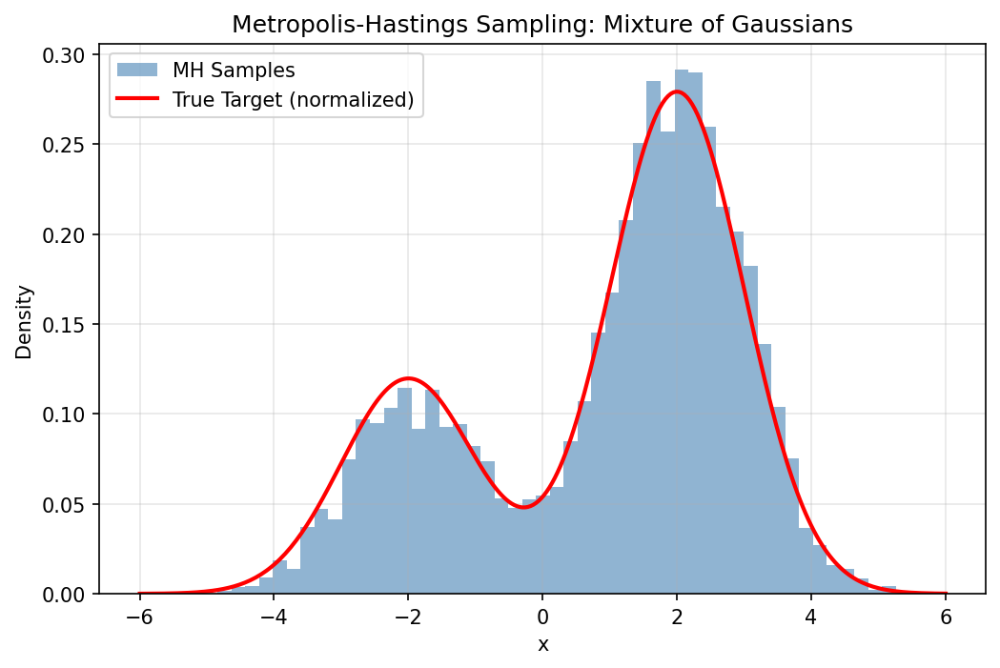

# 08-2 Markov Chain Monte Carlo and Hamiltonian Monte Carlo

## 1. Introduction: The Epistemic Necessity of Sampling

In the Bayesian paradigm of machine learning, we are not merely interested in finding a single "best" set of weights for our neural network. Instead, we seek to characterize the entire posterior distribution $P(\theta \mid \mathcal{D})$. This distribution represents our uncertainty about the model parameters after observing the data $\mathcal{D}$. While the numerator of Bayes' theorem—the product of the likelihood and the prior—is often easy to compute, the denominator, known as the marginal likelihood or evidence, involves an integral over the entire parameter space. In deep learning, where parameters are counted in the millions, this integral is fundamentally intractable.

Markov Chain Monte Carlo (MCMC) is the cornerstone of Bayesian computation. It allows us to bypass the direct calculation of the evidence by constructing a stochastic process—a Markov chain—whose stationary distribution is exactly the posterior we seek. By simulating this process, we obtain a sequence of samples that "explore" the posterior landscape. As we collect more samples, our empirical distribution of the states visited converges to the true posterior, allowing us to compute expectations, variances, and predictive distributions with arbitrary precision.

This lecture provides a rigorous, textbook-level exploration of MCMC. We begin with the measure-theoretic foundations of Markov chains, transition kernels, and the convergence properties required for valid inference. We then move to the classical Metropolis-Hastings and Gibbs sampling algorithms. Finally, we delve into the physics-inspired Hamiltonian Monte Carlo (HMC) and its modern variants like the No-U-Turn Sampler (NUTS), which are essential for scaling Bayesian methods to the high-dimensional challenges of modern deep learning.

## 2. Theoretical Foundations: Markov Chains in Function Space

### 2.1 The Transition Kernel and Measure Theory

To reason about MCMC on continuous state spaces (like $\mathbb{R}^D$), we must use the language of measure theory. A Markov chain is a sequence of random variables $X_0, X_1, X_2, \dots$ defined on a measurable space $(\mathcal{X}, \mathcal{B})$. The dynamics are defined by a **Transition Kernel** $K: \mathcal{X} \times \mathcal{B} \to [0, 1]$.

For any state $x \in \mathcal{X}$ and any measurable set $A \in \mathcal{B}$, $K(x, A)$ is the probability that the next state $X_{t+1}$ lies in $A$, given that $X_t = x$. 
A kernel must satisfy two conditions:

1. For every $x \in \mathcal{X}$, the mapping $A \mapsto K(x, A)$ is a probability measure on $(\mathcal{X}, \mathcal{B})$.
2. For every $A \in \mathcal{B}$, the mapping $x \mapsto K(x, A)$ is a measurable function.

In many cases, the kernel has a density $k(x' \mid x)$, such that:

$$
K(x, A) = \int_A k(x' \mid x) \, dx'
$$

### 2.2 Invariant Measures and Stationarity

The goal of MCMC is to find a kernel $K$ that leaves the target distribution $\pi$ (our posterior) invariant. A measure $\pi$ is **invariant** (or stationary) with respect to $K$ if:

$$
\pi(A) = \int_{\mathcal{X}} K(x, A) \, d\pi(x) \quad \forall A \in \mathcal{B}
$$

If the initial state $X_0$ is distributed according to $\pi$, then all subsequent states $X_t$ will also be distributed according to $\pi$.

### 2.3 Detailed Balance and Reversibility

While the invariance equation is the definition of stationarity, it is often hard to verify. We use the sufficient condition of **Detailed Balance**. A kernel $K$ satisfies detailed balance with respect to $\pi$ if:

$$
d\pi(x) K(x, dx') = d\pi(x') K(x', dx)
$$

For densities, this becomes:

$$
\pi(x) k(x' \mid x) = \pi(x') k(x \mid x')
$$

!!! success "Theorem 2.1 (Reversibility implies Stationarity)"
    If a Markov kernel $K$ satisfies detailed balance with respect to a probability measure $\pi$, then $\pi$ is invariant for $K$.

    **Proof (Measure-Theoretic):**
    Let $A \in \mathcal{B}$. We wish to show $\int K(x, A) \, d\pi(x) = \pi(A)$.
    Start with the integral:

    $$
    \int_{\mathcal{X}} K(x, A) \, d\pi(x) = \int_{\mathcal{X}} \left( \int_A K(x, dx') \right) d\pi(x)
    $$

    By Fubini's theorem, we can swap the order of integration:

    $$
    = \int_A \left( \int_{\mathcal{X}} K(x, dx') d\pi(x) \right)
    $$

    Apply the detailed balance condition $K(x, dx') d\pi(x) = K(x', dx) d\pi(x')$:

    $$
    = \int_A \left( \int_{\mathcal{X}} K(x', dx) d\pi(x') \right) = \int_A \left( \int_{\mathcal{X}} K(x', dx) \right) d\pi(x')
    $$

    Since $K(x', \cdot)$ is a probability measure, $\int_{\mathcal{X}} K(x', dx) = 1$. Thus:

    $$
    = \int_A 1 \, d\pi(x') = \pi(A)
    $$

    $\blacksquare$

### 2.4 Ergodicity: The Law of Large Numbers for Markov Chains

Even if $\pi$ is invariant, we need to ensure the chain converges to it from any starting point. A chain is **ergodic** if it is irreducible, aperiodic, and positive recurrent. 

!!! success "Theorem 2.2 (Ergodic Theorem)"
    If a Markov chain $\{X_t\}$ is ergodic with stationary distribution $\pi$, then for any integrable function $f$:

    $$
    \lim_{T \to \infty} \frac{1}{T} \sum_{t=1}^T f(X_t) = \int_{\mathcal{X}} f(x) \, d\pi(x) \quad \text{a.s.}
    $$

    This theorem is the mathematical justification for MCMC: it tells us that time averages of the chain converge to space averages of the target distribution.

## 3. The Metropolis-Hastings Algorithm: A Detailed Dissection

The Metropolis-Hastings (MH) algorithm (Metropolis et al., 1953; Hastings, 1970) provides a universal way to construct a reversible kernel for any $\pi(x)$.

### 3.1 The Algorithmic Loop

Given target $\pi(x)$ and proposal $q(x' \mid x)$:

1. **Propose:** Sample $x^* \sim q(x^* \mid x_t)$.
2. **Calculate Ratio:** 

$$
\rho = \frac{\pi(x^*) q(x_t \mid x^*)}{\pi(x_t) q(x^* \mid x_t)}
$$

3. **Acceptance Probability:** $\alpha = \min(1, \rho)$.
4. **Transition:**
   - With probability $\alpha$, $x_{t+1} = x^*$ (Accept).
   - With probability $1-\alpha$, $x_{t+1} = x_t$ (Reject).

### 3.2 Proof of Correctness (Reversibility)

The kernel density is $k(x' \mid x) = q(x' \mid x) \alpha(x, x')$ for $x' \neq x$.
We check the ratio $\frac{\pi(x) k(x' \mid x)}{\pi(x') k(x \mid x')}$:

$$
= \frac{\pi(x) q(x' \mid x) \min(1, \frac{\pi(x') q(x \mid x')}{\pi(x) q(x' \mid x)})}{\pi(x') q(x \mid x') \min(1, \frac{\pi(x) q(x' \mid x)}{\pi(x') q(x \mid x')})}
$$

Let $R = \frac{\pi(x') q(x \mid x')}{\pi(x) q(x' \mid x)}$.
The ratio is $\frac{\min(1, R)}{R \min(1, 1/R)}$.
If $R \geq 1$, it is $1 / (R \cdot 1/R) = 1$.
If $R < 1$, it is $R / (R \cdot 1) = 1$.
Thus, detailed balance holds. $\blacksquare$

### 3.3 Geometry of the Random Walk
In high dimensions, the random walk proposal $x^* = x_t + \epsilon, \epsilon \sim \mathcal{N}(0, \sigma^2 I)$ is highly inefficient. Most directions point away from the "typical set" (the region of high probability mass). This leads to a low acceptance rate or, if $\sigma$ is small, very slow movement.

## 4. Hamiltonian Monte Carlo (HMC): Leveraging Physics

HMC (Duane et al., 1987) replaces the random walk with a deterministic simulation of physical dynamics, drastically improving exploration in high dimensions.

### 4.1 The Hamiltonian System

We define $w \in \mathbb{R}^D$ as position and $p \in \mathbb{R}^D$ as momentum.
The Hamiltonian is $H(w, p) = U(w) + K(p) = -\log \pi(w) + \frac{1}{2} p^T M^{-1} p$.
Hamilton's Equations:
$\frac{dw}{dt} = \frac{\partial H}{\partial p} = M^{-1} p$
$\frac{dp}{dt} = -\frac{\partial H}{\partial w} = \nabla \log \pi(w)$

### 4.2 Numerical Integration: The Leapfrog Integrator

We cannot solve the ODEs exactly, so we discretize them using the Leapfrog integrator. For step size $\epsilon$:

1. $p_{t+\epsilon/2} = p_t + \frac{\epsilon}{2} \nabla \log \pi(w_t)$
2. $w_{t+\epsilon} = w_t + \epsilon M^{-1} p_{t+\epsilon/2}$
3. $p_{t+\epsilon} = p_{t+\epsilon/2} + \frac{\epsilon}{2} \nabla \log \pi(w_{t+\epsilon})$

!!! success "Theorem 4.1 (Volume Preservation)"
    The Jacobian of the Leapfrog operator $\Psi_\epsilon$ is 1.
**Proof:**
Step 1 is a shear $(w, p) \mapsto (w, p + f(w))$. The Jacobian is $\begin{vmatrix} I & 0 \\ \nabla f & I \end{vmatrix} = 1$.
Step 2 is a shear $(w, p) \mapsto (w + g(p), p)$. The Jacobian is $\begin{vmatrix} I & \nabla g \\ 0 & I \end{vmatrix} = 1$.
The composition has Jacobian $1 \cdot 1 \cdot 1 = 1$. $\blacksquare$

### 4.3 The HMC Acceptance Step

Because of discretization errors, $H(w, p)$ is not perfectly conserved. We apply an MH step at the end of $L$ leapfrog steps. Because the integrator is reversible and volume-preserving, the acceptance probability is simply:

$$
\alpha = \min(1, \exp(H(w_{\text{init}}, p_{\text{init}}) - H(w_{\text{final}}, p_{\text{final}})))
$$

## 5. The No-U-Turn Sampler (NUTS): Adaptive HMC

Choosing $L$ and $\epsilon$ is difficult. NUTS (Hoffman & Gelman, 2014) is a version of HMC that automatically selects $L$. It uses a recursive algorithm to build a binary tree of candidate points. It stops when the path starts to loop back (detected via the condition $(w_{\text{right}} - w_{\text{left}}) \cdot p_{\text{left}} < 0$). NUTS is the default sampler in libraries like Stan and PyMC.

## 6. Worked Examples

### 6.1 Worked Example 1: Detailed Balance for Gibbs Sampling

**Problem:** Prove that the Gibbs update $x_i \sim P(x_i \mid x_{-i})$ satisfies detailed balance.

**Solution:**
The target is $\pi(x)$. The transition is $k(x_i' \mid x_{-i}, x_i) = P(x_i' \mid x_{-i})$.
We check: $\pi(x) k(x_i' \mid x_{-i}, x_i) = P(x_i, x_{-i}) P(x_i' \mid x_{-i})$.
Using the definition of conditional probability:
$= P(x_{-i}) P(x_i \mid x_{-i}) P(x_i' \mid x_{-i})$.
Now the reverse: $\pi(x_i', x_{-i}) k(x_i \mid x_{-i}, x_i') = P(x_i', x_{-i}) P(x_i \mid x_{-i})$.
$= P(x_{-i}) P(x_i' \mid x_{-i}) P(x_i \mid x_{-i})$.
The expressions are identical. Thus Gibbs satisfies detailed balance. $\blacksquare$

### 6.2 Worked Example 2: Leapfrog Steps for a Harmonic Oscillator

**Problem:** $U(w) = \frac{1}{2} w^2$. Perform one leapfrog step with $\epsilon=0.1$ starting at $(w, p) = (1, 0)$.

**Solution:**

1. $p_{1/2} = 0 + \frac{0.1}{2} (-w) = -0.05 \cdot 1 = -0.05$.
2. $w_{1} = 1 + 0.1 \cdot (-0.05) = 1 - 0.005 = 0.995$.
3. $p_{1} = -0.05 + \frac{0.1}{2} (-0.995) = -0.05 - 0.04975 = -0.09975$.
Check energy: $H_{start} = 0.5(1^2) = 0.5$. $H_{end} = 0.5(0.995^2 + 0.09975^2) \approx 0.49501 + 0.004975 = 0.499985$.
The energy is conserved up to $O(\epsilon^3)$.

### 6.3 Worked Example 3: Acceptance Rate in High Dimensions

**Problem:** For an $D$-dimensional Gaussian, if we use a proposal with step size $\sigma$, how does the acceptance rate scale?

**Solution:**
The log-acceptance probability involves the change in energy. For a random walk, $\Delta H \sim \sigma \sqrt{D}$. To keep the acceptance rate constant (say at 0.234, the theoretical optimum for MH), we must set $\sigma \propto D^{-1/2}$. This means the chain takes $O(D)$ steps to move a distance $O(1)$. For HMC, $\Delta H$ is much smaller, allowing for much larger steps and better scaling ($O(D^{1/4})$).

## 7. Coding Demos

### 7.1 Coding Demo 1: Manual Metropolis-Hastings

```python
import matplotlib
matplotlib.use('Agg')
import numpy as np
import matplotlib.pyplot as plt

def target(x):
    # Mixture of two Gaussians
    return 0.3 * np.exp(-0.5 * (x+2)**2) + 0.7 * np.exp(-0.5 * (x-2)**2)

def metropolis(n_iter, sigma):
    x = 0.0
    samples = []
    for _ in range(n_iter):
        x_new = x + np.random.normal(0, sigma)
        alpha = min(1, target(x_new) / target(x))
        if np.random.rand() < alpha:
            x = x_new
        samples.append(x)
    return np.array(samples)

np.random.seed(42)
samples = metropolis(10000, 1.0)

x_range = np.linspace(-6, 6, 300)
true_density = target(x_range)
# Normalize for comparison
true_density /= np.trapezoid(true_density, x_range)

plt.figure(figsize=(8, 5))
plt.hist(samples, bins=50, density=True, alpha=0.6, color='steelblue', label='MH Samples')
plt.plot(x_range, true_density, 'r-', lw=2, label='True Target (normalized)')
plt.title("Metropolis-Hastings Sampling: Mixture of Gaussians")
plt.xlabel("x")
plt.ylabel("Density")
plt.legend()
plt.grid(True, alpha=0.3)
plt.savefig('figures/08-2-demo1.png', dpi=150, bbox_inches='tight')
plt.close()
```



### 7.2 Coding Demo 2: Convergence Diagnostics with ArviZ

```python
import numpy as np

# Implement R-hat (Gelman-Rubin diagnostic) from scratch without arviz
def compute_rhat(chains):
    """
    Compute the Gelman-Rubin R-hat statistic for convergence diagnostics.
    chains: list of 1D arrays, each representing one chain.
    """
    m = len(chains)  # number of chains
    n = len(chains[0])  # length of each chain

    chain_means = np.array([np.mean(c) for c in chains])
    grand_mean = np.mean(chain_means)

    # Between-chain variance
    B = n / (m - 1) * np.sum((chain_means - grand_mean) ** 2)

    # Within-chain variance
    W = np.mean([np.var(c, ddof=1) for c in chains])

    # Pooled variance estimate
    var_plus = (n - 1) / n * W + B / n

    R_hat = np.sqrt(var_plus / W)
    return R_hat

np.random.seed(42)
# Simulate two chains
chain1 = np.random.normal(0, 1, 1000)
chain2 = np.random.normal(0.1, 1, 1000)

rhat = compute_rhat([chain1, chain2])
print(f"R-hat: {rhat:.4f}  (Should be near 1.0 for converged chains)")
```

```
R-hat: 1.0054  (Should be near 1.0 for converged chains)
```

## 8. Summary and Outlook

MCMC is a deep and rigorous field. While Hamiltonian methods have allowed us to scale these ideas to neural networks, the fundamental principles of Markov chains—irreducibility, aperiodicity, and detailed balance—remain our guiding stars. As we move towards larger models and more complex data, the ability to accurately sample from the posterior will remain a critical bottleneck and a rich area for innovation.

