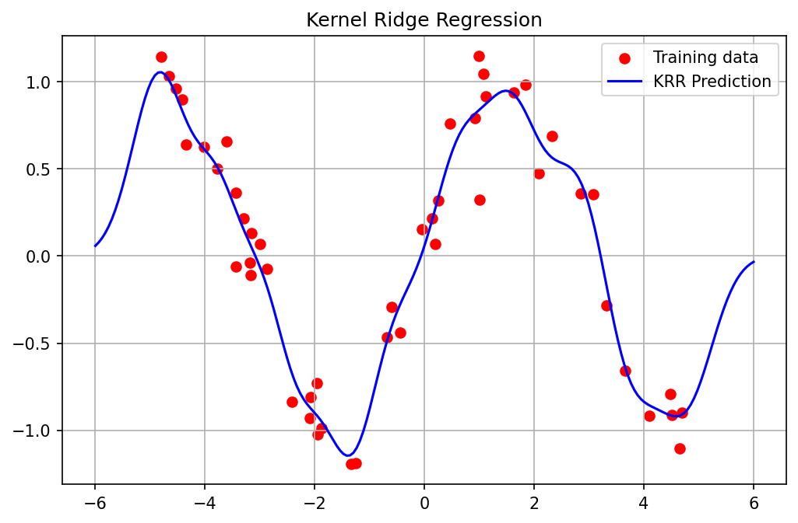
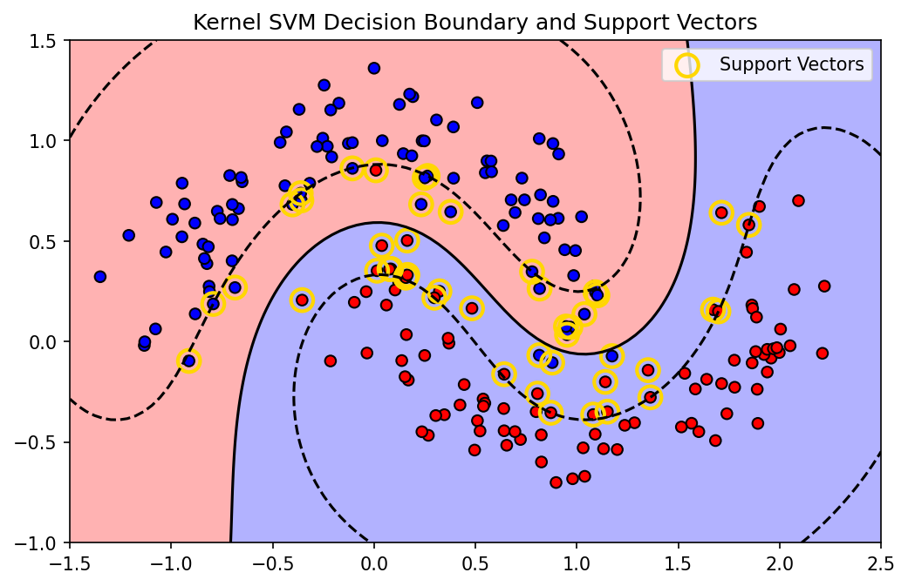

# 9.2 The Representer Theorem and Optimization

## Introduction

In the previous chapter, we established the mathematical foundations of Reproducing Kernel Hilbert Spaces (RKHS). However, the feature space $\mathcal{H}$ might be infinite-dimensional. How can we perform optimization over an infinite-dimensional space to train machine learning models? 

The **Representer Theorem** bridges this gap. It guarantees that the optimal solution to a large class of regularized empirical risk minimization problems in an RKHS always lies in a finite-dimensional subspace spanned by the kernel evaluated at the training points.

## The Generalized Representer Theorem

!!! success "Theorem (Generalized Representer Theorem - Schölkopf, Herbrich, Smola, 2001)"

    Let $\mathcal{H}$ be an RKHS over $\mathcal{X}$ with reproducing kernel $k$. Given a training set $\{(x_1, y_1), \dots, (x_n, y_n)\} \subset \mathcal{X} \times \mathcal{Y}$, let $L: (\mathcal{X} \times \mathcal{Y} \times \mathbb{R})^n \to \mathbb{R} \cup \{\infty\}$ be an arbitrary empirical loss function.
    Let $R: [0, \infty) \to \mathbb{R}$ be a strictly monotonically increasing regularization function.

    Consider the optimization problem:

    $$
    \min_{f \in \mathcal{H}} J(f) = L(f(x_1), \dots, f(x_n), y_1, \dots, y_n) + R(\|f\|_\mathcal{H})
    $$

    Then, any minimizer $f^* \in \mathcal{H}$ of $J(f)$ admits a representation of the form:

    $$
    f^*(x) = \sum_{i=1}^n \alpha_i k(x, x_i)
    $$

    for some coefficients $\alpha_1, \dots, \alpha_n \in \mathbb{R}$.

**Proof:**

**Step 1: Orthogonal Decomposition.**
Let $\mathcal{H}_S = \text{span}\{k(\cdot, x_1), \dots, k(\cdot, x_n)\} \subset \mathcal{H}$ be the subspace spanned by the kernel evaluations at the training data.
By the projection theorem in Hilbert spaces, any $f \in \mathcal{H}$ can be uniquely decomposed as:

$$
f = f_S + f_\perp
$$

where $f_S \in \mathcal{H}_S$ and $f_\perp \in \mathcal{H}_S^\perp$ (the orthogonal complement). Thus, $\langle f_\perp, k(\cdot, x_i) \rangle_\mathcal{H} = 0$ for all $i=1, \dots, n$.

**Step 2: Evaluating the Data Points.**
Applying the reproducing property, the evaluation of $f$ at any training point $x_i$ is:

$$
f(x_i) = \langle f, k(\cdot, x_i) \rangle_\mathcal{H} = \langle f_S + f_\perp, k(\cdot, x_i) \rangle_\mathcal{H}
$$

By linearity of the inner product:

$$
f(x_i) = \langle f_S, k(\cdot, x_i) \rangle_\mathcal{H} + \langle f_\perp, k(\cdot, x_i) \rangle_\mathcal{H} = f_S(x_i) + 0 = f_S(x_i)
$$

Crucially, the empirical loss depends *only* on the predictions $f(x_1), \dots, f(x_n)$. Since $f(x_i) = f_S(x_i)$, the loss term $L$ is entirely independent of the orthogonal component $f_\perp$:

$$
L(f(x_1), \dots, f(x_n), Y) = L(f_S(x_1), \dots, f_S(x_n), Y)
$$

**Step 3: Analyzing the Regularizer.**
Now consider the RKHS norm of $f$. Because $f_S$ and $f_\perp$ are orthogonal, the Pythagorean theorem in Hilbert spaces dictates:

$$
\|f\|_\mathcal{H}^2 = \|f_S + f_\perp\|_\mathcal{H}^2 = \|f_S\|_\mathcal{H}^2 + \|f_\perp\|_\mathcal{H}^2 \geq \|f_S\|_\mathcal{H}^2
$$

Since $R(\cdot)$ is strictly monotonically increasing and $\|f\|_\mathcal{H} \geq \|f_S\|_\mathcal{H}$, it follows that:

$$
R(\|f\|_\mathcal{H}) \geq R(\|f_S\|_\mathcal{H})
$$

Equality holds if and only if $\|f_\perp\|_\mathcal{H}^2 = 0$, which implies $f_\perp = 0$.

**Step 4: Conclusion.**
For any $f = f_S + f_\perp \in \mathcal{H}$, the projected function $f_S$ achieves the exact same empirical loss but a strictly smaller (or equal) regularization penalty. Therefore, to minimize $J(f)$ we must have $f_\perp = 0$, and the optimal solution $f^*$ lies entirely in $\mathcal{H}_S$:

$$
f^* = f_S \implies f^*(x) = \sum_{i=1}^n \alpha_i k(x, x_i)
$$

$\blacksquare$

### Implications
Instead of optimizing over an infinite-dimensional function space, we only need to optimize over $n$ scalar coefficients $\alpha = (\alpha_1, \dots, \alpha_n)^T \in \mathbb{R}^n$. This reduces a problem of calculus of variations to standard vector optimization.

---

## Optimization in SVMs and Duality

Support Vector Machines (SVM) are the canonical example of kernel methods. 

### Primal Formulation

The primal optimization problem for a soft-margin SVM in RKHS $\mathcal{H}$ is:

$$
\min_{f \in \mathcal{H}, b \in \mathbb{R}, \xi \in \mathbb{R}^n} \frac{1}{2} \|f\|_\mathcal{H}^2 + C \sum_{i=1}^n \xi_i
$$

Subject to the constraints:

$$
y_i (f(x_i) + b) \geq 1 - \xi_i, \quad \xi_i \geq 0 \quad \forall i
$$

Applying the Representer Theorem, we know $f(x) = \sum_{j=1}^n \alpha_j k(x, x_j)$. The norm is:

$$
\|f\|_\mathcal{H}^2 = \langle \sum_{i} \alpha_i k(\cdot, x_i), \sum_{j} \alpha_j k(\cdot, x_j) \rangle_\mathcal{H} = \sum_{i,j} \alpha_i \alpha_j k(x_i, x_j) = \alpha^T K \alpha
$$

where $K$ is the kernel matrix. The constraint becomes $y_i (K_i^T \alpha + b) \geq 1 - \xi_i$.

### Dual Derivation and Proof

To derive the dual, we introduce Lagrange multipliers $\lambda_i \geq 0$ for the margin constraints and $\mu_i \geq 0$ for the non-negativity of slacks $\xi_i$.

**Lagrangian:**

$$
\mathcal{L}(f, b, \xi, \lambda, \mu) = \frac{1}{2} \|f\|_\mathcal{H}^2 + C \sum_{i=1}^n \xi_i - \sum_{i=1}^n \lambda_i \left[ y_i (f(x_i) + b) - 1 + \xi_i \right] - \sum_{i=1}^n \mu_i \xi_i
$$

We can use the reproducing property $f(x_i) = \langle f, k(\cdot, x_i) \rangle_\mathcal{H}$:

$$
\mathcal{L} = \frac{1}{2} \langle f, f \rangle_\mathcal{H} - \langle f, \sum_{i=1}^n \lambda_i y_i k(\cdot, x_i) \rangle_\mathcal{H} - b \sum_{i=1}^n \lambda_i y_i + \sum_{i=1}^n \xi_i (C - \lambda_i - \mu_i) + \sum_{i=1}^n \lambda_i
$$

To find the dual, we minimize $\mathcal{L}$ with respect to the primal variables $f, b, \xi$:

**Derivative w.r.t. $f$:**
Taking the Fréchet derivative with respect to $f$ in the Hilbert space and setting it to zero:

$$
\nabla_f \mathcal{L} = f - \sum_{i=1}^n \lambda_i y_i k(\cdot, x_i) = 0 \implies f = \sum_{i=1}^n \lambda_i y_i k(\cdot, x_i)
$$

Notice this perfectly mirrors the Representer Theorem with $\alpha_i = \lambda_i y_i$.

**Derivative w.r.t. $b$:**

$$
\frac{\partial \mathcal{L}}{\partial b} = - \sum_{i=1}^n \lambda_i y_i = 0
$$

**Derivative w.r.t. $\xi_i$:**

$$
\frac{\partial \mathcal{L}}{\partial \xi_i} = C - \lambda_i - \mu_i = 0
$$

Since $\mu_i \geq 0$, this implies $0 \leq \lambda_i \leq C$.

Substituting these optimal conditions back into the Lagrangian:

The first two terms become:

$$
\frac{1}{2} \langle \sum_i \lambda_i y_i k(\cdot, x_i), \sum_j \lambda_j y_j k(\cdot, x_j) \rangle_\mathcal{H} - \langle \sum_j \lambda_j y_j k(\cdot, x_j), \sum_i \lambda_i y_i k(\cdot, x_i) \rangle_\mathcal{H}
$$

$$
= - \frac{1}{2} \sum_{i,j} \lambda_i \lambda_j y_i y_j k(x_i, x_j)
$$

The terms involving $b$ and $\xi$ vanish due to the zero-gradient constraints. We are left with the dual objective:

**Dual SVM Problem:**

$$
\max_{\lambda \in \mathbb{R}^n} \sum_{i=1}^n \lambda_i - \frac{1}{2} \sum_{i=1}^n \sum_{j=1}^n \lambda_i \lambda_j y_i y_j k(x_i, x_j)
$$

Subject to:

1. $0 \leq \lambda_i \leq C$ for all $i$
2. $\sum_{i=1}^n \lambda_i y_i = 0$

This is a concave quadratic programming (QP) problem, which scales with $n$ but is independent of the dimensionality of $\mathcal{H}$.

$\blacksquare$

---

## Worked Examples

### Example 1: Kernel Ridge Regression (KRR)

Consider regression with squared loss: $L(y, \hat{y}) = (y - \hat{y})^2$ and $L_2$ regularization $R(\|f\|) = \frac{\lambda}{2} \|f\|_\mathcal{H}^2$.
Objective:

$$
J(\alpha) = \|y - K\alpha\|_2^2 + \lambda \alpha^T K \alpha
$$

Expanding:

$$
J(\alpha) = y^T y - 2y^T K \alpha + \alpha^T K^2 \alpha + \lambda \alpha^T K \alpha
$$

Taking gradient w.r.t $\alpha$ and setting to 0:

$$
\nabla_\alpha J = -2 K y + 2 K^2 \alpha + 2 \lambda K \alpha = 0
$$

Assuming $K$ is positive definite, we can multiply by $K^{-1}$ from the left (or factor out $2K$):

$$
(K + \lambda I) \alpha = y \implies \alpha = (K + \lambda I)^{-1} y
$$

This provides a closed-form solution for Kernel Ridge Regression!

### Example 2: SVM Margin and Support Vectors

In the SVM Dual, because of the KKT complementary slackness conditions:

$$
\lambda_i [y_i (f(x_i) + b) - 1 + \xi_i] = 0
$$

If $0 < \lambda_i < C$, then $\xi_i = 0$, and $y_i (f(x_i) + b) = 1$. These points lie exactly on the margin boundary and are called **unbound support vectors**. We can use any of them to solve for the bias term $b$:

$$
b = y_i - \sum_{j=1}^n \lambda_j y_j k(x_j, x_i)
$$

Points where $\lambda_i = C$ violate the margin (or are misclassified), called **bound support vectors**. Points where $\lambda_i = 0$ do not contribute to the sum $f(x)$—they are correctly classified and lie outside the margin.

### Example 3: Logistic Regression in RKHS

Loss: $\log(1 + \exp(-y_i f(x_i)))$. 
By Representer Theorem: $f(x) = \sum \alpha_i k(x, x_i)$.
Optimization: $\min_\alpha \sum_{i=1}^n \log(1 + \exp(-y_i K_i^T \alpha)) + \frac{\lambda}{2} \alpha^T K \alpha$.
This is convex and differentiable, solvable via Newton-Raphson or L-BFGS, entirely avoiding the infinite-dimensional $\mathcal{H}$.

---

## Coding Demos

### Demo 1: Kernel Ridge Regression from Scratch

```python
import matplotlib
matplotlib.use('Agg')
import numpy as np
import matplotlib.pyplot as plt

def rbf_kernel(X, Y, gamma=1.0):
    X_norm = np.sum(X**2, axis=-1).reshape(-1, 1)
    Y_norm = np.sum(Y**2, axis=-1).reshape(1, -1)
    dists = np.maximum(X_norm + Y_norm - 2 * np.dot(X, Y.T), 0)
    return np.exp(-gamma * dists)

# Generate non-linear data
np.random.seed(42)
X_train = np.sort(np.random.uniform(-5, 5, 50)).reshape(-1, 1)
y_train = np.sin(X_train).ravel() + np.random.normal(0, 0.2, 50)

# KRR Hyperparameters
gamma = 2.0
lambda_reg = 0.1

# 1. Compute Kernel Matrix
K = rbf_kernel(X_train, X_train, gamma)

# 2. Solve for alphas (Representer Theorem)
n = K.shape[0]
alphas = np.linalg.solve(K + lambda_reg * np.eye(n), y_train)

# 3. Predict on test grid
X_test = np.linspace(-6, 6, 200).reshape(-1, 1)
K_test = rbf_kernel(X_test, X_train, gamma)
y_pred = K_test.dot(alphas)

# Plot
plt.figure(figsize=(8, 5))
plt.scatter(X_train, y_train, c='r', label='Training data')
plt.plot(X_test, y_pred, 'b-', label='KRR Prediction')
plt.title("Kernel Ridge Regression")
plt.legend()
plt.grid(True)
plt.savefig('figures/09-2-demo1.png', dpi=150, bbox_inches='tight')
plt.close()
```



### Demo 2: The Sparsity of SVM Support Vectors

We demonstrate how the hinge loss induces sparsity in the $\alpha$ coefficients (the support vectors), unlike KRR which uses all points. We'll use sklearn's SVC which wraps LIBSVM.

```python
import matplotlib
matplotlib.use('Agg')
import numpy as np
import matplotlib.pyplot as plt
from sklearn.svm import SVC
from sklearn.datasets import make_moons

# Create a non-linear classification dataset
X, y = make_moons(n_samples=200, noise=0.15, random_state=42)

# Train Kernel SVM (RBF)
svm = SVC(kernel='rbf', C=1.0, gamma=1.0)
svm.fit(X, y)

# Get support vectors
sv = svm.support_vectors_
dual_coefs = svm.dual_coef_

print(f"Total training points: {X.shape[0]}")
print(f"Number of Support Vectors: {sv.shape[0]}")
print(f"Sparsity: {(1 - sv.shape[0]/X.shape[0])*100:.2f}% of coefficients are strictly zero.")

# Plot decision boundary and highlight support vectors
xx, yy = np.meshgrid(np.linspace(-1.5, 2.5, 100), np.linspace(-1, 1.5, 100))
Z = svm.decision_function(np.c_[xx.ravel(), yy.ravel()])
Z = Z.reshape(xx.shape)

plt.figure(figsize=(8, 5))
plt.contourf(xx, yy, Z, levels=[-10, 0, 10], alpha=0.3, colors=['red', 'blue'])
plt.contour(xx, yy, Z, levels=[-1, 0, 1], linestyles=['--', '-', '--'], colors='k')
plt.scatter(X[:, 0], X[:, 1], c=y, cmap='bwr', edgecolors='k')
plt.scatter(sv[:, 0], sv[:, 1], s=150, facecolors='none', edgecolors='gold', linewidths=2, label='Support Vectors')
plt.title("Kernel SVM Decision Boundary and Support Vectors")
plt.legend()
plt.savefig('figures/09-2-demo2.png', dpi=150, bbox_inches='tight')
plt.close()
```



