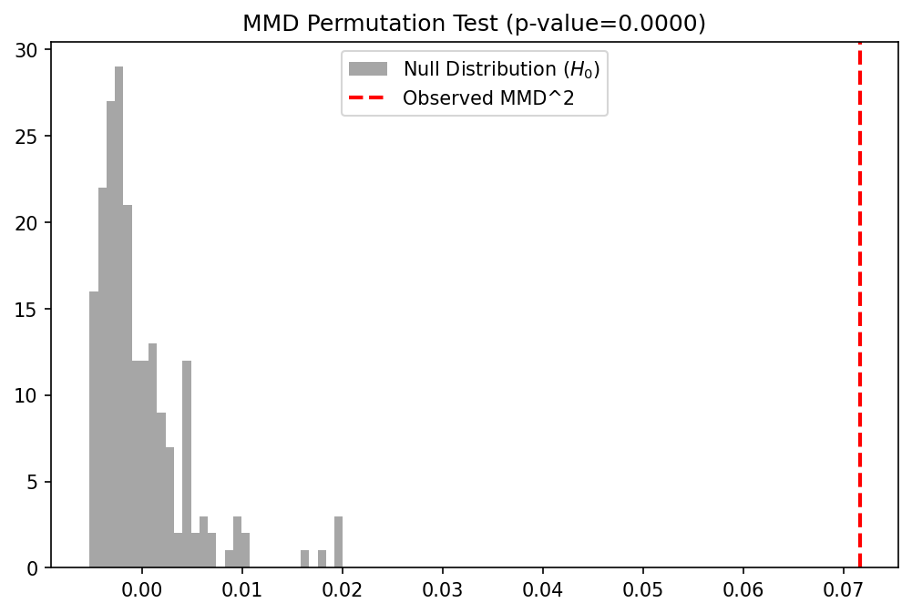
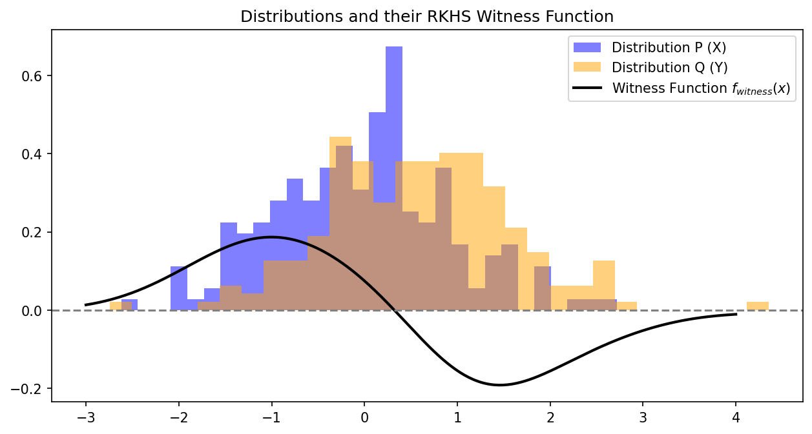

# 9.5 Kernel Mean Embeddings and Maximum Mean Discrepancy (MMD)

## Introduction

So far, we have used kernels to map *individual data points* into a Hilbert space: $x \mapsto \phi(x)$. But what if we want to map an *entire probability distribution* into the RKHS? 

This is the goal of **Kernel Mean Embeddings**. By representing distributions as points in an RKHS, we can use Hilbert space operations (like distance and inner products) to compare distributions, leading to the **Maximum Mean Discrepancy (MMD)**. MMD is a cornerstone of modern two-sample testing, generative modeling (like MMD-GANs), and domain adaptation.

## Kernel Mean Embeddings

Let $\mathbb{P}$ be a probability distribution over $\mathcal{X}$. Let $\mathcal{H}$ be an RKHS with kernel $k$.

!!! info "Definition"
    The kernel mean embedding of $\mathbb{P}$, denoted $\mu_\mathbb{P} \in \mathcal{H}$, is defined as the expected feature map:

    $$
    \mu_\mathbb{P} = \mathbb{E}_{X \sim \mathbb{P}} [\phi(X)] = \int_{\mathcal{X}} k(\cdot, x) d\mathbb{P}(x)
    $$

    For this integral to be well-defined in $\mathcal{H}$ (in the sense of a Bochner integral), we require $\mathbb{E}_{X \sim \mathbb{P}} [\sqrt{k(X,X)}] < \infty$. If the kernel is bounded (e.g., Gaussian RBF $k(x,x)=1$), this holds for all probability distributions.

    By the Riesz representation theorem and linearity of expectation, the inner product of any function $f \in \mathcal{H}$ with the mean embedding yields the expected value of the function under the distribution:

    $$
    \langle f, \mu_\mathbb{P} \rangle_\mathcal{H} = \langle f, \mathbb{E}_{X \sim \mathbb{P}} [k(\cdot, X)] \rangle_\mathcal{H} = \mathbb{E}_{X \sim \mathbb{P}} [\langle f, k(\cdot, X) \rangle_\mathcal{H}] = \mathbb{E}_{X \sim \mathbb{P}} [f(X)]
    $$

### Characteristic Kernels

An embedding is only useful if it is **injective**. If two different distributions map to the same point in the RKHS ($\mu_\mathbb{P} = \mu_\mathbb{Q}$ but $\mathbb{P} \neq \mathbb{Q}$), we lose information.

!!! info "Definition"
    A kernel $k$ is **characteristic** if the mean embedding map $\mathbb{P} \mapsto \mu_\mathbb{P}$ is injective. That is:

    $$
    \mu_\mathbb{P} = \mu_\mathbb{Q} \iff \mathbb{P} = \mathbb{Q}
    $$

!!! success "Theorem (Characteristic kernels and Bochner)"
    A translation-invariant kernel $k(x, y) = k(x-y)$ on $\mathbb{R}^d$ is characteristic if and only if the support of its Fourier transform (from Bochner's Theorem) is the entire $\mathbb{R}^d$.

    **Proof Outline:**
    1. Assume $\mu_\mathbb{P} = \mu_\mathbb{Q}$. This means $\langle f, \mu_\mathbb{P} \rangle = \langle f, \mu_\mathbb{Q} \rangle$ for all $f \in \mathcal{H}$.
    2. Thus, $\mathbb{E}_\mathbb{P}[f(X)] = \mathbb{E}_\mathbb{Q}[f(X)]$ for all $f \in \mathcal{H}$.
    3. For translation-invariant kernels, Bochner's theorem implies $\mathcal{H}$ is closely related to Fourier transforms.
    4. If the kernel's Fourier spectrum covers all of $\mathbb{R}^d$ (like the Gaussian kernel), the RKHS is dense in the space of continuous functions vanishing at infinity $C_0(\mathbb{R}^d)$.
    5. By the Riesz-Markov-Kakutani representation theorem, if expectations of all $C_0$ functions match, the probability measures must be strictly identical ($\mathbb{P} = \mathbb{Q}$).
    6. If the Fourier transform has zero support on some frequency band, we can construct two distributions whose characteristic functions differ only in that band, causing a collision in the mean embedding. $\blacksquare$

    *Consequence:* The Gaussian RBF kernel and Laplacian kernel are characteristic. The linear kernel $k(x,y)=x^Ty$ is **not** characteristic (its embedding is just the first moment/mean of the distribution; distributions with the same mean will collide).

---

## Maximum Mean Discrepancy (MMD)

We can now define a distance between two probability distributions $\mathbb{P}$ and $\mathbb{Q}$ simply as the RKHS distance between their embeddings.

!!! info "Definition (MMD)"

    $$
    \text{MMD}(\mathbb{P}, \mathbb{Q}) = \|\mu_\mathbb{P} - \mu_\mathbb{Q}\|_\mathcal{H}
    $$

    If $k$ is a characteristic kernel, $\text{MMD}(\mathbb{P}, \mathbb{Q}) = 0 \iff \mathbb{P} = \mathbb{Q}$. Thus, MMD is a valid metric on probability distributions.

### Integral Probability Metric View

MMD can be equivalently written as a variational problem. Using the definition of the dual norm:

$$
\text{MMD}(\mathbb{P}, \mathbb{Q}) = \sup_{f \in \mathcal{H}, \|f\|_\mathcal{H} \leq 1} \langle f, \mu_\mathbb{P} - \mu_\mathbb{Q} \rangle_\mathcal{H}
$$

$$
\text{MMD}(\mathbb{P}, \mathbb{Q}) = \sup_{f \in \mathcal{H}, \|f\|_\mathcal{H} \leq 1} \left( \mathbb{E}_{X \sim \mathbb{P}}[f(X)] - \mathbb{E}_{Y \sim \mathbb{Q}}[f(Y)] \right)
$$

This is the **Integral Probability Metric (IPM)** formulation. MMD finds the smooth function $f$ (the "critic") in the unit ball of the RKHS that maximally distinguishes the two distributions.

### Explicit Empirical Estimator

Expanding the squared MMD norm yields a form that depends only on kernel evaluations:

$$
\text{MMD}^2(\mathbb{P}, \mathbb{Q}) = \langle \mu_\mathbb{P} - \mu_\mathbb{Q}, \mu_\mathbb{P} - \mu_\mathbb{Q} \rangle_\mathcal{H} = \langle \mu_\mathbb{P}, \mu_\mathbb{P} \rangle - 2\langle \mu_\mathbb{P}, \mu_\mathbb{Q} \rangle + \langle \mu_\mathbb{Q}, \mu_\mathbb{Q} \rangle
$$

$$
= \mathbb{E}_{X, X' \sim \mathbb{P}} [k(X, X')] - 2 \mathbb{E}_{X \sim \mathbb{P}, Y \sim \mathbb{Q}} [k(X, Y)] + \mathbb{E}_{Y, Y' \sim \mathbb{Q}} [k(Y, Y')]
$$

Given finite samples $X = \{x_1, \dots, x_n\} \sim \mathbb{P}$ and $Y = \{y_1, \dots, y_m\} \sim \mathbb{Q}$, we construct the unbiased empirical estimator (removing the diagonal terms where $x_i = x_i$):

$$
\widehat{\text{MMD}^2}_u(X, Y) = \frac{1}{n(n-1)} \sum_{i \neq j}^n k(x_i, x_j) + \frac{1}{m(m-1)} \sum_{i \neq j}^m k(y_i, y_j) - \frac{2}{nm} \sum_{i=1}^n \sum_{j=1}^m k(x_i, y_j)
$$

This estimator runs in $O((n+m)^2)$ time.

---

## MMD Asymptotics and Two-Sample Testing

A primary use of MMD is the **Two-Sample Test**: deciding whether two sets of samples $X$ and $Y$ come from the same distribution ($H_0: \mathbb{P} = \mathbb{Q}$) or different distributions ($H_1: \mathbb{P} \neq \mathbb{Q}$).

To set a rejection threshold, we need the asymptotic distribution of $\widehat{\text{MMD}^2}_u$ under the null hypothesis.

!!! success "Theorem (Asymptotics of MMD)"
    Assume $m=n$ for simplicity.
    1. **Under $H_1 (\mathbb{P} \neq \mathbb{Q})$:** $\widehat{\text{MMD}^2}_u$ is asymptotically normal.

    $$
    \sqrt{n}(\widehat{\text{MMD}^2}_u - \text{MMD}^2(\mathbb{P}, \mathbb{Q})) \xrightarrow{d} \mathcal{N}(0, \sigma_{H_1}^2)
    $$

    2. **Under $H_0 (\mathbb{P} = \mathbb{Q})$:** $\widehat{\text{MMD}^2}_u$ is a degenerate U-statistic. Its asymptotic distribution is an infinite mixture of Chi-squared variables.

    $$
    n \widehat{\text{MMD}^2}_u \xrightarrow{d} \sum_{l=1}^\infty \lambda_l (\mathcal{Z}_l^2 - 1)
    $$

    where $\mathcal{Z}_l \sim \mathcal{N}(0,1)$ i.i.d., and $\lambda_l$ are the eigenvalues of the integral operator $\int \tilde{k}(x, y) \psi_l(y) d\mathbb{P}(y) = \lambda_l \psi_l(x)$, with the centered kernel $\tilde{k}(x, y) = k(x,y) - \mathbb{E}_x[k(x,y)] - \mathbb{E}_y[k(x,y)] + \mathbb{E}_{x,y}[k(x,y)]$.

    **Proof outline of $H_0$ Asymptotics:**
    Since $\mathbb{P} = \mathbb{Q}$, the first order term of the U-statistic Hoeffding decomposition vanishes (hence "degenerate"). The limiting distribution of a degenerate U-statistic of order 2 is characterized by the spectral decomposition of its kernel. Applying Mercer's Theorem to the centered kernel $\tilde{k}$ gives $\tilde{k}(x,y) = \sum \lambda_l \psi_l(x) \psi_l(y)$. Substituting this into the U-statistic and applying the Central Limit Theorem to the empirical averages of $\psi_l(x)$ yields the infinite sum of independent $\chi^2_1$ variables. $\blacksquare$

    Because the null distribution involves unknown eigenvalues $\lambda_l$ (which depend on the unknown $\mathbb{P}$), we typically compute the p-value via **permutation testing**.

---

## Worked Examples

### Example 1: The Witness Function
The function $f$ that maximizes the discrepancy in the IPM view is called the **witness function**. By taking the Fréchet derivative of the dual norm formulation, it can be shown that the optimal witness function (up to scaling) is exactly the difference of the mean embeddings:

$$
f_{witness}(x) = \langle k(\cdot, x), \mu_\mathbb{P} - \mu_\mathbb{Q} \rangle_\mathcal{H} = \mu_\mathbb{P}(x) - \mu_\mathbb{Q}(x) = \mathbb{E}_{X}[k(x, X)] - \mathbb{E}_{Y}[k(x, Y)]
$$

Where this function is positive, $\mathbb{P}$ has higher density than $\mathbb{Q}$. Where it is negative, $\mathbb{Q}$ has higher density.

### Example 2: Mean Embedding with Linear Kernel
If $k(x,y) = x^T y$, then $\mu_\mathbb{P} = \mathbb{E}[X] \in \mathbb{R}^d$.
$\text{MMD}^2(\mathbb{P}, \mathbb{Q}) = \|\mathbb{E}[X] - \mathbb{E}[Y]\|_2^2$.
This only tests for differences in the means of the distributions, ignoring variance, skewness, etc., which proves why the linear kernel is not characteristic.

### Example 3: Training Generative Models (MMD-GAN)
Generative Adversarial Networks usually use a neural network discriminator. MMD-GAN replaces the discriminator with MMD. Let $Y \sim \mathbb{Q}$ be real data, and $X = G_\theta(Z)$ be generated data. We train the generator to minimize the MMD between $G_\theta(Z)$ and $Y$ using gradients backpropagated through the MMD estimator.

---

## Coding Demos

### Demo 1: MMD Two-Sample Test with Permutations

We implement the unbiased MMD estimator and use a permutation test to calculate the p-value for testing if two datasets are from the same distribution.

```python
import matplotlib
matplotlib.use('Agg')
import numpy as np
import matplotlib.pyplot as plt
from sklearn.metrics.pairwise import rbf_kernel

def mmd_squared_unbiased(K_XX, K_YY, K_XY):
    n = K_XX.shape[0]
    m = K_YY.shape[0]
    
    # Remove diagonals
    np.fill_diagonal(K_XX, 0)
    np.fill_diagonal(K_YY, 0)
    
    term_XX = np.sum(K_XX) / (n * (n - 1))
    term_YY = np.sum(K_YY) / (m * (m - 1))
    term_XY = np.sum(K_XY) / (n * m)
    
    return term_XX + term_YY - 2 * term_XY

def compute_mmd(X, Y, gamma=1.0):
    K_XX = rbf_kernel(X, X, gamma=gamma)
    K_YY = rbf_kernel(Y, Y, gamma=gamma)
    K_XY = rbf_kernel(X, Y, gamma=gamma)
    return mmd_squared_unbiased(K_XX, K_YY, K_XY)

# Generate data
np.random.seed(42)
# P is N(0, 1), Q is N(0.5, 1) - slight shift
n_samples = 200
X = np.random.normal(0, 1, size=(n_samples, 1))
Y = np.random.normal(0.5, 1, size=(n_samples, 1))

# 1. Compute actual MMD
gamma_val = 1.0
actual_mmd = compute_mmd(X, Y, gamma=gamma_val)
print(f"Observed MMD^2: {actual_mmd:.5f}")

# 2. Permutation Test for p-value
n_permutations = 200
pooled_data = np.vstack([X, Y])
total_samples = 2 * n_samples

mmd_null = np.zeros(n_permutations)
for i in range(n_permutations):
    perm_idx = np.random.permutation(total_samples)
    pooled_perm = pooled_data[perm_idx]
    X_perm = pooled_perm[:n_samples]
    Y_perm = pooled_perm[n_samples:]
    mmd_null[i] = compute_mmd(X_perm, Y_perm, gamma=gamma_val)

p_value = np.mean(mmd_null >= actual_mmd)
print(f"P-value: {p_value:.4f}")

# 3. Plot Null Distribution
plt.figure(figsize=(8, 5))
plt.hist(mmd_null, bins=30, alpha=0.7, color='gray', label='Null Distribution ($H_0$)')
plt.axvline(actual_mmd, color='red', linestyle='dashed', linewidth=2, label='Observed MMD^2')
plt.title(f"MMD Permutation Test (p-value={p_value:.4f})")
plt.legend()
plt.savefig('figures/09-5-demo1.png', dpi=150, bbox_inches='tight')
plt.close()
```

```
Observed MMD^2: 0.07164
P-value: 0.0000
```



### Demo 2: Visualizing the Witness Function

We plot the witness function, showing where the RKHS has detected the difference between the distributions.

```python
import matplotlib
matplotlib.use('Agg')
import numpy as np
import matplotlib.pyplot as plt
from sklearn.metrics.pairwise import rbf_kernel

# Reusing X, Y from previous demo
np.random.seed(42)
n_samples = 200
X = np.random.normal(0, 1, size=(n_samples, 1))
Y = np.random.normal(0.5, 1, size=(n_samples, 1))
gamma_val = 1.0

X_grid = np.linspace(-3, 4, 300).reshape(-1, 1)

# Compute E[k(x, X)] and E[k(x, Y)]
K_grid_X = rbf_kernel(X_grid, X, gamma=gamma_val)
K_grid_Y = rbf_kernel(X_grid, Y, gamma=gamma_val)

mu_P_grid = np.mean(K_grid_X, axis=1)
mu_Q_grid = np.mean(K_grid_Y, axis=1)

witness_function = mu_P_grid - mu_Q_grid

plt.figure(figsize=(10, 5))
plt.hist(X, bins=30, density=True, alpha=0.5, color='blue', label='Distribution P (X)')
plt.hist(Y, bins=30, density=True, alpha=0.5, color='orange', label='Distribution Q (Y)')
plt.plot(X_grid, witness_function, 'k-', linewidth=2, label='Witness Function $f_{witness}(x)$')
plt.axhline(0, color='gray', linestyle='--')
plt.title("Distributions and their RKHS Witness Function")
plt.legend()
plt.savefig('figures/09-5-demo2.png', dpi=150, bbox_inches='tight')
plt.close()
```


*Observation:* The witness function is positive where $\mathbb{P}$ (blue) has more mass, and negative where $\mathbb{Q}$ (orange) has more mass. It cleanly separates the discrepancy between the two geometries, acting as the optimal discriminator in the RKHS.

