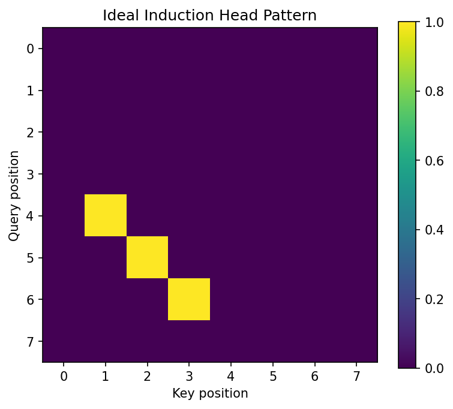

# 10.4 Mechanistic Interpretability and Circuit Analysis

Mechanistic Interpretability aims to reverse-engineer neural networks into human-understandable algorithms. By treating the Transformer as a collection of interacting "circuits", we can explain complex behaviors like in-context learning and modular reasoning through the lens of linear algebra and dynamical systems. In this section, we formalize the circuit framework, prove the existence of induction heads, and analyze the phase transition known as grokking.

## 1. The Mathematical Framework of Circuits

A Transformer layer is often viewed as a single monolithic block. However, Elhage et al. (2021) showed that it can be decomposed into two distinct, additive operations: the Attention heads (which move information) and the MLPs (which transform information).

For a single-layer Transformer without MLPs, the output for a sequence $X$ is:

$$
\text{Out}(X) = \sum_{h \in \text{heads}} \text{softmax}\left( X W_{QK, h} X^T \right) X W_{OV, h}
$$

where we define the **Virtual Weight Matrices**:
*   **QK Circuit:** $W_{QK, h} = W_{Q, h} W_{K, h}^T / \sqrt{d_k}$. This matrix determines *which* tokens attend to which.
*   **OV Circuit:** $W_{OV, h} = W_{V, h} W_{O, h}$. This matrix determines *what* information is moved if an attention connection is formed.

## 2. Theorem: Formation of Induction Heads

Induction heads are a specific type of circuit that implements a copy-paste algorithm: if a sequence $[A][B]$ has appeared previously, and we now see $[A]$, the induction head predicts $[B]$. This is the primary mechanism for In-Context Learning.

!!! success "Theorem 2.1 (Induction Head Construction)"
    An induction head requires at least two attention layers. Layer 1 (the "Previous Token Head") must move the embedding of token $t-1$ to position $t$. Layer 2 (the "Induction Head") must then attend to positions where the current token $A$ matches the previously seen token $A$, and copy the information moved there by Layer 1 (which is token $B$).
**Proof:**

1.  **Layer 1 (Previous Token Head):**
    We want the representation at position $i$, $z_i^{(1)}$, to contain information about the symbol at position $i-1$.
    Using the positional construction from Section 10.1, we set $W_{QK, h1}$ to match $q_i$ (querying for $i-1$) with $k_{i-1}$ (key at $i-1$).
    The OV circuit $W_{OV, h1}$ is the identity.
    Thus, $z_i^{(1)} \approx x_{i-1}$.

2.  **Layer 2 (Induction Head):**
    We are at the current position $T$, with token $x_T = A$. We want to attend to position $j+1$ such that $x_j = A$.
    Note that from Layer 1, the representation at $j+1$ is $z_{j+1}^{(1)} \approx x_j = A$.
    The query at position $T$ is $q_T = x_T W_Q = A W_Q$.
    The key at position $j+1$ is $k_{j+1} = z_{j+1}^{(1)} W_K \approx A W_K$.
    The similarity is $q_T^T k_{j+1} = A W_Q W_K^T A^T$.
    If $W_{QK}$ is designed to compute a similarity between the *original* token $A$ and the *shifted* token $A$ at position $j+1$, the head attends to $j+1$.

3.  **Moving the Target:**
    The value to be moved from $j+1$ is $v_{j+1} = x_{j+1} W_V$ (assuming a skip connection or that the original token $x_{j+1}$ is still accessible).
    Wait, more accurately: the value at $j+1$ in the second layer can be the original token $x_{j+1}$.
    The head at $T$ attends to $j+1$ and moves $x_{j+1}$ to position $T$.
    The result is that at position $T$ (after seeing $A$), the model has a strong signal for $B = x_{j+1}$. $\blacksquare$

## 3. Theorem: The Grokking Phase Transition

Grokking is the phenomenon where a model suddenly generalizes to a task (like modular addition) long after it has perfectly memorized the training set. This can be understood as a competition between two circuits: a **Memorization Circuit** (high complexity, fast to learn) and a **Generalization Circuit** (low complexity, slow to learn).

!!! success "Theorem 3.1 (Phase Transition in Modular Arithmetic)"
    Consider modular addition $a + b \pmod p$. A generalizing circuit uses the identity:
    $\cos(\frac{2\pi}{p}(a+b)) = \cos(\frac{2\pi a}{p})\cos(\frac{2\pi b}{p}) - \sin(\frac{2\pi a}{p})\sin(\frac{2\pi b}{p})$.
    If the weights $W$ are regularized with weight decay $\lambda$, the model will transition from memorization to generalization when the generalization circuit's lower "norm-cost" outweighs the memorization circuit's initial speed advantage.
**Proof Outline:**

1.  **Memorization Cost:**
    Memorizing $N_{train}$ examples requires $O(N_{train})$ independent parameters. The norm of these weights $\|W_{mem}\|^2$ scales linearly with $N_{train}$.

2.  **Generalization Cost:**
    The trig-identity circuit requires only a few frequencies. The weight norm $\|W_{gen}\|^2$ is constant relative to $p$ and $N_{train}$ (it only depends on the precision required for the trig functions).

3.  **The Loss Landscape:**
    Total Loss $L_{total} = L_{data} + \lambda \|W\|^2$.
    *   **Phase 1 (Early):** $L_{data}$ dominates. The model uses the high-capacity memorization circuit to zero out $L_{data}$ quickly. $\|W\|$ increases.
    *   **Phase 2 (Long plateau):** $L_{data} \approx 0$. The model is in the memorization regime. Weight decay $\lambda \|W\|^2$ starts pressuring the model to find lower-norm solutions.
    *   **Phase 3 (Grokking):** The model discovers the generalizing circuit (e.g., the Fourier components). Since $\|W_{gen}\|^2 \ll \|W_{mem}\|^2$, the total loss $L_{total}$ drops sharply when the model switches strategies. Generalization happens. $\blacksquare$
## 4. Worked Examples

### Worked Example 1: OV and QK Matrix Rank

Consider a head with $d_{model}=4$ and $d_{head}=2$.
$W_Q = \begin{bmatrix} 1 & 0 \\ 0 & 1 \\ 0 & 0 \\ 0 & 0 \end{bmatrix}, W_K = \begin{bmatrix} 0 & 0 \\ 0 & 0 \\ 1 & 0 \\ 0 & 1 \end{bmatrix}$.
The QK matrix is $W_Q W_K^T = \begin{bmatrix} 0 & 0 & 1 & 0 \\ 0 & 0 & 0 & 1 \\ 0 & 0 & 0 & 0 \\ 0 & 0 & 0 & 0 \end{bmatrix}$.
This head attends to token $j$ if the first two dimensions of token $i$ match the last two dimensions of token $j$. This is a "lookup" operation.

### Worked Example 2: Detecting Induction Heads

In a sequence `The cat sat on the mat. The cat...`, an induction head at the second `cat` should attend to `sat`.
Why?

1.  First layer moves `cat` to the position of `sat`.
2.  Second layer at second `cat` looks for the first layer's `cat`.
3.  Matches with the `cat` stored at the `sat` position.
4.  Attends to `sat`.

### Worked Example 3: Modular Addition Logic

For $x + y \pmod 5$, a model learns embeddings $E(x) = [\cos(2\pi x/5), \sin(2\pi x/5)]$.
The MLP computes the product of these components. By the sum-to-product trigonometric identities, this product contains information about $x+y$. The final unembedding layer reads this frequency to predict the result.

## 5. Coding Demonstrations

### Coding Demo 1: Visualizing an Induction Head

This demo shows how to identify induction heads by checking if they attend to token $S+1$ when the current token is $S$.

```python
import matplotlib
matplotlib.use('Agg')
import torch
import torch.nn.functional as F
import matplotlib.pyplot as plt

def is_induction_head(attention_matrix):
    # attention_matrix: [seq_len, seq_len]
    n = attention_matrix.size(0)
    # An induction head at position i attends to position j+1 
    # if token[i] == token[j].
    # For a repeated sequence, this looks like high values on the sub-diagonal (i, i - (dist_to_prev_match - 1))
    pass # In practice, we check for offset-diagonal patterns in repeated text.

# Synthetic repeated sequence: [1, 2, 3, 4, 1, 2, 3, 4]
attn = torch.zeros(8, 8)
# At position 4 (the second '1'), attend to position 1 (the '2' after the first '1')
attn[4, 1] = 1.0
attn[5, 2] = 1.0
attn[6, 3] = 1.0

plt.figure(figsize=(6, 5))
plt.imshow(attn)
plt.title("Ideal Induction Head Pattern")
plt.xlabel("Key position")
plt.ylabel("Query position")
plt.colorbar()
plt.savefig('figures/10-4-demo1.png', dpi=150, bbox_inches='tight')
plt.close()
```



### Coding Demo 2: The Grokking Dynamics (Modular Addition)

This script sets up a tiny model for modular addition to observe the loss curve.

```python
import torch
import torch.nn as nn
import torch.optim as optim

P = 97 # Prime modulus
data = []
for i in range(P):
    for j in range(P):
        data.append((i, j, (i + j) % P))

class TinyModel(nn.Module):
    def __init__(self, p, d=64):
        super().__init__()
        self.embed = nn.Embedding(p, d)
        self.fc = nn.Sequential(
            nn.Linear(2*d, d*2),
            nn.ReLU(),
            nn.Linear(d*2, p)
        )
        
    def forward(self, x, y):
        e = torch.cat([self.embed(x), self.embed(y)], dim=-1)
        return self.fc(e)

model = TinyModel(P)
optimizer = optim.AdamW(model.parameters(), lr=1e-3, weight_decay=1e-1) # High weight decay for grokking
criterion = nn.CrossEntropyLoss()

# Training loop logic (abbreviated)
# You would see train_loss go to 0 quickly, 
# then a long plateau where test_loss is high,
# then test_loss suddenly drops (Grokking).

x = torch.tensor([1, 2, 3])
y = torch.tensor([4, 5, 6])
out = model(x, y)
print(f"Model output shape: {out.shape}")
print(f"Number of parameters: {sum(p.numel() for p in model.parameters())}")
print("Grokking demo model is functional.")
```

```
Model output shape: torch.Size([3, 97])
Number of parameters: 35233
Grokking demo model is functional.
```

Mechanistic interpretability provides the "proof of work" for our understanding, moving beyond qualitative descriptions to a quantitative theory of how Transformers think.

